### 目錄
1. [總覽](/index.md)
2. [GMT介紹及安裝](/intro_install.md)
3. [網路資源及配套軟體](/net_software.md)
4. [第零章: 基本概念及默認值](/basic_defaults.md)
5. [第一章: 製作地圖(地理投影法)](/projection.md)

---

## 4.1 基本概念[](#m4.1)
GMT是由指令輸入來製圖，那如何開啟指令輸入的環境

* Windows: 點擊開始按鈕，搜尋<mark>cmd.exe</mark>或是命令提示字元，點擊後將出現命令提示字元的畫面。
* Linux: 按`Ctrl+Alt+T`，或是在搜尋打<mark>terminal</mark>，就可叫出終端機。
* MAC: 可在Applications/Utilities/下找到<mark>Terminal.app</mark>。

為了避免與其他指令混用，自GMT5之後，GMT的指令輸入格式如下:

```shell
  GMT [options]
  GMT <module name> [<module-options>]
```

<mark>options</mark>代表GMT的基本設定，例如`gmt --show-bindir`顯示執行檔的資料夾，
或是`gmt --version`告訴你當前執行環境下GMT的版本。
<mark>module name</mark>表示你用來製圖的模組，像是**psxy**(畫圖形)、**pstext**(寫字)等等，
而<mark>module-options</mark>則對應像是**-R**(設定範圍)、**-J**(投影法)等等。

試一下輸入`gmt --help`，你將可以看到一串關於module purpose的資訊，
或是輸入`gmt psxy --help`，你可以看到關於psxy模組的資訊。
當然別忘記，當有指令不熟的時後，多加查詢[GMT官網](http://gmt.soest.hawaii.edu/doc/5.4.2/index.html)的資訊，
像是剛剛[module purpose](http://gmt.soest.hawaii.edu/doc/5.4.2/quick_ref.html)及
[psxy](http://gmt.soest.hawaii.edu/doc/5.4.2/psxy.html)，都可以在官網中找到。

## 4.2 圖層概念
GMT的作圖是利用一張張PS檔疊加在一起，示意圖如下:

<p align="center">
  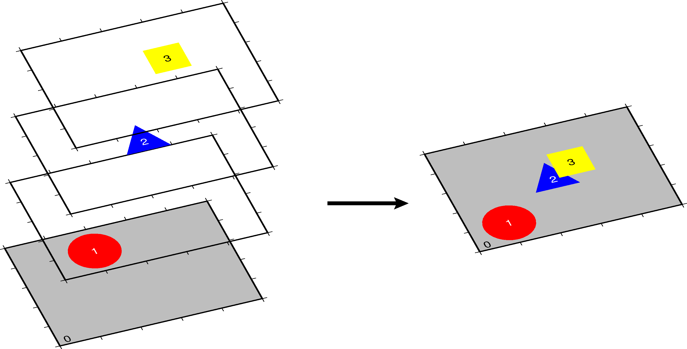
</p>

在示意圖的左側，可以看到4張圖層，分別是0(底色為灰色)、1(紅色圓形)、
2(藍色三角形)、3(黃色正方形)，當這些圖層按照順序疊在一起後，就變成右側的圖，
可以看到較後面圖層(3)中的黃色正方形，蓋在圖層(2)的藍色三角形上，
各幾何圖形的圖層(1, 2, 3)都蓋在灰色底圖(0)上，GMT利用指令的先後順序，來達到圖層疊加的概念。

而這邊還有一個重要的指令概念，是在module-options下的**-K**及**-O**，
當要畫multi-layer(多層圖)時，**-K**表示後面還有圖層，**-O**表示覆蓋作圖模式，
如下圖所示，簡單來說，第一行圖層指令只加**-K**，中間的圖層指令加**-K**及**-O**，
最後一行圖層指令只加**-O**。

<p align="center">
  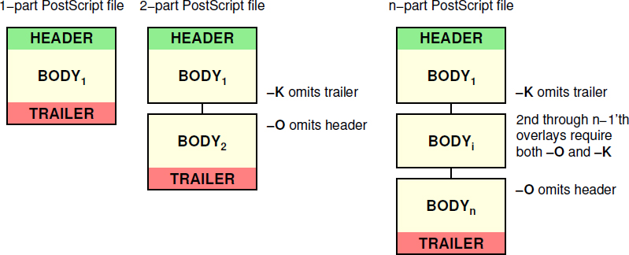
</p>

## 4.3 默認值
GMT在畫圖上有一些默認的設定，像是圖框種類、時間單位、長度單位等等，可以透過輸入`gmt gmtset`，
會產生<mark>gmt.conf</mark>檔案，將檔案用編輯器打開後，可以看各種參數的默認值，如果要修改有四種方式:

1. 在下 GMT 指令時，使用<mark>--長參數</mark>的語法，參數的名稱就是在這裡出現的大寫字串，例如：
```shell
  gmt psxy -T -JX1/1 -R0/1/0/1 -K --PS_PAGE_ORIENTATION=portrait > out.ps
```
2. 開啟一個畫圖腳本檔，寫入
```shell
  gmt gmtset 參數名1 參數值1 [參數名2 參數值2 參數名3 參數值3...]
  # 或是
  gmtset 參數名1=參數值1 [參數名2=參數值2 參數名3=參數值3...]
```
3. 利用`gmt gmtset`叫出<mark>gmt.conf</mark>，開啟當前資料夾底下的<mark>gmt.conf</mark>，更改裡面的參數。
4. 更改位於<mark>GMT根目錄/share/conf/gmt.conf</mark>的參數檔，但請小心，這是GMT原始的設定，
修改前請記得備份。

GMT在讀取<mark>gmt.conf</mark>檔時，會優先讀取當前資料夾底下的檔案，如果沒有，
才會讀取<mark>GMT根目錄</mark>下的檔案。第一種方式的話，**改變的參數只對這行指令有效**，
而後三者，**改變的參數則會對接下來的指令都有影響**。

## 4.4 參考資訊
這邊整理一些GMT常用的參數的表單或是圖檔。

* <mark>地圖框的設定</mark>

<p align="center">
  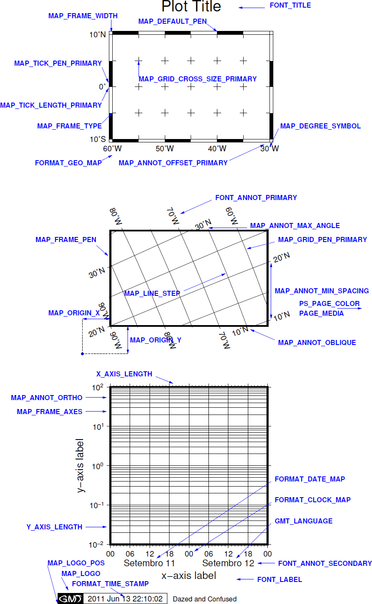
</p>

* <mark>距離的單位</mark>

<p align="center">
  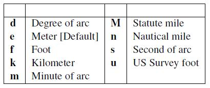
</p>

* <mark>時間的單位</mark>

<p align="center">
  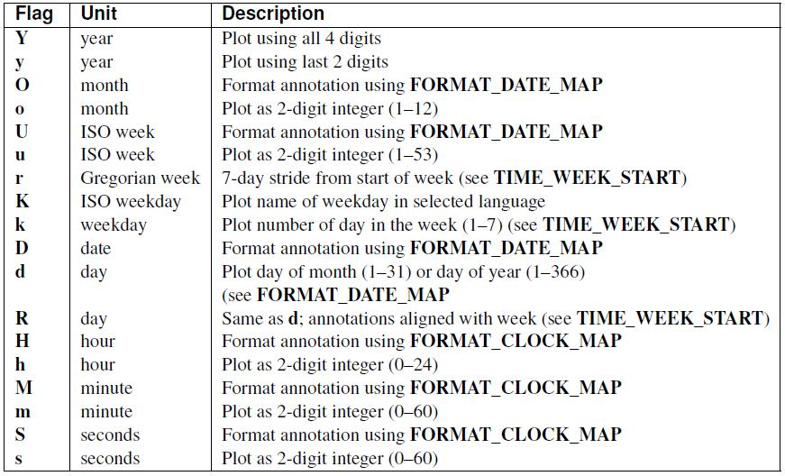
</p>

* <mark>字的對齊方式</mark>

<p align="center">
  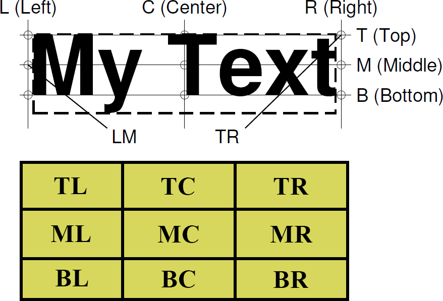
</p>

* <mark>地質圖案</mark>(bit and hachure patterns)

<p align="center">
  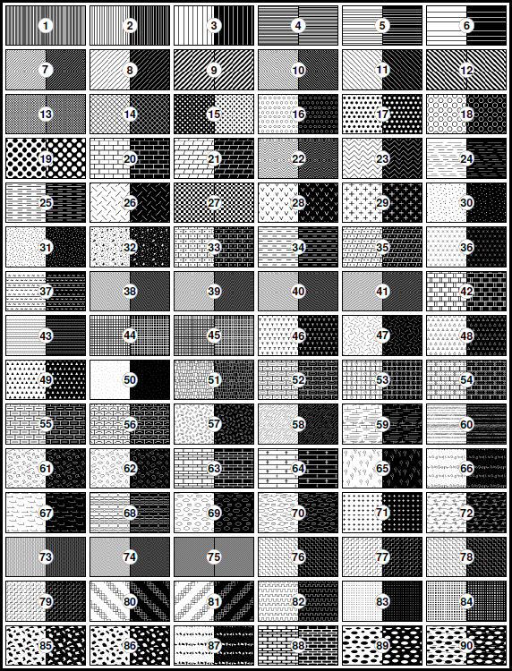
</p>

* <mark>特殊字元或符號</mark>

<p align="center">
  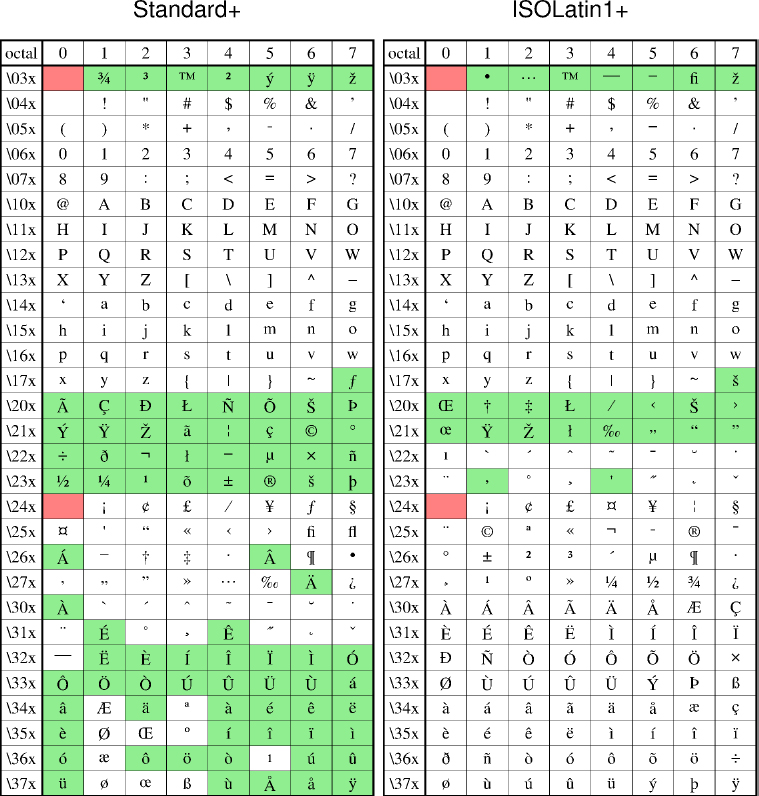
</p>

* <mark>字體對照表</mark>

<p align="center">
  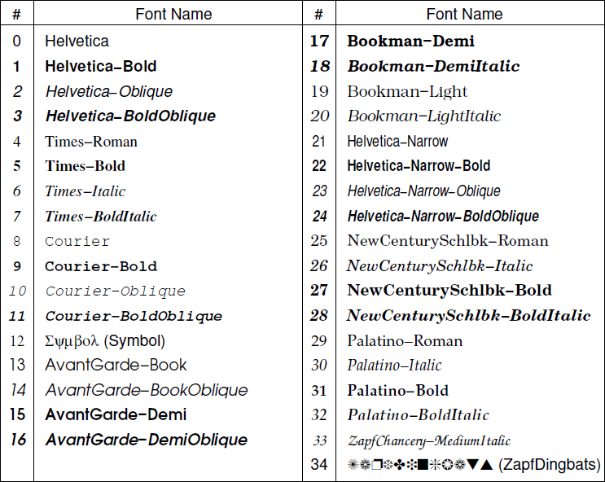
</p>

* <mark>顏色RGB對照表</mark>

<p align="center">
  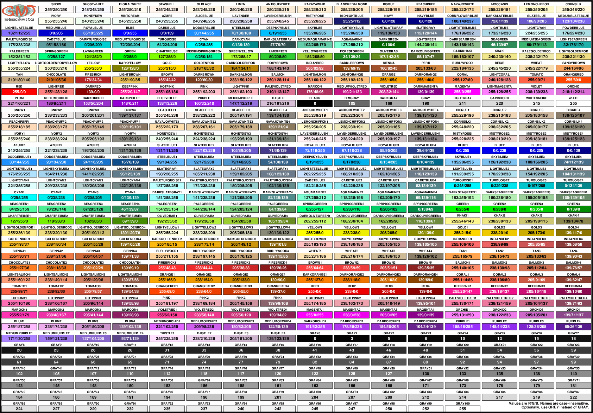
</p>

* <mark>-S符號對照表</mark>

<p align="center">
  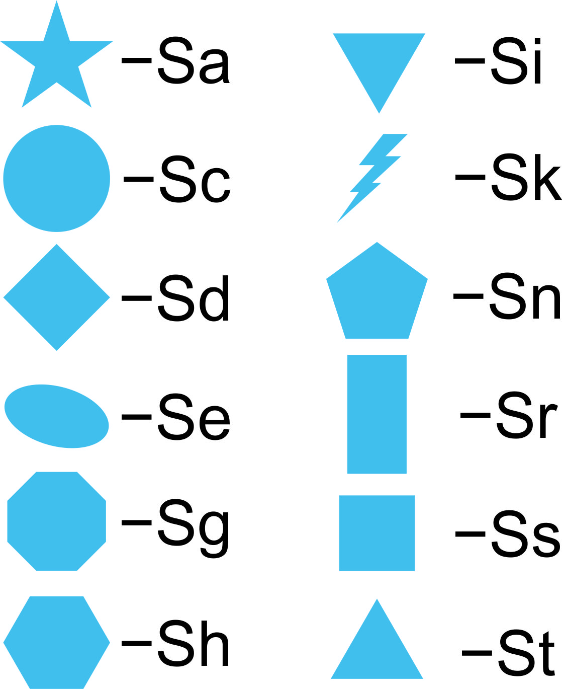
</p>

部份的圖檔，可以在<mark>GMT根目錄/share/doc/html/_images</mark>找到。


---

[上一章](/net_software.md) -- [下一章](/projection.md)