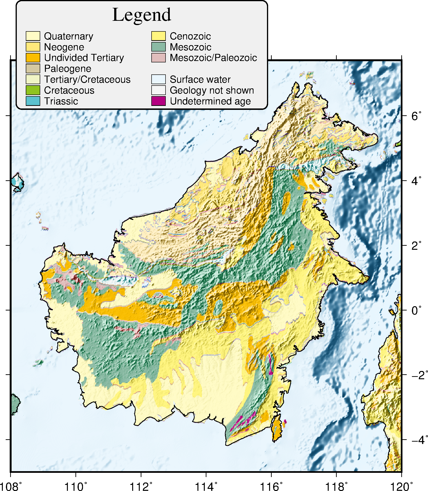

# 地質圖

---

### 目錄
1. [總覽](/index.md)
2. [GMT介紹及安裝](/intro_install.md)
3. [網路資源及配套軟體](/net_software.md)
4. [第零章: 基本概念及默認值](/basic_defaults.md)
5. [第一章: 製作地圖(地理投影法)](/projection.md)
6. [第二章: XY散佈圖(其他投影法)](/xy_figure.md)
7. [第三章: 等高線圖及剖面](/contour_profile.md)
8. [第四章: 地形圖與色階](/topography_cpt.md)
9. [第五章: 地震活動性與機制解](/seismicity_meca.md)
10. [第六章: 向量與速度場](/vector_velocity.md)
11. [第七章: 台灣地理資訊](/taiwan_geography.md)
12. [第八章: 直方、圓餅、三元圖](/histo_pie_ternary.md)
13. [第九章: 三維空間視圖](/three_dimension.md)
14. [第十章: 地質圖](/geology_map.md)

---

## 14. 地質圖
在地球科學研究領域中，編者偏向做地球物理的研究，通過將大量儀器收集來的數據，
經由電腦進行各種的運算處理，觀察計算後的結果，試圖找出地球告訴我們的事情。
有趣的是，這些結果往往與地質有密不可分的關係，更常常會有一種感慨，
地質學家早早透過野外觀察，見微知著，提出理論，而自己只是利用數據去驗證理論。
本章就來學會怎樣繪製地質圖，來輔助自己的研究吧!

## 14.1 目的
本章將學習如何繪製
  1. 點和刻線圖案(Bit and Hachure Patterns)
  2. 地質年代地圖(Geological Time Map)
  3. 地質年代結合地形(Geological Time Map with Terrain)

## 14.2 學習的指令與概念

* `gmtconvert`: 處理多區塊式文件
* `grdmask`: 透過點或多邊形來製作網格檔
* `psxy`: 繪製線、多邊形、符號
* `ogr2ogr`: GDAL中處理向量的轉檔程式
* `python pyproj`: python中用以處理座標系投影的模組

## 14.3 點和刻線圖案
在繪製地質圖中，會利用簡單的點或是線來代表各種不同的岩性，通常被稱做地質圖元符號。
**GMT 5.4.2** 提供90種的符號，可參考[4-4點和刻線圖案](basic_defaults#m4.4g)，
本節將利用美國聯邦地理資料委員會(FGDC, Federal Geographic Data Committee)
其下的地質資料子委員會(Geologic Data Committee)所製訂的
[數位地質圖符號標準](https://ngmdb.usgs.gov/fgdc_gds/geolsymstd.php)
(Digital Cartographic Standard for Geologic Map Symbolization)，
來示範幾種GMT中的地質圖元符號，通常代表哪種岩性。

成果圖

<p align="center">
  
</p>

批次檔
```bash
set ps=14_3_bit_harchure_patterns.ps

# -Gpdpi/pattern[:Bcolor[Fcolor]]
echo .2 23.3 Demonstration of -Gp | gmt pstext -R0/16/0/24 -JX16/24 -F+f18p,1+jML -P -K > %ps%
echo 2 21 3 1.5 | gmt psxy -R -JX -Sr -Gp100/24 -W.5 -K -O >> %ps%
echo 6 21 3 1.5 | gmt psxy -R -JX -Sr -Gp300/24 -W.5 -K -O >> %ps%
echo 10 21 3 1.5 | gmt psxy -R -JX -Sr -Gp500/24:Fblue -W.5 -K -O >> %ps%
echo 14 21 3 1.5 | gmt psxy -R -JX -Sr -Gp300/24:BblackFyellow -W.5 -K -O >> %ps%
echo .5 22.1 -Gp100/24 > tmp
echo 4.5 22.1 -Gp300/24 >> tmp
echo 8.5 22.1 -Gp500/24:Fblue >> tmp
echo 11.8 22.1 -Gp300/24:BblackFyellow >> tmp
gmt pstext tmp -R -JX -F+f10p+jML -K -O >> %ps%

# Sedimentary Rock
echo .3 19 Sedimentary Lithology Patterns | gmt pstext -R -JX -F+f14p,1+jML -K -O >> %ps%
echo 2 17.5 3 1.5 | gmt psxy -R -JX -Sr -Gp200/24:B230 -W.5 -K -O >> %ps%
echo 6 17.5 3 1.5 | gmt psxy -R -JX -Sr -Gp200/43:B230 -W.5 -K -O >> %ps%
echo 10 17.5 3 1.5 | gmt psxy -R -JX -Sr -Gp200/31:B230 -W.5 -K -O >> %ps%
echo 14 17.5 3 1.5 | gmt psxy -R -JX -Sr -Gp200/62:B227/249/124 -W.5 -K -O >> %ps%
echo .6 18 24 > tmp
echo 4.6 18 43 >> tmp
echo 8.6 18 31 >> tmp
echo 12.6 18 62 >> tmp
gmt pstext tmp -R -JX -F+f10p+jML -W.2 -G255 -K -O >> %ps%
echo 2 16.4 Clay or clay shale > tmp
echo 6 16.4 Sandy or silty shale >> tmp
echo 10 16.4 Massive sand or sandstone >> tmp
echo 14 16.4 Gravel or conglomerate >> tmp
gmt pstext tmp -R -JX -F+f9p+jMC -K -O >> %ps%

echo 2 15.1 3 1.5 | gmt psxy -R -JX -Sr -Gp200/33 -W.5 -K -O >> %ps%
echo 6 15.1 3 1.5 | gmt psxy -R -JX -Sr -Gp200/20 -W.5 -K -O >> %ps%
echo 10 15.1 3 1.5 | gmt psxy -R -JX -Sr -Gp200/21 -W.5 -K -O >> %ps%
echo 14 15.1 3 1.5 | gmt psxy -R -JX -Sr -Gp200/61:B136/251/144 -W.5 -K -O >> %ps%
echo .6 15.6 33 > tmp
echo 4.6 15.6 20 >> tmp
echo 8.6 15.6 21 >> tmp
echo 12.6 15.6 61 >> tmp
gmt pstext tmp -R -JX -F+f10p+jML -W.2 -G255 -K -O >> %ps%
echo 2 14.0 Sandy limestone > tmp
echo 6 14.0 Limestone >> tmp
echo 10 14.0 Dolostone or dolomite >> tmp
echo 14 14.0 Breccia >> tmp
gmt pstext tmp -R -JX -F+f9p+jMC -K -O >> %ps%

# Igneous rock
echo .3 12.4 Igneous and Vein-matter Lithology Patterns | gmt pstext -R -JX -F+f14p,1+jML -K -O >> %ps%
echo 2 10.9 3 1.5 | gmt psxy -R -JX -Sr -Gp200/29:B245/99/165 -W.5 -K -O >> %ps%
echo 6 10.9 3 1.5 | gmt psxy -R -JX -Sr -Gp200/47:B245/99/165 -W.5 -K -O >> %ps%
echo 10 10.9 3 1.5 | gmt psxy -R -JX -Sr -Gp200/28:B245/99/165 -W.5 -K -O >> %ps%
echo .6 11.4 29 > tmp
echo 4.6 11.4 47 >> tmp
echo 8.6 11.4 28 >> tmp
gmt pstext tmp -R -JX -F+f10p+jML -W.2 -G255 -K -O >> %ps%
echo 2 9.8 Igneous > tmp
echo 6 9.8 Granite >> tmp
echo 10 9.8 Vitrophyre >> tmp
gmt pstext tmp -R -JX -F+f9p+jMC -K -O >> %ps%

gmt psxy -R -J -T -O >> %ps%
gmt psconvert %ps% -Tg -A -P
del tmp*
```

學習到的指令:
* `psxy -Gp`填上地質圖元符號。格式為<mark>-Gp解析度/種類代碼:B背景色F前景色</mark>。

GMT提供了非常簡單的方式來繪製地質圖案，透過解析度可以調整點或是線的疏密程度，
顏色上可利用**B**及**F**來調整背景色及前景色。而上面的成果圖中，
圖案象徵的岩性採用對照數位地質圖符號標準，實際上還有更多的種類可供選擇，讀者可自行參考。

## 14.4 東南亞地質年代圖
本節使用由美國地質調查所(USGS)所公佈，放在美國政府公開資訊網站上的[東南亞概略地質](https://catalog.data.gov/dataset/generalized-geology-of-southeast-asia-geo3bl)
(Generalized Geology of Southeast Asia)，來將上節所學到的地質圖元符號，
實際應用在繪製地圖上。

該網上提供的檔案格式為.shp (Shapefile)，
該格式為GIS軟體所使用的地理空間向量格式(geospatial vector format)，要讓GMT能使用，
還需要透過一些轉檔步驟，讀者可以使用下方轉檔好的東南亞地質檔，
也可以實際更跟編者來完成整個轉檔的流程。
在[7.3 簡介網格檔](contour_profile.md#m7.3)中學到，
透過[GDAL](http://www.gdal.org/index.html)提供的轉檔程式<mark>gdal_translate</mark>，
可將.tiff檔轉換成GMT使用的網格檔。
而這邊將介紹該組織所提供的另一個轉檔程式<mark>ogr2ogr</mark>，
它可將.shp檔案轉換成GMT可使用的格式，指令如下:

```bash
# ogr2ogr -f "輸出格式種類" 輸出檔名 輸入檔名
ogr2ogr -f "GMT" geo3bl.gmt geo3bl.shp
ogr2ogr -f "CSV" geo3bl.csv geo3bl.shp
```

實際將geo3bl.shp透過上述指令轉換成.gmt及.csv檔，在此需要注意的是，除了.shp檔外，
其他像是.bdf, .kst, .shx 等等的檔案都需要放在同一個資料夾，否則會發生轉檔錯誤。
打開轉好的geo3bl.gmt，會發現轉出的格式為GMT區塊文件，
而檔頭則給了一些該資料的編排模式及座標系資訊等等，下面展示前11列的資訊。

```bash
# @VGMT1.0 @GPOLYGON
# @R-2843593.21876/4218174.81256/-1324372.95632/2600390.64774             
# @Jp"+proj=lcc +lat_1=31 +lat_2=-29 +lat_0=0 +lon_0=120 +x_0=0 +y_0=0 +datum=WGS84 +units=m +no_defs "
# @Jw"PROJCS[\"WGS_1984_Lambert_Conformal_Conic\",GEOGCS[\"GCS_WGS_1984\",DATUM[\"WGS_1984\",SPHEROID[\"WGS_84\",6378137.0,298.257223563]],PRIMEM[\"Greenwich\",0.0],UNIT[\"Degree\",0.0174532925199433]],PROJECTION[\"Lambert_Conformal_Conic_2SP\"],PARAMETER[\"False_Easting\",0.0],PARAMETER[\"False_Northing\",0.0],PARAMETER[\"Central_Meridian\",120.0],PARAMETER[\"Standard_Parallel_1\",31.0],PARAMETER[\"Standard_Parallel_2\",-29.0],PARAMETER[\"Latitude_Of_Origin\",0.0],UNIT[\"Meter\",1.0]]"
# @NAREA|PERIMETER|TYPE|GLG|GEN_GLG
# @Tdouble|double|string|string|string
# FEATURE_DATA
>
# @D12326932870131.613|139356345.717||H2O|H2O
# @P
-24973.412025285801 2597878.6243802495
```

其中最後一列顯示出x及y的位置，但不是我們熟悉的WGS84座標系統，
而第三列顯示該檔案的座標系統被投影在東經120度，南緯29度至北緯31度間，
所以還需要做座標系的轉換，轉換成WGS84，才能方便地供GMT使用。
編者這裡透過Python中的**pyproj**模組來完成座標系轉換，僅列出關鍵的指令部份:

```python
import pyproj
p = pyproj.Proj(
    "+proj=lcc +lat_1=31 +lat_2=-29 +lat_0=0 +lon_0=120 +x_0=0 +y_0=0 +datum=WGS84 +units=m +no_defs")
lon, lat = p(float(x), float(y), inverse=True)
```

接著透過讀取檔案、迴圈處理、條件判斷，將轉好的資料輸出，就是下方所提供的東南亞地質檔。

使用的資料檔:
- [東南亞地質檔](dat/geo3bl_lonlat.gmt)
- [地質年代色階檔](dat/rock_unit.cpt)
- [圖例壓縮檔](dat/legend.rar)

成果圖

<p align="center">
  
</p>

批次檔
```bash
set ps=14_4_se_geo.ps

# basemap and geology color
gmt pscoast -R88/165/-16/28 -JL140.0/0.0/-10.0/15.0/25 -Ba10g2.5 -Df ^
-A5000 -W.5 -G245/246/246 -S234/246/253 -K > %ps%
gmt psxy geo3bl_lonlat.gmt -R -JL -W.1,red -Crock_unit.cpt -L -K -O >> %ps%

# 3 specified rock type
gmt gmtconvert geo3bl_lonlat.gmt -S"|v|" > tmp
awk "{print $1,""p400/28:F50B""""$2,$3,""p400/28:F50B""""$4}" rock_unit.cpt > tmp.cpt
gmt psxy tmp -R -JL -Ctmp.cpt -W.1,red -L -K -O >> %ps%

gmt gmtconvert geo3bl_lonlat.gmt -S"|i|" > tmp
awk "{print $1,""p400/29:F50B""""$2,$3,""p400/29:F50B""""$4}" rock_unit.cpt > tmp.cpt
gmt psxy tmp -R -JL -Ctmp.cpt -W.1,red -L -K -O >> %ps%

gmt gmtconvert geo3bl_lonlat.gmt -S"|w|" > tmp
awk "{print $1,""p400/44:F50B""""$2,$3,""p400/44:F50B""""$4}" rock_unit.cpt > tmp.cpt
gmt psxy tmp -R -JL -Ctmp.cpt -W.1,red -L -K -O >> %ps%

# legend part
echo 0 0 > tmp
echo 10 0 >> tmp
echo 10 10 >> tmp
echo 0 10 >> tmp
gmt psxy tmp -JX13/10 -R0/10/0/10 -G255/255/255 -W1 -L -K -O -X13 -Y7 >> %ps%
echo 0.3 9.6 Age of rock units > tmp
echo 2.2 2.3 Specified rock type >> tmp
echo 6.5 2.3 Other units >> tmp
gmt pstext tmp -R -JX -F+f12p,3+jML -K -O >> %ps%
echo 2.4 1.7 0.5 0.30 | gmt psxy -R -JX -Sr -W.5 -Gp400/28:B255 -K -O >> %ps%
echo 2.4 1.2 0.5 0.30 | gmt psxy -R -JX -Sr -W.5 -Gp400/29:B255 -K -O >> %ps%
echo 2.4 0.7 0.5 0.30 | gmt psxy -R -JX -Sr -W.5 -Gp400/44:B255 -K -O >> %ps%
echo 2.7 1.7 Volcanic rocks > tmp
echo 2.7 1.2 Intrusive rocks >> tmp
echo 2.7 0.7 Ophiolites \046 ultrabasic rocks >> tmp
gmt pstext tmp -R -JX -F+f10p+jML -K -O >> %ps%
gmt psxy legend.dat -R -JX -Sr -W.5 -Crock_unit.cpt -K -O >> %ps%
gmt pstext legend.cod -R -JX -F+f4p+jMC -K -O >> %ps%
gmt pstext legend.tex -R -JX -F+f10p+jML -K -O >> %ps%

gmt psxy -R -J -T -O >> %ps%
gmt psconvert %ps% -Tg -A -P
del tmp*
```

學習到的指令:

首先可從輸出的.csv檔中，找出共有幾種地質年代及岩性，並將其手動製作成圖例說明的資料。
在[11.7人口密度](taiwan_geography.md#m11.7)中，示範了如何利用`psxy -C -L`配合區塊文件
中檔頭`-Z`的值，來完成封閉多邊形的著色，此處也利用同樣的方式。

由於東南亞地質檔中，
部份的區域有提供岩石種類的資訊，用`gmtconvert -S`來搜尋相對應的關鍵字母，並輸出成暫存檔，
並將原有色階檔的顏色前面加上`-p400/28F50B`字串，
讓這些特定的區域能加上地質圖元符號進行著色，來達到顯示不同岩性的效果。
最後轉成在xy座標系統上，把之前整理好圖例說明檔，調整位置繪製出來，就大功告成了。

## 14.5 地質年代結合地形
地形與地質往往是密不可分的關係，本節雖使用的是地質年代的底圖，
但也還是可以從山區及平原看出地層年代的差異。但在將地質資料結合地形時，
需要將上節所使用的區塊文件做網格化處理，在此將透過繪製婆羅洲(或稱加里曼丹島)，
來示範如何將此二者結合在一起。

使用的資料檔:
- [東南亞地質網格檔](dat/geo3bl_lonlat.grd)
- [地質年代色階檔](dat/rock_unit.cpt)

成果圖

<p align="center">
  
</p>

批次檔
```bash
set ps=14_5_se_geo_grd.ps
set data=D:\GMT_data\

# gmt grdmask geo3bl_lonlat.gmt -R88/165/-16/28 -I1m -Nz -Ggeo3bl_lonlat.grd -V

gmt gmtset MAP_FRAME_TYPE plain

# base grid image
gmt grdimage geo3bl_lonlat.grd -R108/120/-5/7.7 -JM14 -Ba -BwESn ^
-Crock_unit.cpt -I%data%ETOPO1_Bed_g_gmt5_shad.grd -K > %ps%
gmt pscoast -R -JM -Df -A500 -W.5 -K -O >> %ps%

# legend set
echo H 20 Times-Roman Legend > tmp
echo G .2 >> tmp
echo N 2 >> tmp
echo S .5 r .5 255/251/198 .3 .9 Quaternary >> tmp
echo S .5 r .5 255/245/127 .3 .9 Cenozoic >> tmp
echo S .5 r .5 255/233/123 .3 .9 Neogene >> tmp
echo S .5 r .5 139/186/164 .3 .9 Mesozoic >> tmp
echo S .5 r .5 250/190/0 .3 .9 Undivided Tertiary >> tmp
echo S .5 r .5 224/189/188 .3 .9 Mesozoic/Paleozoic >> tmp
echo N 1 >> tmp
echo S .5 r .5 213/201/161 .3 .9 Paleogene >> tmp
echo N 2 >> tmp
echo S .5 r .5 240/244/197 .3 .9 Tertiary/Cretaceous >> tmp
echo S .5 r .5 234/246/253 .3 .9 Surface water >> tmp
echo S .5 r .5 144/195/31 .3 .9 Cretaceous >> tmp
echo S .5 r .5 245/246/246 .3 .9 Geology not shown >> tmp
echo S .5 r .5 92/194/207 .3 .9 Triassic >> tmp
echo S .5 r .5 181/0/129 .3 .9 Undetermined age >> tmp
gmt pslegend tmp -R -JM -C.1/.1 -Dx.2/13+w9 -F+g240+p1+r.2 ^
--FONT_ANNOT_PRIMARY=10p -K -O >> %ps%

gmt psxy -R -J -T -O >> %ps%
gmt psconvert %ps% -Tg -A -P
del tmp*
```

學習到的指令:
* `grdmask`透過點或多邊形來製作網格檔。
  * 輸入檔案可以是區塊文件，或是多個文件，像是coastline_*.xy。
  * `-G`輸出網格檔名。
  * `-I`解析度。
  * `-R`設定範圍。
  * `-A`修改兩數據點中的連接方式。
    * **-A**忽略現有的連接方式，採用直線連接。
    * **-Am**先沿著經線，再沿著緯線。
    * **-Ap**先沿著緯線，再沿著經線。
    * **-Ax**先沿著x軸，再沿著y軸。
    * **-Ay**先沿著y軸，再沿著x軸。
  * `-N`設定多邊形外部、邊緣、內部的值。格式為<mark>-N[模式代碼]外部數值/邊緣數值/內部數值</mark>，數值除了給任意數值外，也可以給**NaN**。
    * **-Nz**讀取區塊文件中的**-Z**賦予的值，將其値視為多邊形內部的值。
    * **-NZ**與**-Nz**一樣，除了多邊形內部外，邊緣也被視為內部的一部份。
    * **-Np**使用從0開始遞增的數字作為多邊形的編號，也可在後面加上一個數值，作為起始値。
    * **-NP**與**-Np**一樣，除了多邊形內部外，邊緣也被視為內部的一部份。
  * `-S`利用節點來設定搜尋半徑，決定園內、邊緣、園外的值。格式為<mark>-S搜尋半徑[單位]</mark>
  * `-N[z|Z|p|P]`與`-S`不能共用。

透過`grdmask`就可以將區塊文件轉換成數値檔，需要注意的是，要讓地質與地形繪製在一起，
地質網格與地形陰影這兩個網格檔，需要同樣的解析度，所以設定`-I1m`來對應全球一角分的
地形陰影檔，借此，就可以一次地將這兩種資訊表現在圖上了。


## 14.6 習題
TODO

## 14.7 參考批次檔
列出本章節使用的批次檔，供讀者參考使用，檔案路經可能會有些許不同，再自行修改。
* [14_3_bit_harchure_patterns](bat/14_3_bit_harchure_patterns.bat)
* [14_4_se_geo](bat/14_4_se_geo.bat)
* [14_5_se_geo_grd](bat/14_5_se_geo_grd.bat)

---

[上一章](/three_dimension.md) -- [下一章](/geology_map.md)
