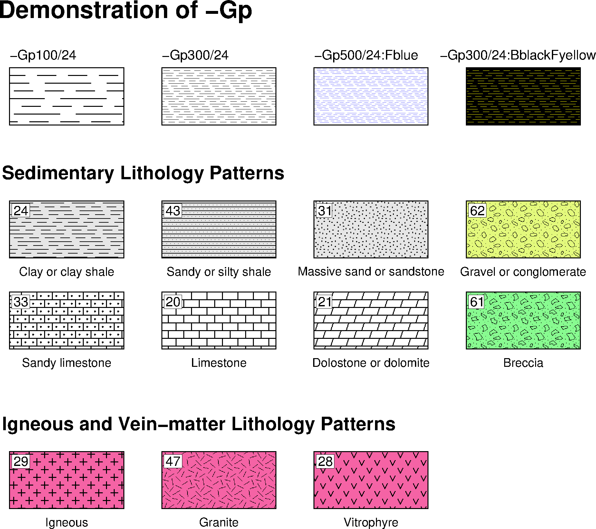
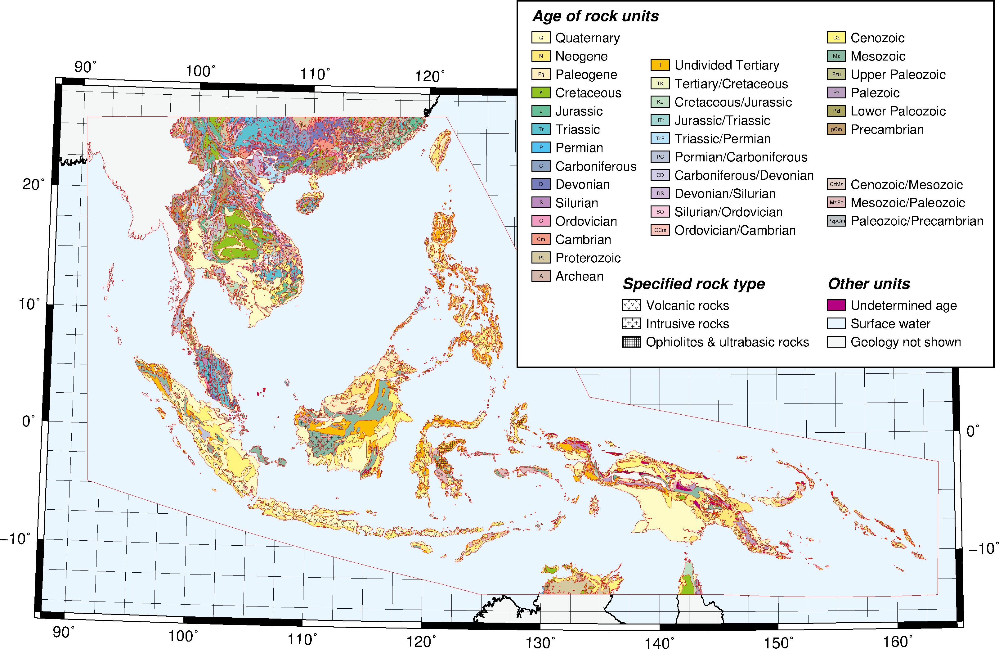

# 地質圖

---

### 目錄
1. [總覽](/index.md)
2. [GMT介紹及安裝](/intro_install.md)
3. [網路資源及配套軟體](/net_software.md)
4. [第零章: 基本概念及默認值](/basic_defaults.md)
5. [第一章: 製作地圖(地理投影法)](/projection.md)
6. [第二章: XY散佈圖(其他投影法)](/xy_figure.md)
7. [第三章: 等高線圖及剖面](/contour_profile.md)
8. [第四章: 地形圖與色階](/topography_cpt.md)
9. [第五章: 地震活動性與機制解](/seismicity_meca.md)
10. [第六章: 向量與速度場](/vector_velocity.md)
11. [第七章: 台灣地理資訊](/taiwan_geography.md)
12. [第八章: 直方、圓餅、三元圖](/histo_pie_ternary.md)
13. [第九章: 三維空間視圖](/three_dimension.md)
14. [第十章: 地質圖](/geology_map.md)

---

## 14. 地質圖
在地球科學研究領域中，編者偏向做地球物理的研究，通過將大量儀器收集來的數據，
經由電腦進行各種的運算處理，觀察計算後的結果，試圖找出地球告訴我們的事情。
有趣的是，這些結果往往與地質有密不可分的關係，更常常會有一種感慨，
地質學家早早透過野外觀察，見微知著，提出理論，而自己只是利用數據去驗證理論。
本章就來學會怎樣繪製地質圖，來輔助自己的研究吧!

## 14.1 目的
本章將學習如何繪製
  1. 點和刻線圖案(Bit and Hachure Patterns)
  2. 地質圖(Geology Map)

## 14.2 學習的指令與概念

* `gmtconvert`: 處理多區塊式文件
* `psxy`: 繪製線、多邊形、符號
* `ogr2ogr`: GDAL中處理向量的轉檔程式
* `python pyproj`: python中用以處理座標系投影的模組

## 14.3 點和刻線圖案
TODO

成果圖

<p align="center">
  
</p>

批次檔
```bat
set ps=14_3_bit_harchure_patterns.ps

rem -Gpdpi/pattern[:Bcolor[Fcolor]]
echo .2 23.3 Demonstration of -Gp | gmt pstext -R0/16/0/24 -JX16/24 -F+f18p,1+jML -P -K > %ps%
echo 2 21 3 1.5 | gmt psxy -R -JX -Sr -Gp100/24 -W.5 -K -O >> %ps%
echo 6 21 3 1.5 | gmt psxy -R -JX -Sr -Gp300/24 -W.5 -K -O >> %ps%
echo 10 21 3 1.5 | gmt psxy -R -JX -Sr -Gp500/24:Fblue -W.5 -K -O >> %ps%
echo 14 21 3 1.5 | gmt psxy -R -JX -Sr -Gp300/24:BblackFyellow -W.5 -K -O >> %ps%
echo .5 22.1 -Gp100/24 > tmp
echo 4.5 22.1 -Gp300/24 >> tmp
echo 8.5 22.1 -Gp500/24:Fblue >> tmp
echo 11.8 22.1 -Gp300/24:BblackFyellow >> tmp
gmt pstext tmp -R -JX -F+f10p+jML -K -O >> %ps%

rem Sedimentary Rock
echo .3 19 Sedimentary Lithology Patterns | gmt pstext -R -JX -F+f14p,1+jML -K -O >> %ps%
echo 2 17.5 3 1.5 | gmt psxy -R -JX -Sr -Gp200/24:B230 -W.5 -K -O >> %ps%
echo 6 17.5 3 1.5 | gmt psxy -R -JX -Sr -Gp200/43:B230 -W.5 -K -O >> %ps%
echo 10 17.5 3 1.5 | gmt psxy -R -JX -Sr -Gp200/31:B230 -W.5 -K -O >> %ps%
echo 14 17.5 3 1.5 | gmt psxy -R -JX -Sr -Gp200/62:B227/249/124 -W.5 -K -O >> %ps%
echo .6 18 24 > tmp
echo 4.6 18 43 >> tmp
echo 8.6 18 31 >> tmp
echo 12.6 18 62 >> tmp
gmt pstext tmp -R -JX -F+f10p+jML -W.2 -G255 -K -O >> %ps%
echo 2 16.4 Clay or clay shale > tmp
echo 6 16.4 Sandy or silty shale >> tmp
echo 10 16.4 Massive sand or sandstone >> tmp
echo 14 16.4 Gravel or conglomerate >> tmp
gmt pstext tmp -R -JX -F+f9p+jMC -K -O >> %ps%

echo 2 15.1 3 1.5 | gmt psxy -R -JX -Sr -Gp200/33 -W.5 -K -O >> %ps%
echo 6 15.1 3 1.5 | gmt psxy -R -JX -Sr -Gp200/20 -W.5 -K -O >> %ps%
echo 10 15.1 3 1.5 | gmt psxy -R -JX -Sr -Gp200/21 -W.5 -K -O >> %ps%
echo 14 15.1 3 1.5 | gmt psxy -R -JX -Sr -Gp200/61:B136/251/144 -W.5 -K -O >> %ps%
echo .6 15.6 33 > tmp
echo 4.6 15.6 20 >> tmp
echo 8.6 15.6 21 >> tmp
echo 12.6 15.6 61 >> tmp
gmt pstext tmp -R -JX -F+f10p+jML -W.2 -G255 -K -O >> %ps%
echo 2 14.0 Sandy limestone > tmp
echo 6 14.0 Limestone >> tmp
echo 10 14.0 Dolostone or dolomite >> tmp
echo 14 14.0 Breccia >> tmp
gmt pstext tmp -R -JX -F+f9p+jMC -K -O >> %ps%

rem Igneous rock
echo .3 12.4 Igneous and Vein-matter Lithology Patterns | gmt pstext -R -JX -F+f14p,1+jML -K -O >> %ps%
echo 2 10.9 3 1.5 | gmt psxy -R -JX -Sr -Gp200/29:B245/99/165 -W.5 -K -O >> %ps%
echo 6 10.9 3 1.5 | gmt psxy -R -JX -Sr -Gp200/47:B245/99/165 -W.5 -K -O >> %ps%
echo 10 10.9 3 1.5 | gmt psxy -R -JX -Sr -Gp200/28:B245/99/165 -W.5 -K -O >> %ps%
echo .6 11.4 29 > tmp
echo 4.6 11.4 47 >> tmp
echo 8.6 11.4 28 >> tmp
gmt pstext tmp -R -JX -F+f10p+jML -W.2 -G255 -K -O >> %ps%
echo 2 9.8 Igneous > tmp
echo 6 9.8 Granite >> tmp
echo 10 9.8 Vitrophyre >> tmp
gmt pstext tmp -R -JX -F+f9p+jMC -K -O >> %ps%

gmt psxy -R -J -T -O >> %ps%
gmt psconvert %ps% -Tg -A -P
del tmp*
```

## 14.4 東南亞地質圖
TODO

使用的資料檔:
- [東南亞地質檔](dat/geo3bl_lonlat.gmt)
- [地質年代色階檔](dat/rock_unit.cpt)
- [圖例壓縮檔](dat/legend.rar)

成果圖

<p align="center">
  
</p>

批次檔
```bat
set ps=14_4_se_geo.ps

rem basemap and geology color
gmt pscoast -R88/165/-16/28 -JL140.0/0.0/-10.0/15.0/25 -Ba10g2.5 -Df ^
-A5000 -W.5 -G245/246/246 -S234/246/253 -K > %ps%
gmt psxy geo3bl_lonlat.gmt -R -JL -W.1,red -Crock_unit.cpt -L -K -O >> %ps%

rem 3 specified rock type
gmt gmtconvert geo3bl_lonlat.gmt -S"|v|" > tmp
awk "{print $1,""p400/28:F50B""""$2,$3,""p400/28:F50B""""$4}" rock_unit.cpt > tmp.cpt
gmt psxy tmp -R -JL -Ctmp.cpt -W.1,red -L -K -O >> %ps%

gmt gmtconvert geo3bl_lonlat.gmt -S"|i|" > tmp
awk "{print $1,""p400/29:F50B""""$2,$3,""p400/29:F50B""""$4}" rock_unit.cpt > tmp.cpt
gmt psxy tmp -R -JL -Ctmp.cpt -W.1,red -L -K -O >> %ps%

gmt gmtconvert geo3bl_lonlat.gmt -S"|w|" > tmp
awk "{print $1,""p400/44:F50B""""$2,$3,""p400/44:F50B""""$4}" rock_unit.cpt > tmp.cpt
gmt psxy tmp -R -JL -Ctmp.cpt -W.1,red -L -K -O >> %ps%

rem legend part
echo 0 0 > tmp
echo 10 0 >> tmp
echo 10 10 >> tmp
echo 0 10 >> tmp
gmt psxy tmp -JX13/10 -R0/10/0/10 -G255/255/255 -W1 -L -K -O -X13 -Y7 >> %ps%
echo 0.3 9.6 Age of rock units > tmp
echo 2.2 2.3 Specified rock type >> tmp
echo 6.5 2.3 Other units >> tmp
gmt pstext tmp -R -JX -F+f12p,3+jML -K -O >> %ps%
echo 2.4 1.7 0.5 0.30 | gmt psxy -R -JX -Sr -W.5 -Gp400/28:B255 -K -O >> %ps%
echo 2.4 1.2 0.5 0.30 | gmt psxy -R -JX -Sr -W.5 -Gp400/29:B255 -K -O >> %ps%
echo 2.4 0.7 0.5 0.30 | gmt psxy -R -JX -Sr -W.5 -Gp400/44:B255 -K -O >> %ps%
echo 2.7 1.7 Volcanic rocks > tmp
echo 2.7 1.2 Intrusive rocks >> tmp
echo 2.7 0.7 Ophiolites \046 ultrabasic rocks >> tmp
gmt pstext tmp -R -JX -F+f10p+jML -K -O >> %ps%
gmt psxy legend.dat -R -JX -Sr -W.5 -Crock_unit.cpt -K -O >> %ps%
gmt pstext legend.cod -R -JX -F+f4p+jMC -K -O >> %ps%
gmt pstext legend.tex -R -JX -F+f10p+jML -K -O >> %ps%

gmt psxy -R -J -T -O >> %ps%
gmt psconvert %ps% -Tg -A -P
del tmp*
```

學習到的指令:
* `psxy`繪製線、多邊形、符號。


## 14.5 習題
TODO

## 14.6 參考批次檔
列出本章節使用的批次檔，供讀者參考使用，檔案路經可能會有些許不同，再自行修改。
* [14_3_bit_harchure_patterns](bat/14_3_bit_harchure_patterns.bat)
* [14_4_se_geo](bat/14_4_se_geo.bat)

---

[上一章](/three_dimension.md) -- [下一章](/geology_map.md)
