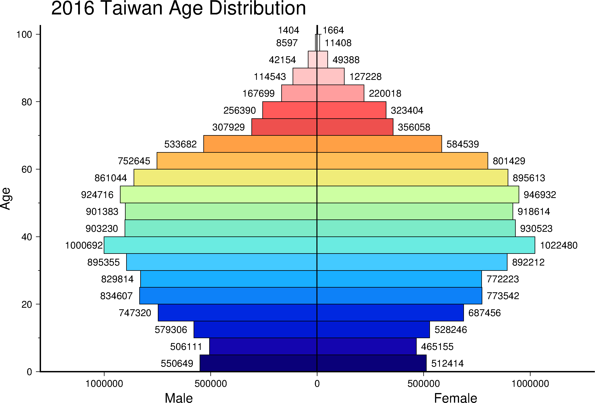
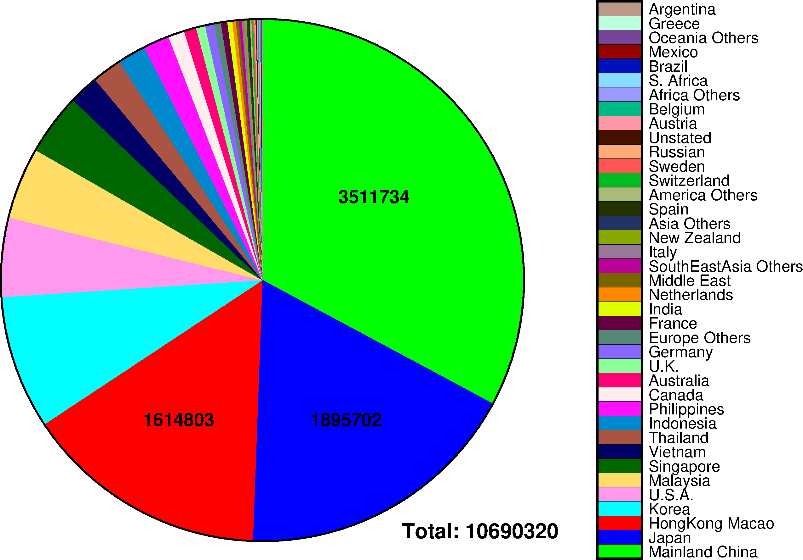
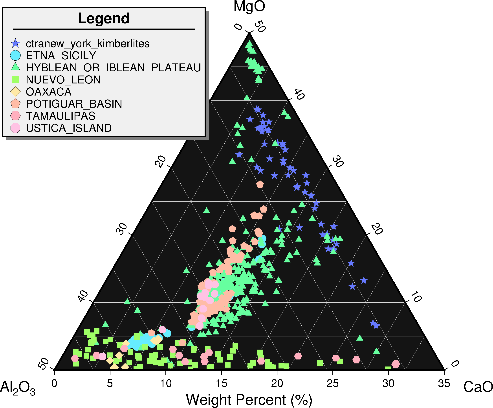

### 目錄
1. [總覽](/index.md)
2. [GMT介紹及安裝](/intro_install.md)
3. [網路資源及配套軟體](/net_software.md)
4. [第零章: 基本概念及默認值](/basic_defaults.md)
5. [第一章: 製作地圖(地理投影法)](/projection.md)
6. [第二章: XY散佈圖(其他投影法)](/xy_figure.md)
7. [第三章: 等高線圖及剖面](/contour_profile.md)
8. [第四章: 地形圖與色階](/topography_cpt.md)
9. [第五章: 地震活動性與機制解](/seismicity_meca.md)
10. [第六章: 向量與速度場](/vector_velocity.md)
11. [第七章: 台灣地理資訊](/taiwan_geography.md)
12. [第八章: 直方、圓餅、三元圖](/histo_pie_ternary.md)

---

## 12. 直方、圓餅、三元圖
在統計圖表中，除了之前介紹的折線圖、點散佈圖等，還有一些是平常生活中也常會使用到的，
本章將依序介紹GMT是如何繪製直方圖、圓餅圖及三元圖。

## 12.1 目的
本章將學習如何繪製
  1. 直方圖(Histogram)
  2. 圓餅圖(Pie Chart)
  3. 三元圖(Ternary)

## 12.2 學習的指令與概念

* `makecpt`: 製作色階檔
* `pshistogram`: 繪製直方圖
* `psxy`: 繪製線、多邊形、符號
* `awk`語法的示範

## 12.3 直方圖
當拿到散亂的大筆一維資料時，通常第一時間想到的分類方式是透過設定區間，將資料分類，
譬如期中考成績，透過固定分數級距，將分數轉變成A+、A、A-依序下去，
將不同級距的數量統計並繪製成圖，通常稱這種圖為直方圖。本節將利用2016台灣人口的年齡資料，
以每五歲為一個級距，來繪製人口金字塔圖。本次檔案有點大，故做壓縮處理。

使用的資料檔:
- [2016台灣人口年齡](dat/population_2016.rar)

成果圖

<p align="center">
  
</p>

批次檔
```bash
set ps=12_3_population_histo.ps
set cpt=haxby.cpt

gmt makecpt -C%cpt% -T0/100/5 -D > tmp.cpt
gmt pshistogram population_2016_b.dat -R0/102.5/0/1.3e6 -JX-12/15 ^
-BWeS+t"2016 Taiwan Age Distribution" -Bxa20f10+l"Age" -Bya+l"Male" ^
-A -Ctmp.cpt -D+o-1.7 -W5 -L0.5 -K > %ps%
gmt pshistogram population_2016_g.dat -R -JX12/15 ^
-BS -Bxa -Bya+l"Female" -A -Ctmp.cpt -D -W5 -L0.5 -X12 -K -O >> %ps%

gmt psxy -R -J -T -O >> %ps%
gmt psconvert %ps% -Tg -A -P
del tmp*
```

學習到的指令:
* `pshistogram`繪製直方圖。
  * `-W`間隔寬度。
    * 控制落在範圍外點的處理方式，**+b**範圍外的數據包含在第一個或最後一個級距中；
    **+l**只將小於範圍的放入第一個級距中；**+h**只將大於範圍的放入最後一個級距中。
  * `-A`改為繪製水平直方圖。
  * `-C`色階檔，依照每個間隔的中間值繪製對應顏色。
  * `-D`在每個Bar加上標注，內容為統計數目。
    * **+b**標注放在Bar底部，默認是頂部
    * **+f**字體
    * **+o**偏移量
    * **+r**標注從水平轉垂直
  * `-F`更改取邊界範圍的方式。以0到100為例，一般以10為一個級距，是算0~10為一間隔，
  使用`-F`將變成0~5、5~15為間隔。
  * `-G`填滿Bar的顏色。
  * `-I`輸出計算結果不繪圖，輸出<mark>x最小值 x最大值 y最小值 y最大值</mark>。
  * `-L`設定Bar的邊框屬性。
  * `-N`模式+p筆觸，繪製常態分佈曲線。
    * **mode=0**: mean and standard deviation
    * **mode=1**: median and L1 scale
    * **mode=2**: LMS mode and scale
  * `-Q`繪製累積直方圖。
  * `-S`繪製階梯直方圖。
  * `-Z`種類+w間隔，繪製其他種類直方圖。
    * **type=0**: count(默認值)
    * **type=1**: frequency_percent
    * **type=2**: log(1.0+count)
    * **type=3**: log(1.0+frequency_percent)
    * **type=4**: log10(1.0+count)
    * **type=5**: log10(1.0+frequency_percent)

從圖中了解到台灣已經度過人口紅利的時期，慢慢要進入高扶養比、高齡化的時代，
老人產業將會是下一個重要的課題，提早做好準備，或許能搶得一些先機。

## 12.4 圓餅圖
當想呈現資料中各種種類中的數量佔總體數量多少時，常用到的就是圓餅圖，本節將利用
交通部觀光局[觀光統計資料庫](http://stat.taiwan.net.tw/system/sheet_download.html)
中歷年來臺旅客按居住地分的資料，來看看2016年來台旅客的國家分佈情形吧！

透過Python，將資料按人數多至少排序且轉換成適合`gmt psxy -SW`的格式。

使用的資料檔:
- [2016來台觀光人數](dat/visitor_2016.gmt)
- [觀光人數色階檔](dat/visitor.cpt)

成果圖

<p align="center">
  
</p>

批次檔
```bash
set ps=12_4_visitor_residence.ps
set cpt=categorical.cpt

# gmt makecpt -C%cpt% -T0/39/1 -Fr > tmp.cpt
echo 10 10 0 360 | gmt psxy -R0/20/0/20 -JX15 -SW14 -W3 -K > %ps%
gmt psxy visitor_2016.gmt -R -JX -Cvisitor.cpt -SW14 -K -O >> %ps%
awk "NR==1 {print 14,13,$6}" visitor_2016.gmt | ^
gmt pstext -R -JX -F+f14p,1 -N -K -O >> %ps%
awk "NR==2 {print 13,5,$6}" visitor_2016.gmt | ^
gmt pstext -R -JX -F+f14p,1 -N -K -O >> %ps%
awk "NR==3 {print 7,5,$6}" visitor_2016.gmt | ^
gmt pstext -R -JX -F+f14p,1 -N -K -O >> %ps%
awk "{sum += $6} END {print 15,1,""Total:"""",sum}" visitor_2016.gmt | ^
gmt pstext -R -JX -F+f16p,1+jML -N -K -O >> %ps%
gmt psscale -R -JX -Cvisitor.cpt -D22/0+w15/1.2 -K -O >> %ps%

gmt psxy -R -J -T -O >> %ps%
gmt psconvert %ps% -Tg -A -P
del tmp*
```

學習到的指令:
* `makecpt`製作色階檔，最常用於分類的色階檔為<mark>categorical.cpt</mark>，
在給定色階的範圍，製作好色階檔後，手動開啟色階檔在每個分類後面加上`; 國家名稱`，
這樣`psscale`的註解將會用國家名稱來取代編號。
* `psxy -SW`繪製扇形，對應的輸入格式<mark>x座標 y座標 [顏色編號] 起始角度 結束角度</mark>。
  * `-Sw`及`-SW`差別在於，前者起始是在x軸正向，逆時針旋轉；後者起始是在y軸正向，順時針旋轉。
  * 在有`-C`的情況下，會讀取第三欄顏色編號的訊息。
* `awk "{sum ...}"`計算特定欄的加總值，這邊是累加第六欄(旅客人數)的資料，在最後的時候(`END`)，
才將訊息`print`出來。

從官網統計的數據來看，2016各國觀光客來台人數最多的國家，是中國(約350萬)，
依次下去是日本(約190萬)、香港(約160萬)，而來台觀光總人數已經來到約1070萬人次，
圓餅圖也清楚地表示，光中國及日本的觀光客就已經超過總體人數的一半。
GMT在圓餅圖上的功能甚少，但還是製作示範供大家參考。

## 12.5 三元圖
[海洋與大陸岩石的地球化學](http://georoc.mpch-mainz.gwdg.de/georoc/Start.asp)
(Geochemistry of Rocks of the Oceans and Continents, GEOROC)

使用的資料檔:
- [火山組成資料](dat/volcano_composition.dat)

成果圖

<p align="center">
  
</p>

批次檔
```bash
set ps=12_5_volcano_compo.ps

# ternary diagram
gmt gmtconvert volcano_composition.dat -S"ctranew_york_kimberlites" | ^
awk "NR!=1{print $2,$3,$4}" | ^
gmt psternary -R0/35/0/50/0/50 -JX15 -Baag+l"Weight Percent (\045)" ^
-Bbag -Bcag -B+g20 -LAl@-2@-O@-3@-/CaO/MgO -Sa.3 -G102/121.13/255 ^
-P -Xc -Y5 -K --MAP_GRID_PEN_PRIMARY=.25p,230 > %ps%

gmt gmtconvert volcano_composition.dat -S"ETNA_SICILY" | ^
awk "NR!=1 {print $2,$3,$4}" | ^
gmt psternary -R -JX -Ba -Sc.3 -G102/235.88/255 -K -O >> %ps%

gmt gmtconvert volcano_composition.dat -S"HYBLEAN_OR_IBLEAN_PLATEAU" | ^
awk "NR!=1 {print $2,$3,$4}" | ^
gmt psternary -R -JX -Ba -St.3 -G102/255/159.38 -K -O >> %ps%

gmt gmtconvert volcano_composition.dat -S"NUEVO_LEON" | ^
awk "NR!=1 {print $2,$3,$4}" | ^
gmt psternary -R -JX -Ba -Ss.3 -G159.38/255/102 -K -O >> %ps%

gmt gmtconvert volcano_composition.dat -S"OAXACA" | ^
awk "NR!=1 {print $2,$3,$4}" | ^
gmt psternary -R -JX -Ba -Sd.3 -G255/232.69/165.75 -K -O >> %ps%

gmt gmtconvert volcano_composition.dat -S"POTIGUAR_BASIN" | ^
awk "NR!=1 {print $2,$3,$4}" | ^
gmt psternary -R -JX -Ba -Sn.3 -G255/188.06/165.75 -K -O >> %ps%

gmt gmtconvert volcano_composition.dat -S"TAMAULIPAS" | ^
awk "NR!=1 {print $2,$3,$4}" | ^
gmt psternary -R -JX -Ba -Sh.3 -G255/175.31/190.25 -K -O >> %ps%

gmt gmtconvert volcano_composition.dat -S"USTICA_ISLAND" | ^
awk "NR!=1 {print $2,$3,$4}" | ^
gmt psternary -R -JX -Ba -Sg.3 -G255/194.44/228.5 -K -O >> %ps%

# legend set
echo H 16 1 Legend > tmp
echo D 0.4 1p >> tmp
echo G .2 >> tmp
echo S .4 a .4 102/121.13/255 0 .8 ctranew_york_kimberlites >> tmp
echo S .4 c .4 102/235.88/255 0 .8 ETNA_SICILY >> tmp
echo S .4 t .4 102/255/159.38 0 .8 HYBLEAN_OR_IBLEAN_PLATEAU >> tmp
echo S .4 s .4 159.38/255/102 0 .8 NUEVO_LEON >> tmp
echo S .4 d .4 255/232.69/165.75 0 .8 OAXACA >> tmp
echo S .4 n .4 255/188.06/165.75 0 .8 POTIGUAR_BASIN >> tmp
echo S .4 h .4 255/175.31/190.25 0 .8 TAMAULIPAS >> tmp
echo S .4 g .4 255/194.44/228.5 0 .8 USTICA_ISLAND >> tmp
gmt pslegend tmp -R0/1/0/1 -JX -C.1/.1 -Dx-2/9+w7.8 -F+g240+p1+s4p/-4p/gray50 ^
--FONT_ANNOT_PRIMARY=12p -K -O >> %ps%

gmt psxy -R -J -T -O >> %ps%
gmt psconvert %ps% -Tg -A -P
del tmp*
```

學習到的指令:

## 12.6 習題

使用的資料檔:

完成圖如下:

## 12.7 參考批次檔
列出本章節使用的批次檔，供讀者參考使用，檔案路經可能會有些許不同，再自行修改。

---

[上一章](/taiwan_geography.md) -- [下一章](/histo_pie_ternary.md)
