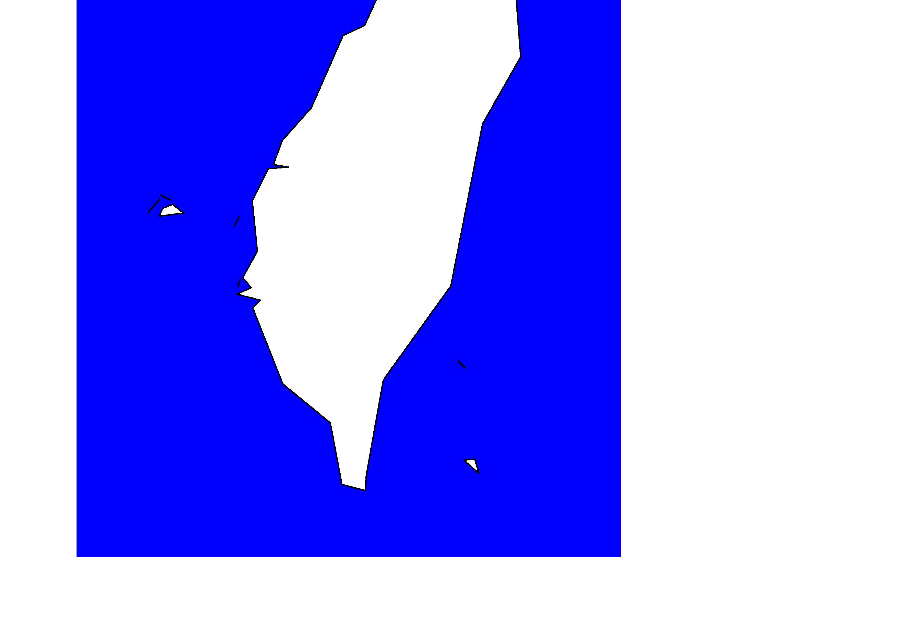
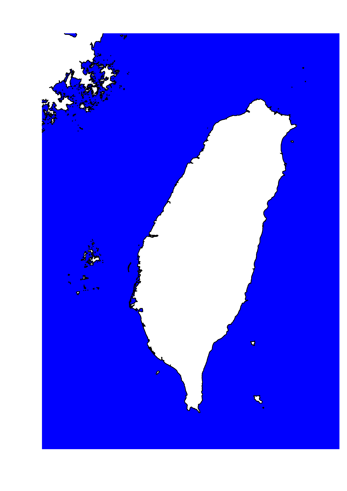
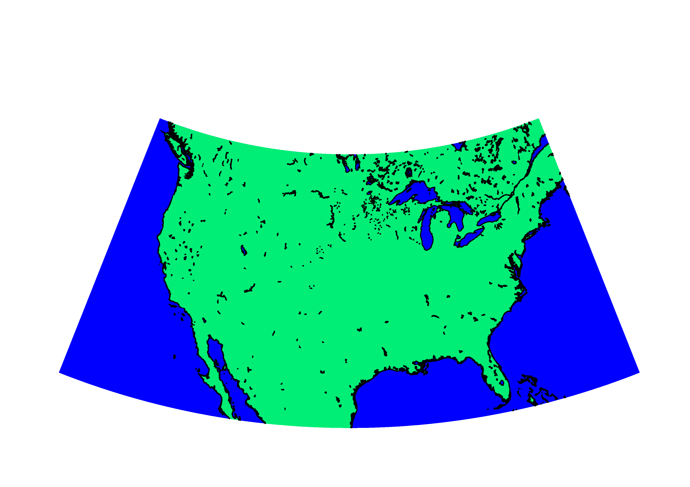
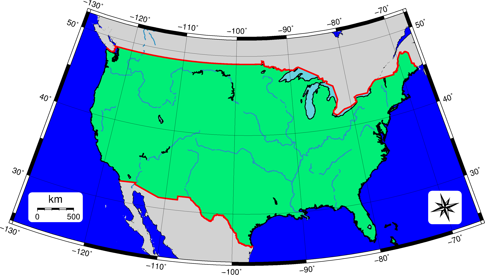
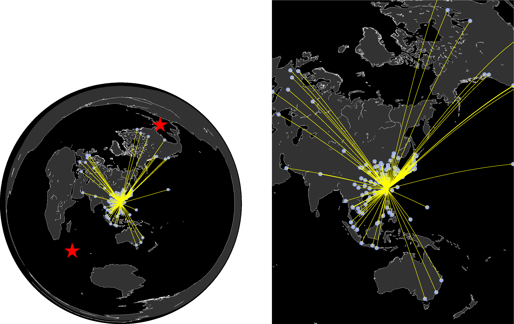
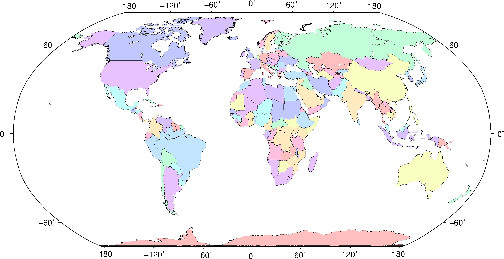
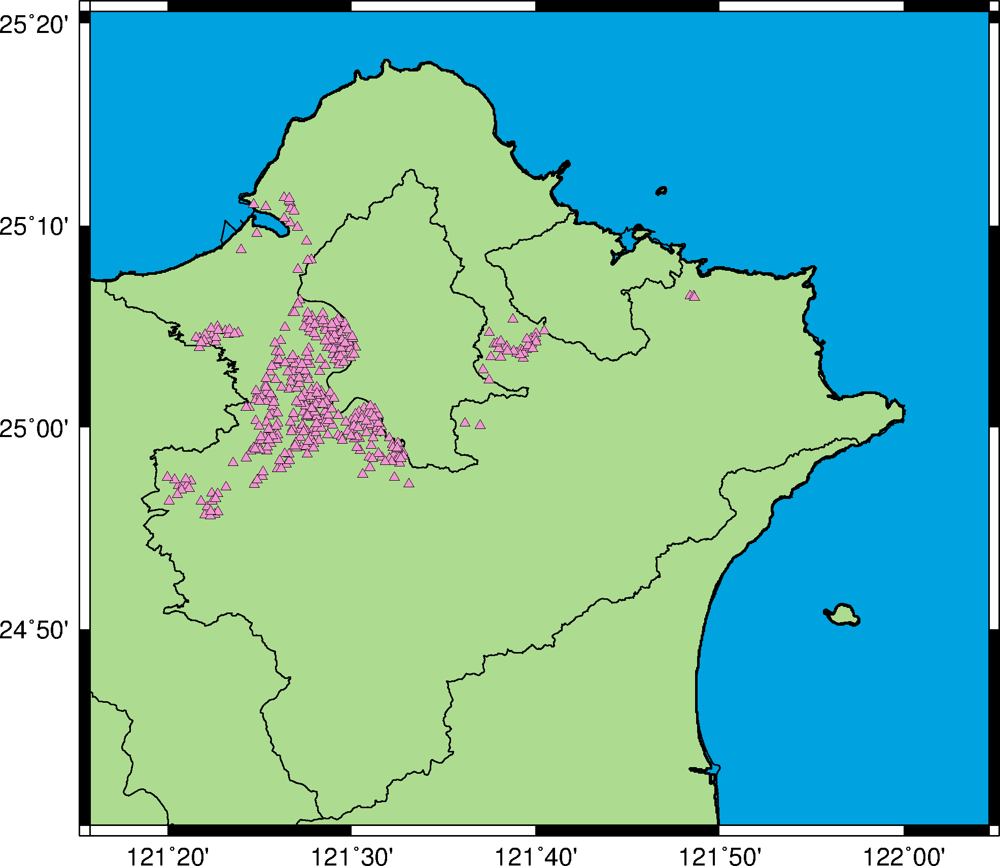
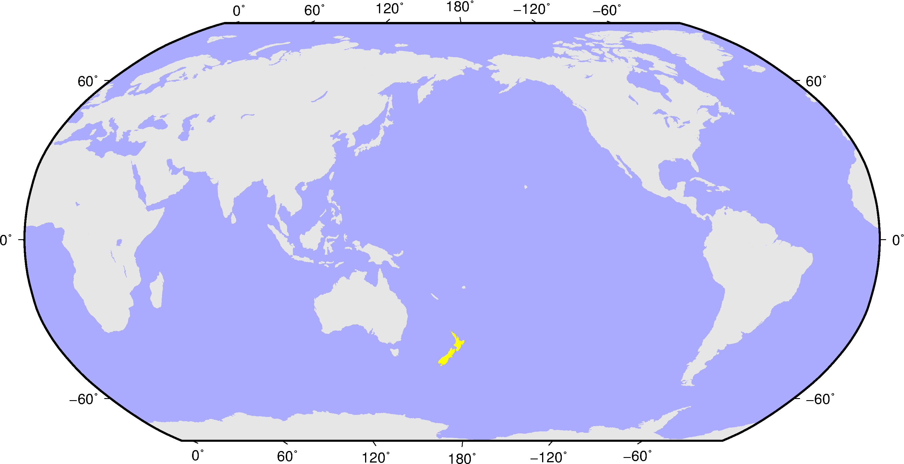

### 目錄
1. [總覽](/index.md)
2. [GMT介紹及安裝](/intro_install.md)
3. [網路資源及配套軟體](/net_software.md)
4. [第零章: 基本概念及默認值](/basic_defaults.md)
5. [第一章: 製作地圖(地理投影法)](/projection.md)
6. [第二章: XY散佈圖(其他投影法)](/xy_figure.md)
7. [第三章: 等高線圖及剖面](/contour_profile.md)
8. [第四章: 地形圖與色階](/topography_cpt.md)
9. [第五章: 地震活動性與機制解](/seismicity_meca.md)
10. [第六章: 向量與速度場](/vector_velocity.md)

---

## 5. 投影法
GMT在投影法方面，分成兩部份，如下圖，一部份是地理投影法，另一部分是其他投影法，

<p align="center">
  
</p>

本章節將主要介紹地理投影法，其中又分成四個子部份，分別是:

* 圓柱形投影(Cylindrical Projection): 因其圓柱體與地球弧面相切在赤道，相切處較為真實，
**多用於繪製低緯度或是赤道附近的國家**。
* 圓錐形投影(Conical Projection): 因標準緯度線相切在中緯度，**適合繪製中緯度的國家**，像是中國、美國。
* 方位投影(Azimuthal Projection): 將球投影到假設的中心點上，可以**正確顯示中心點與世界各地的實際距離**。
* 主題式投影(Thematic Projection): 為一些目的而設計的投影方式，例如莫爾威等積投影法(Mollweide Projection)，
因其等面積，常用於畫世界人口分佈圖，又例如羅賓森投影法(Robinson Projection)，綜合等角、等積投影的特性，
使投影結果不會變形太嚴重，常用於繪製世界地圖。

## 5.1 目的

本章將學習如何繪製
1. 麥卡托投影法(Mercator Projection)
2. 蘭伯特正形圓錐投影(Lambert Conic conformal Projection)
3. 等距方位投影(Azimuthal Equidistant Projection)
4. 羅賓森投影法(Robinson Projection)

將依序利用這四種繪製台灣、美國、桃園機場的航線圖以及世界行政分區地圖。

## 5.2 學習的指令與概念

* `pscoast`: 繪製海岸線
* `psxy`: 繪製線、多邊形、符號
* `psconvert`: 圖檔的輸出
* GMT共用選項: `-B`、`-J`、`-K`、`-O`、`-P`、`-R`
* GMT各模組細部選項的介紹
* 不同投影法的應用
* Winodws中批次檔`batch`常用指令
* `awk`語法的示範

## 5.3 麥卡托投影(`-Jm` `-JM`)
首先可以從Google Map或是Google Earth抓出台灣的經緯度範圍，

* Google Map:在選定的點上按右鍵，點選「這是哪裡?」(What's here?)，底下就會出現該點的經緯度。
* Google Earth: 滑鼠移至目標點，即可從下方讀取到該點的經緯度。使用Google Earth的時後，
請注意下方經緯度的表示方式，請至上方功能列中，點選工具->選項，在顯示經緯度的選項中，
勾選十進制度小數(decimal)。

使用十進制度小數的格式是由於數學計算上的方便以及GMT預設採用的座標表示法，關於經緯度表示格式之間的轉換關係，
可以參考[WIKI百科](https://en.wikipedia.org/wiki/Geographic_coordinate_conversion)。
請開啟命令提式字元(cmd.exe)或是終端機(terminal)，開啟方式可[參考4-1](basic_defaults.md#m4.1)，
接著輸入下方指令:
```bash
gmt pscoast
```
會看到一連串關於`pscoast`的說明，如果你對各選項的意思已經了解，可以透過:
```bash
gmt pscoast -
```
你將只看到選項用法出現在影幕上。通常GMT指令的語法如下:
```bash
gmt 模組 (輸入檔) [-選項1 -選項2 -選項3 ...] > 輸出檔名.ps
```
簡單來說，先選定你要用的模組，給定輸入的資料，配合該模組底下的選項，來達到你要繪製的圖形，
而<mark>-</mark>開頭會被GMT視作選項，沒有<mark>-</mark>開頭則被當做資料，所以其先後順序沒差，
不過為養成好習慣，建議按照下面的範例來輸入每一行指令。
```bash
# 第1行
gmt psxy (輸入檔) -J -R [-選項1 -選項2 ...] -K  > 輸出檔名.ps
# 中間各行
gmt psxy (輸入檔) -J -R [-選項1 -選項2 ...] -K -O >> 輸出檔名.ps
                          .  
                          .  
                          .
# 最後1行
gmt psxy (輸入檔) -J -R [-選項1 -選項2 ...] -O >> 輸出檔名.ps
```
這樣的好處是，在debug時候，可以快速發現自己遺漏了哪個部份，而<mark>></mark>及<mark>>></mark>
符號為輸出導向的符號，分別是「取代」與「累加」。

`pscoast`屬於比較特殊的模組，它可以用來畫海岸線、國界、河流等等的資訊，如果你在安裝GMT時有特別注意的話
你會發現在安裝GMT時，一同安裝的<mark>GSHHG</mark>資料庫，裡面包含上述的資訊，而`pscoast`會去調用此資料庫的資料，
因此不需要給定輸入檔，只需透過選項來調用需要的資訊。接下來，我們來看會用到的選項有哪些，中括號[]表示可選選項，
剩下的是必選選項。

* `-R`西邊界經度/東邊界經度/南邊界緯度/北邊界緯度。
* `-J`投影法(一個英文字母代碼)[中心點經度]/[中心點緯度]/規模(或是寬度)。
  * 當英文字母為小寫時，其大小設定為規模，表示每一度的寬度，或是用1:5000表示；
  * 字母為大寫時，表示整張圖的寬度。
  * GMT5的寬度預設值是公分(c)，如果要換單位，方式如`-JM6i`，變成圖的寬度設定為6英吋(inch)。
* `-S`海洋的顏色。在GMT中顏色的輸入有很多種，常見的有三種，以藍色為例，
  * Hex Color，十六進位色碼(#0000FF)
  * RGB Color，十進位制色碼(0/0/255)
  * 英文單字(blue)
  * 英文單字與RGB色碼之間的對照表，請[參考4-4顏色RGB對照表](basic_defaults.md#m4.4c)。
* `-W`寬度,顏色,樣式。

選定好的範圍是119.0/123.0/21.5/26.0，預定地圖的寬度為15公分，海洋顏色為藍色，海岸線的寬度是1公分，
顏色及樣式則採用預設值黑色及實線，指令如下:
```bash
gmt pscoast -R119.0/122.5/21.5/26.0 -JM18 -S0/0/255 -W1 > 5_3_taiwan.ps
```
來看看結果的圖長什麼樣。
<p align="center">
  
</p>
在預設紙張大小為A4的情況下，看到台灣北部並沒有被涵蓋在A4的紙張上，是什麼原因呢？
原來是因為GMT預設紙張方向是橫向(Landscape)，如果要改成縱向(Portrait)，需要加上`-P`這個選項。
再來是這海岸線的解析度也太粗糙了吧！我們可以透過`-D`這個選項來改善這問題，其解析成度分別是
詳細(<mark>f</mark>ull)、高度(<mark>h</mark>igh)、中度(<mark>i</mark>ntermediate)、
低度(<mark>l</mark>ow)、粗糙(<mark>c</mark>rude)，海岸線的解析度預設值是低度(l)，
也可以透過自動(<mark>a</mark>uto)，依照地圖尺寸來決定海岸線的解析度。
接著陸地是白色，似乎有點單調，來試看看用`-G`英文單字，來更改陸地的顏色，
於是乎將指令改寫如下:
```bash
gmt pscoast -R119.0/122.5/21.5/26.0 -JM18 -S0/0/255 -Gspringgreen2 -W1 -Df -P > 5_3_taiwan.ps
```
<p align="center">
  
</p>
看起來，這圖已經有點起色了，但好像還缺少點什麼，例如地圖比例尺(map scale)、
地圖方向標(map directional rose)、座標框架(map boundary frame and axes attributes)等等，
這些我們將在下一節提到。

## 5.4 蘭伯特投影(`-Jl` `-JL`)

美國幅員遼闊，經度橫跨約55度，且主要在中緯度，不適合使用麥卡托投影(`-JM`)，因此這邊介紹蘭伯特投影法(`-JL`)。
與前一節一樣，先初步畫出美國的國土，給定範圍在-130/-66/24/52，但`-JL`的用法較不一樣，
它需要的格式是`-JL`中心點經度/中心點緯度/固定緯度線1/固定緯度線2/寬度，指令如下:
```bash
gmt pscoast -R-130/-66/24/52 -JL-98/35/33/45/25 -S0/0/255 -Gspringgreen2 -W1 -Df > 5_4_unitedstate.ps
```
其結果為
<p align="center">
  
</p>

中心點的經度，表示該經度線為垂直線，而中心點緯度則不影響，兩條固定緯度線則請想像用圓錐去罩住一顆球，
當你罩的緯度範圍越大，越接近平面。接下來看看有什麼地方需要改善，

* `-A`最小區域(km^2)。
* `-B`設定地圖框架及軸的參數。
  * `-BWESN`用來設定東西南北的框架(frame)及註解(annotation)，大寫表示同時畫框架及寫註解，
  小寫則為只畫框架，沒寫則無框架及註解。
  * `-B`軸a[數字][f數字][g數字]，軸用x、y來代表水平及垂直，a給定主要註解及刻度(ticks)，f給定次要刻度，
  而g則是格線(gridline)，後面的數字代表間隔。
* `-C`湖的顏色。
* `-E`國碼+g顏色。
* `-F`設定比例尺或是方向標的邊框。
* `-I`河的種類/畫筆設定。種類數字或英文對應河的種類(主流、支流)，請自行參考官網說明。
* `-L`比例尺對應的中心點方式/中心點經度/中心點緯度+c參考緯度+w比例尺長度(默認單位km)+f黑白相間的比例尺+l標籤。
* `-N`行政邊界(種類)/畫筆設定。
  *種類對應，1表示國家邊界；2表示州邊界(美國);3表示領海邊界;a表示全部邊界。
* `-T`指針方向標(d)[羅盤方向標(m)]對應的中心點方式/中心點經度/中心點緯度+w寬度+l標籤

透過上述的選項，將這張美國地圖做了一些改善，包括省略面積500km^2以下的湖泊，加上經緯度外框、網格線、
比例尺、方向標，更改湖泊、河川的顏色，把墨西哥(MX)及加拿大(CA)國土變成灰色，以下是指令及成果圖。
```bash
gmt pscoast -R-130/-66/24/52 -JL-98/35/33/45/25 -A500 -BWESN ^
-Bxa10g10 -Bya10f5g10 -C104/210/223 -Df -EMX,CA+g210 ^
-Gspringgreen2 -N1/2,red -S0/0/255 -Lg-125/27+c27+w500+f+l"km" ^
-I1.5/1,41/143/194,solid -Tdg-70/27+w1.5+f2 -W1 -F+g255+r > ^
5_4_unitedstate.ps
```
<p align="center">
  
</p>

應該注意到上面的指令，多出現了一種符號<mark>^</mark>。因為使用的選項很多，造成指令過長，
這時候就需要換行符號來告訴電腦，這指令編寫長度到這要進行換行，在Windows環境中使用<mark>^</mark>，
Linux及MAC則使用<mark>\</mark>。

## 5.5 <a name="m5.5"></a>等距方位投影(`-Je` `-JE`)
在這節開始之前，先介紹在Windows的環境下什麼是批次檔(.bat)，或是在Linux或MAC環境下的shell scripts(.sh)。
主要的原因是:
* 連續的指令單一化: 要把一行行指令打在指令環境底下，要排序或是更改都會變得十分麻煩，
這時後就需要有個檔案(.bat)可以彙整這些指令，透過執行批次檔來達到一行行指令的輸入。
* 簡易的資料處理: 在GMT的資料輸入檔，常常會需要特定欄位的資料，而往往拿到的資料檔，是有非常多欄位是用不到的，
不可能每次都改寫資料檔，這時後就可以調用awk，來達到簡單的數據資料處理。

筆者在編譯此教程是預設在Windows環境底下，但為了處理資料方便，另外安裝了[Gawk for Windows](http://gnuwin32.sourceforge.net/packages/gawk.htm)，
並把執行檔(bin)路徑加入系統環境變數下，設定方式可[參考此網頁](https://openhome.cc/Gossip/JavaEssence/WhatPath.html)，
如果你熟悉使用Linux其他指令，也可以安裝[Cygwin](https://www.cygwin.com/)。

回到本節重點，要利用等距方位投影法來繪製桃園機場的航線圖，首先要收集的是桃園機場的航班資訊，
利用在[3.1提到](net_software.md#m3.1)的政府資料開放平台，
找到了[桃園國際機場定期航班](https://data.gov.tw/dataset/7869)的資料檔(.csv)，依照網頁上的欄位說明，
了解到第一欄為班機性質，本範例只選用客機起飛(PD)的資料，但這份資料缺少了各機場的經緯度資訊，
利用Google大神，找到了提供[機場經緯度的資料](https://openflights.org/data.html)，下載好airports.dat後，
透過Python(一種程式語言)，將兩筆資料整理合併，完成後的檔案有5欄，
分別是流水碼、班機性質、目的地、緯度、經度，也整理了一份航線的資料檔給GMT用。
先來看成果圖及批次檔，再逐行說明。

使用的資料檔:
- [桃園航班資訊](dat/TPE_airline.dat)
- [桃園航線](dat/TPE_airline.gmt)

成果圖
<p align="center">
  
</p>

批次檔
```bash
set ps=5_5_TPEairline.ps

gmt pscoast -Rg -JE121.2342/25.0797/12 -S0 -G50 -W.2,white -A1000 -K > %ps%
echo 40 -45 | gmt psxy -R -JE -Sa.8 -Gred -K -O >> %ps%
echo -80 20 | gmt psxy -R -JE -Sa.8 -Gred -K -O >> %ps%
awk "{print $5, $4}" TPE_airline.dat | gmt psxy -R -JE -Sc.15 -G159/174/229 -K -O >> %ps%
gmt psxy TPE_airline.gmt -R -JE -W.3,yellow -K -O >> %ps%

gmt pscoast -R40/-45/-80/20r -JE121.2342/15.0/12 -S0 -G50 -W.2,white -A1000 -X13.5 -K -O >> %ps%
awk "{print $5, $4}" TPE_airline.dat | gmt psxy -R -JE -Sc.2 -G159/174/229 -K -O >> %ps%
gmt psxy TPE_airline.gmt -R -JE -W.3,yellow -O >> %ps%

gmt psconvert %ps% -Tg -A -P
```

透過範例，學習到的新用法:
* 第1行: `set 變數名=字串`這個指令，可以設定變數供其他指令來使用，而呼叫的方式是`%變數名%`，範例中，
將變數名ps設定成要輸出的ps檔檔名，方便之後改輸出檔名時，不需要一個個改或是利用取代的方式(有可能出錯)。
* 第3行:
  * `-Rg`代表全球尺度
  * `-JE`中心點經度/中心點緯度/寬度
* 第4行:
  * `echo [資料1 資料2 ...] | gmt 模組 [選項1 選項2 ...]`，透過`echo`呼叫自訂的資料來符合模組所需要的格式。
  * `psxy -Sa.8 -Gred`，-S表示畫符號(Symbol)；a表示星星符號，英文字母及符號對應可[參考4-4](basic_defaults.md#m4.4s)；
  .8表示尺寸；-Gred表示填滿紅色。
  * 所以這行表示在東經40度/南緯45度及西經80度/北緯20度，畫紅色的星星符號。
* 第6行: `awk`會自動將以空格區分的檔案資料辨識成以行跟列排序的表格，`"{print $5, $4}"`表示列出第五及第四欄的資料，
即經度及緯度，最後則接上要擷取的檔案檔名，更多的用法，可參考[鳥哥的Linux私房菜](http://linux.vbird.org/linux_basic/0330regularex.php)。
* 第7行: 要繪製兩機場之間的連線，需要兩點的經緯度，透過讀取<mark>TPE_airline.gmt</mark>來實現，而檔案的格式是:
  ```bash
  >
   121.2342  25.0797
   103.9940   1.3502
  >
   121.2342  25.0797
   139.7800  35.5523
  >
   .
   .
   .
  ```
可以看到兩點的經緯度透過<mark>></mark>分開，原來GMT會自動將<mark>></mark>內的資料視為同一組，藉由此方式，
就輕鬆地完成兩機場之間的連線。`psxy`除了能畫符號，也能透過-W來繪製線。
* 第9行: 將-R範圍改成之前星號的經緯度並在後面加上字母r，來放大想看的區域(GMT現無支援圓形的放大)，
-X是用來移動圖形的水平位置(正號往右；負號往左)，同理-Y則是移動垂直位置，而這指令將延續影響到後面的圖形位置。
* 第13行: `psconvert`是將ps檔轉換成其他圖檔格式，-T圖檔格式，常用的有.pdf(**f**)、.png(**g**)、.jpeg(**j**)，
-A調整紙張邊界至最貼齊圖形，-P強制縱向模式，透過此橫向的圖將再縱向模式顯示未被旋轉。

透過繪製桃園機場的航線圖，學習如何利用批次檔來完成一張圖，往後都會以此模式來介紹不同的圖形繪製。

## 5.6 羅賓森投影法(-Jn -JN)
由羅賓森(Arthur H. Robinson)博士在1963年提出，此方法不等積、不等角，使用筆直的緯線及空間均勻分佈的經線，
加上對經緯度線乘上一個插值表，來實現視覺上平衡。本節將製作全球行政分區地圖，
透過`pscoast -E+l > CountryCode.txt`可以將各國的國碼及國名輸出成一個檔案，透過Python做了隨機排序及整檔，
輸出這次範例所需要的[資料檔](dat/CountryCode.dat)，但要如何利用這個檔案，幫不同國家上色呢？
本節將會使用到`setlocal`讓批次檔現可以接受一個選項引數，
`ENABLEDELAYEDEXPANSION`啟用延遲環境變數擴充功能，來批次設定國家的顏色。讓我們來看成果及批次檔吧！

使用的資料檔:
- [顏色對應國碼檔](dat/CountryCode.dat)

成果圖
<p align="center">
  
</p>

批次檔
```bash
set ps=5_6_globalNationalBoundary.ps

setlocal ENABLEDELAYEDEXPANSION
set vidx=0
for /F "tokens=2" %%A in (CountryCode.dat) do (
    set /A vidx=!vidx! + 1
    set var!vidx!=%%A
)
set var

set vidx=0
for /F "tokens=1" %%A in (CountryCode.dat) do (
    set /A vidx=!vidx! + 1
    set color!vidx!=%%A
)
set color

gmt pscoast -R-180/180/-79/90 -JN0/25 -W1 -Ba -K > %ps%
gmt pscoast -R -JN -E%var1%+g%color1% -K -O >> %ps%
gmt pscoast -R -JN -E%var2%+g%color2% -K -O >> %ps%
gmt pscoast -R -JN -E%var3%+g%color3% -K -O >> %ps%
gmt pscoast -R -JN -E%var4%+g%color4% -K -O >> %ps%
gmt pscoast -R -JN -E%var5%+g%color5% -K -O >> %ps%
gmt pscoast -R -JN -E%var6%+g%color6% -K -O >> %ps%
gmt pscoast -R -JN -E%var7%+g%color7% -K -O >> %ps%
gmt pscoast -R -JN -E%var8%+g%color8% -K -O >> %ps%
gmt pscoast -R -JN -E%var9%+g%color9% -K -O >> %ps%
gmt pscoast -R -JN -E%var10%+g%color10% -K -O >> %ps%
gmt pscoast -R -JN -A10000 -N1 -W.2 -S255 -O >> %ps%

gmt psconvert %ps% -Tg -A -P
```

透過範例，學習到的新用法:
* 第4行: 首先設定變數`vidx=0`，因為在後面的迴圈中會每次累加1，
讓每次的變數名從**var1**變**var2**一直到**var10**。
* 第5行: 利用`for`迴圈將檔案中一行行讀取資料，
用法`for /f ["選項"] %%參數名 in (檔名或字串) do 指令`，tokens=2表示讀取每行中第二欄的資料。
* 第6行: 默認的set變數值為字串，透過/A轉換成整數，其中`!vidx!`為延遲表達變數(delayed expansion variable)，
用以實現每次迴圈中，**vidx**就加1。
* 第7行: **var1**、**var2**等等，對應到檔案中的第一行第二欄、第二行第二欄等等。
* 第9行: 這時候才將剛剛延遲表達的變數一次設定好。

顏色變數的設定用法與國碼相同，當這些變數都設置好後，就交給GMT來把圖畫出來吧！`-JN`中心經度/寬度，
將投影法設定為羅賓森投影法，剩下的指令或選項都以在前面各節描述。

## 5.7 習題
已經學過了四種不同應用方向的投影法，接下來，將有兩個習題，來熟習GMT的用法吧！
* 1.利用政府資料開放平台，提供的[新北市公共自行車租賃系統(YouBike)資料](https://data.gov.tw/dataset/28318)，
為.csv檔，如何利用`awk -F "," "指令"`來將經緯度資料擷取出來，用`psxy`畫出哪裡有YouBike的站點，
經緯度範圍可用<mark>121.263/122.077/24.671/25.343</mark>，
另外提供[縣市邊界的資料](dat/city_twd97.gmt)(未來會教導如何製作)，試著畫一張新北市YouBike的點位圖。
<p align="center">
  
</p>
* 2.透過羅賓森投影法，繪製全球地圖，將你最喜歡的國家，設為中心點經度，並用一個特別的顏色標示出來。
編者使用紐西蘭當作範例。
<p align="center">
  
</p>

## 5.8 參考批次檔
列出本章節使用的批次檔，供讀者參考使用，檔案路經可能會有些許不同，再自行修改。
* [5_3_taiwan](bat/5_3_taiwan.bat)
* [5_4_unitedstate](bat/5_4_unitedstate.bat)
* [5_5_TPEairline](bat/5_5_TPEairline.bat)
* [5_6_globalNationalBoundary](bat/5_6_globalNationalBoundary.bat)
* [5_7_youBike](bat/5_7_youBike.bat)
* [5_7_favoriteCountry](bat/5_7_favoriteCountry.bat)

---

[上一章](/basic_defaults.md) -- [下一章](/xy_figure.md)
