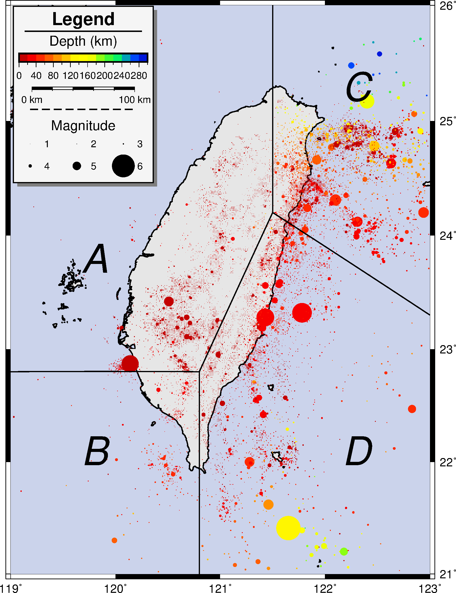
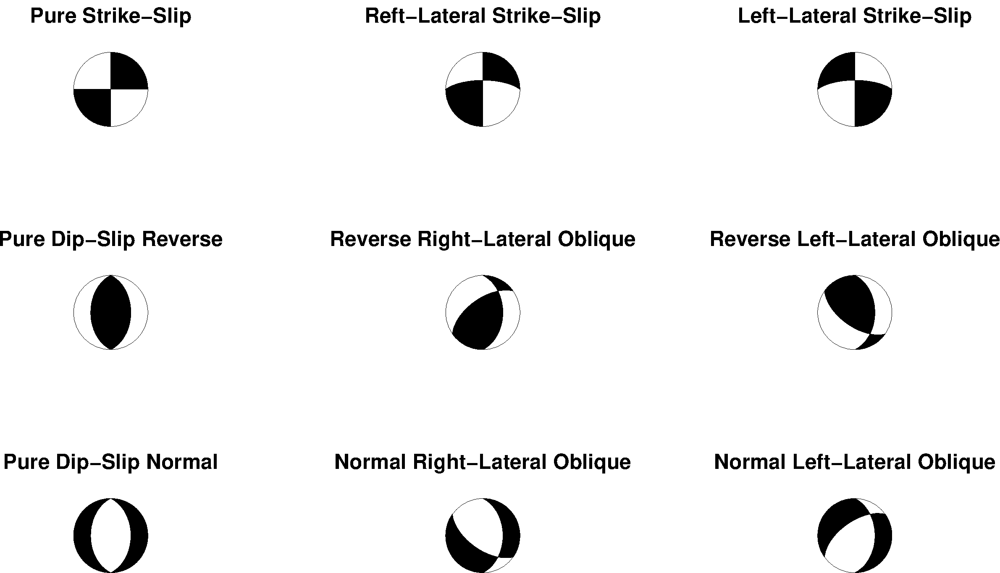
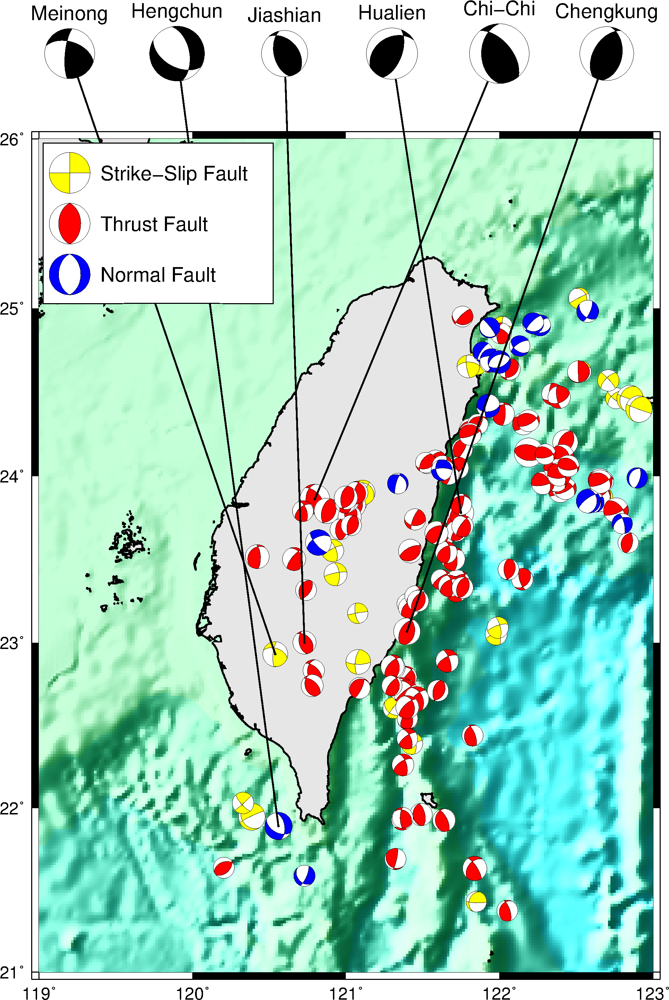

### 目錄
1. [總覽](/index.md)
2. [GMT介紹及安裝](/intro_install.md)
3. [網路資源及配套軟體](/net_software.md)
4. [第零章: 基本概念及默認值](/basic_defaults.md)
5. [第一章: 製作地圖(地理投影法)](/projection.md)
6. [第二章: XY散佈圖(其他投影法)](/xy_figure.md)
7. [第三章: 等高線圖及剖面](/contour_profile.md)
8. [第四章: 地形圖與色階](/topography_cpt.md)
9. [第五章: 地震活動性與機制解](/seismicity_meca.md)

---

## 9. 地震活動性與機制解
地震活動性是描述一段時間內，地震的空間分佈特性，包含其位置及深度，也紀錄地震強度的變化。
震源機制解是描述地震發震機制的一種方式，地震的發生，是由於斷層發生錯動，而透過對地震訊號進行分析，
從不同的測站得到地震波的方位角、入射角及初動的類型，把這些紀錄投影在大圓上，匯集資料得出震源機制解。

## 9.1 目的
  1. 地震活動性(Seismicity)
  2. 震源機制解(Focal Mechanism)
  3. 地震剖面(Seismicity Profile)

## 9.2 學習的指令與概念

* `gmtinfo`: 從表格資料中讀取資訊
* `psmeca`: 繪製震源機制解
* `psxy`: 繪製線、多邊形、符號
* Windows中批次檔`batch`常用指令
* `awk`語法的示範

## 9.3 地震活動性
從[地球物理資料庫](http://gdms.cwb.gov.tw/index.php)下載2017台灣地區的地震目錄(catalog)，資料共4欄，
分別是震央經度、震央緯度、深度、芮氏規模，透過GMT繪製地震活動性的地圖，
來更加了解台灣的地震分佈與地體構造活動。

使用的資料檔:
- [2017地震活動性](dat/2017_catalog.gmt)

成果圖
<p align="center">
  
</p>

批次檔
```bash
set ps=9_3_seismicity.ps
set data=D:\GMT_data\
set cpt=seis.cpt

# 1. seismicity basemap
gmt gmtinfo 2017_catalog.gmt -i2 -T20 > tmp
set /p cr=<tmp
gmt makecpt -C%cpt% %cr% > tmp.cpt
gmt psbasemap -R119/123/21/26 -JM15 -BwESn -Bxa -Bya -P -K > %ps%
gmt pscoast -R -JM -Df -W1 -S203/211/235 -G230 -K -O >> %ps%
awk "{print $1,$2,$3,exp($4)*0.002}" 2017_catalog.gmt | ^
gmt psxy -R -JM -Ctmp.cpt -Sc -K -O >> %ps%

# 2. magnitude calculation
echo 1 > tmp
for /l %%i in (2, 1, 6) do (echo %%i >> tmp)
setlocal ENABLEDELAYEDEXPANSION
set vidx=0
for /f %%i in ('awk "{print exp($1)*0.002}" tmp') do (
    set /A vidx=!vidx! + 1
    set var!vidx!=%%i
)
set var

# 3. boundary of four seismic zones
echo 119.0 22.8 > tmp
echo 120.8 22.8 >> tmp
echo ^> >> tmp
echo 120.8 21.0 >> tmp
echo 120.8 22.8 >> tmp
echo ^> >> tmp
echo 120.8 22.8 >> tmp
echo 121.5 24.2 >> tmp
echo ^> >> tmp
echo 121.5 26.0 >> tmp
echo 121.5 24.2 >> tmp
echo ^> >> tmp
echo 123.0 23.3 >> tmp
echo 121.5 24.2 >> tmp
echo ^> >> tmp
gmt psxy tmp -R -JM -W1 -K -O >> %ps%
echo 119.8 23.8 A | gmt pstext -R -JM -F+f40p,2 -K -O >> %ps%
echo 119.8 22.1 B | gmt pstext -R -JM -F+f40p,2 -K -O >> %ps%
echo 122.3 25.3 C | gmt pstext -R -JM -F+f40p,2 -K -O >> %ps%
echo 122.3 22.1 D | gmt pstext -R -JM -F+f40p,2 -K -O >> %ps%

# 4. legend set
echo H 18 1 Legend > tmp
echo D 0.4 1p >> tmp
echo G .7 >> tmp
echo B tmp.cpt 0.2 0.3+ml -Ba40f20+l"Depth (km)" >> tmp
echo G .3 >> tmp
echo M 121 23.5 100+u +f >> tmp
echo G .1 >> tmp
echo D 0.6 1p,0,- >> tmp
echo G .2 >> tmp
echo L 14 0 C Magnitude >> tmp
echo N 3 >> tmp
echo G .2 >> tmp
echo S .5 c %var1% 0 0 1 1 >> tmp
echo S .5 c %var2% 0 0 1 2 >> tmp
echo S .5 c %var3% 0 0 1 3 >> tmp
echo G .4 >> tmp
echo S .5 c %var4% 0 0 1 4 >> tmp
echo S .5 c %var5% 0 0 1 5 >> tmp
echo S .5 c %var6% 0 0 1 6 >> tmp
echo G .3 >> tmp
gmt pslegend tmp -R -JM -C.1/.1 -Dx.1/14+w5 -F+g245+p1+s4p/-4p/gray50 ^
--FONT_ANNOT_PRIMARY=10p --FONT_LABEL=14p -K -O >> %ps%

gmt psxy -R -JM -T -O >> %ps%
gmt psconvert %ps% -Tg -A -P
del tmp*
```
學習到的指令:

<mark>1</mark>繪製地震活動性底圖
* `gmtinfo`讀取第三欄(深度)做色階的範圍。
  * `-T`間隔，輸出成<mark>-Tz軸最小/z軸最大/z間隔<mark>。
* `awk`將第四欄(規模)透過exp()做指數函數運算。
* `psxy`利用`-C`色階檔，將依照第三欄(深度)做顏色的變化；
`-Sc`在不給數值的情況下，將會讀取第四欄(規模)做圖形大小的變化。

<mark>2</mark>利用迴圈設定1~7規模轉換數值後的變數
* `echo 1 > tmp`及`for /l..`製造1~7的tmp暫存檔。
* `awk`tmp暫存檔做規模數值轉換。
* `set var!vidx!=%%i`迴圈設定變數。

<mark>3</mark>繪製地震分區邊界
* `echo ^> >> tmp`要把<mark>></mark>加入暫存檔中，需要多加上<mark>^</mark>符號，
將<mark>></mark>從特殊字元轉為一般字元。

<mark>4</mark>製作圖例說明
* `pslegend`
  * `B`繪製色彩條。格式為`B cpt檔 兩邊間隔 色彩條高度`。
    * 可在高度後增加`[+e][+h][+m]`等等，也可增加`-B`、`-I`等等參數，可參考`psscale`模組。
  * `M`繪製比例尺。格式為`M 經度 緯度 長度`。
    * 可在長度後增加`[+f][+l][+u]`等等，也可增加`-F`、`-R`等等參數，可參考`psbasemap`模組。
  * `L`增加指令的文字。格式為`L 字體大小 字體 對齊方式 文字`

之前在畫地形圖的時後有提到如何在二維的平面上表現三維的資料，
有提到顏色可以做為第三維度的呈現方式，這邊示範了利用圖案的大小，來呈現第四維度的變化，
所以當`psxy`在給定`-C`及`-S`時後，會分別對應到資料檔的第三及第四欄，
依照數值的大小去做變化。

從圖中來看，台灣的地震主要分佈分成四塊(<mark>Wu and Chen, 2007</mark>[^1])，
A表示西部地震帶，位在歐亞大陸版塊上，多數發生在此地區的地震，是受到活動斷層影響；
B是西南部地震帶，本區大部份位在南中國海板塊上，是四個區塊中，地震活動性最少的；
C代表東北部地震帶，包含了琉球隱沒帶及沖繩海溝，許多規模較大、
深度較深的隱沒帶地震發生於此區，並有一些火山活動；D是東南部地震帶，
受到歐亞板塊與菲律賓海板塊碰撞，造成大量的地震發生，不乏一些規模大於5的地震。

[^1]: Seismic reversal pattern for the 1999 Chi-Chi, Taiwan, Mw 7.6 earthquake (Y.M. Wu and C.C. Chen, 2007)

## 9.4 震源機制解
本節將示範如何將震源機制解運用海灘球(beach ball)圖示，來表示不同的斷層形態，
並將台灣幾個較著名的災害性地震的機制解繪製出來，首先提供可以下載機制解的網頁，如下:
- [BATS](http://tecws.earth.sinica.edu.tw/BATS/cmtbyform.php)，由中研院管理，
提供台灣地震的震源機制解。
- [Global CMT](http://www.globalcmt.org/CMTsearch.html)，
由Lamont-Doherty Earth Observatory (LDEO) of Columbia University開發，
提供全球的震源機制解。

成果圖
<p align="center">
  
</p>

在繪製震源機制解時，有幾種檔案格式會被提到，`-Sa`用Aki and Richards制訂的震源機制格式，
`-Sc`Harvard CMT定義的格式等等，會在接下來詳細介紹，而上圖是利用`-Sa`完成的，
會需要斷層的三個參數，走向(strike)、傾角(dip)、滑移角(rake)，
而各形態的斷層分類是依據滑移角的角度，其參考表格(<mark>Cronin, 2004</mark>[^2])如下:

|Rake of Slip (degree)|Fault Type                   |
|:-------------------:|-----------------------------|
|0 or 180             |pure strike-slip             |
|90                   |pure dip-slip reverse        |
|-90                  |pure dip-slip normal         |
|-20 to 20            |left-lateral strike-slip     |
|20 to 70             |reverse left-lateral oblique |
|70 to 110            |reverse                      |
|110 to 160           |reverse right-lateral oblique|
|-160 to 160          |right-lateral strike-slip    |   
|-110 to -160         |normal right-lateral oblique |
|-70 to -110          |normal                       |      
|-20 to -70           |normal left-lateral oblique  |

[^2]: A draft primer on focal mechanism solutions for geologists (V. Cronin, 2004)

接下來，將利用上述分類模式，將走向滑移斷層(圖中第一列)用黃色表示；
逆斷層(圖中第二列)用紅色表示；正斷層(圖中第三列)用藍色表示，繪製由<mark>BATS</mark>提供
1996~2017台灣地區規模大於5的震源機制解，並將幾個著名災害性地震標示出來。

使用的資料檔:
- [台灣震源機制解](dat/focal_mechanism.gmt)

成果圖
<p align="center">
  
</p>

批次檔
```bash
set ps=9_4_taiwan_focal.ps
set data=D:\GMT_data\

# 1. focal meca basemap
gmt psbasemap -R119/123/21/26 -JM15 -BWeSn -Bxa -Bya -P -K > %ps%
gmt grdimage %data%ETOPO1_Bed_g_gmt5.grd -R -JM -Cgebco.cpt ^
-I%data%ETOPO1_Bed_g_gmt5_shad.grd -K -O >> %ps%
gmt pscoast -R -JM -Df -W1 -G230 -K -O >> %ps%
rem left-lateral strike-slip
awk "{if ($6>=-20 && $6<20) print $1,$2,$3,$4,$5,$6,$7,$8,$9}" focal_mechanism.gmt | ^
gmt psmeca -R -JM -Sa.5 -Gyellow -K -O >> %ps%
rem right-lateral strike-slip
awk "{if ($$6>=160 || 6<-160) print $1,$2,$3,$4,$5,$6,$7,$8,$9}" focal_mechanism.gmt | ^
gmt psmeca -R -JM -Sa.5 -Gyellow -K -O >> %ps%
rem reverse fault
awk "{if ($6>=20 && $6<160) print $1,$2,$3,$4,$5,$6,$7,$8,$9}" focal_mechanism.gmt | ^
gmt psmeca -R -JM -Sa.5 -Gred -K -O >> %ps%
rem normal fault
awk "{if ($6>=-160 && $6<-20) print $1,$2,$3,$4,$5,$6,$7,$8,$9}" focal_mechanism.gmt | ^
gmt psmeca -R -JM -Sa.5 -Gblue -K -O >> %ps%

# 2. earthquake event
echo 120.54 22.93 16 288.36 51.02 19.79 6.11 119.2 26.5 Meinong > tmp
echo 120.56 21.89 41 118.64 50.07 -128.06 6.7 119.9 26.5 Hengchun >> tmp
echo 120.73 23 18 318.05 41.39 67.64 5.66 120.6 26.5 Jiashian >> tmp
echo 121.75 23.78 41 237.95 37.03 120.73 6.26 121.3 26.5 Hualien >> tmp
echo 120.797500 23.861667 8.140 320.06 57.39 66.04 7.30 122.0 26.5 Chi-Chi >> tmp
echo 121.3982 23.0667 18 8.82 42.16 72.8 6.58 122.7 26.5 Chengkung >> tmp
gmt psmeca tmp -R -JM -Sa1/14p/6 -Gblack -C1 -N -K -O >> %ps%

# 3. legend set
echo 119 26 > tmp
echo 119 25.05 >> tmp
echo 120.5 25.05 >> tmp
echo 120.5 26 >> tmp
gmt psxy tmp -R -JM -G255 -W.5 -D.1/-.1 -K -O >> %ps%
echo 119.2 25.8 0 0 90 0 5 | gmt psmeca -JM -R -Sa1 -Gyellow -K -O >> %ps%
echo 119.4 25.8 Strike-Slip Fault | gmt pstext -JM -R -F+f14p+jML -K -O >> %ps%
echo 119.2 25.5 0 0 45 90 5 | gmt psmeca -JM -R -Sa1 -Gred -K -O >> %ps%
echo 119.4 25.5 Thrust Fault | gmt pstext -JM -R -F+f14p+jML -K -O >> %ps%
echo 119.2 25.2 0 0 45 -90 5 | gmt psmeca -JM -R -Sa1 -Gblue -K -O >> %ps%
echo 119.4 25.2 Normal Fault | gmt pstext -JM -R -F+f14p+jML -K -O >> %ps%

gmt psxy -R -JM -T -O >> %ps%
gmt psconvert %ps% -Tg -A -P
del tmp*
```
學習到的指令:

<mark>1</mark>繪製機制解底圖

## 9.5 地震剖面

## 9.6 習題

## 9.7 參考批次檔
列出本章節使用的批次檔，供讀者參考使用，檔案路經可能會有些許不同，再自行修改。


---

[上一章](/topography_cpt.md) -- [下一章](/seismicity_histo.md)

---

### 註腳
