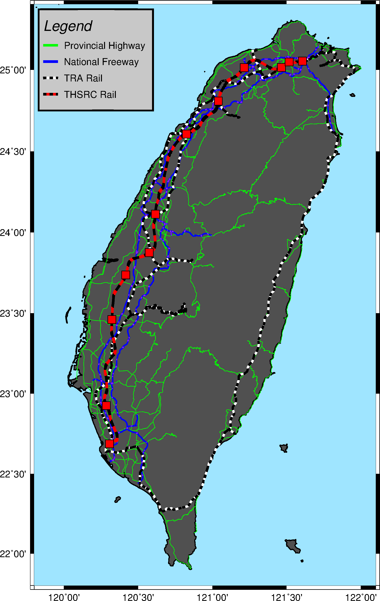
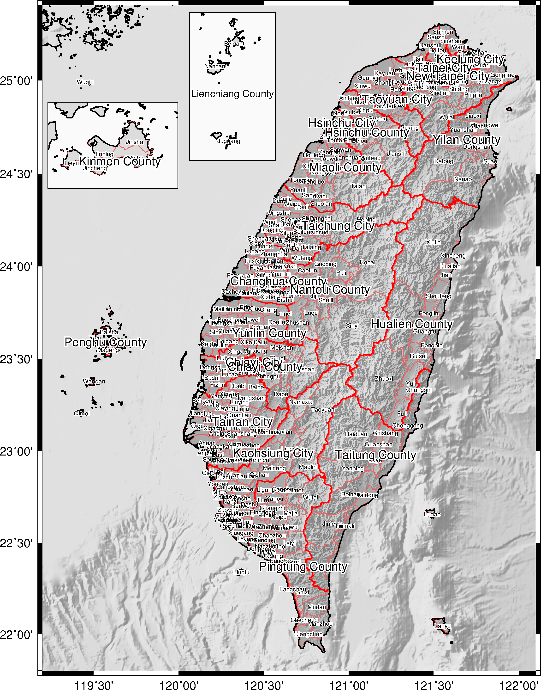
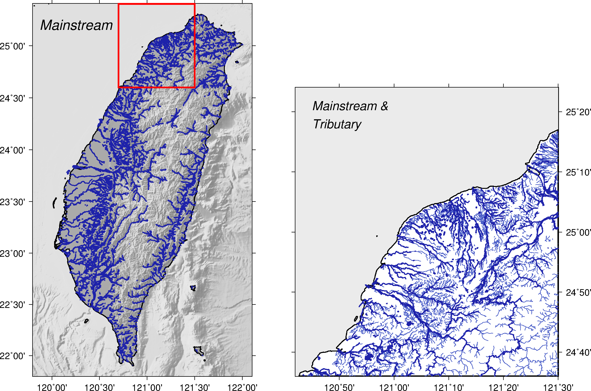
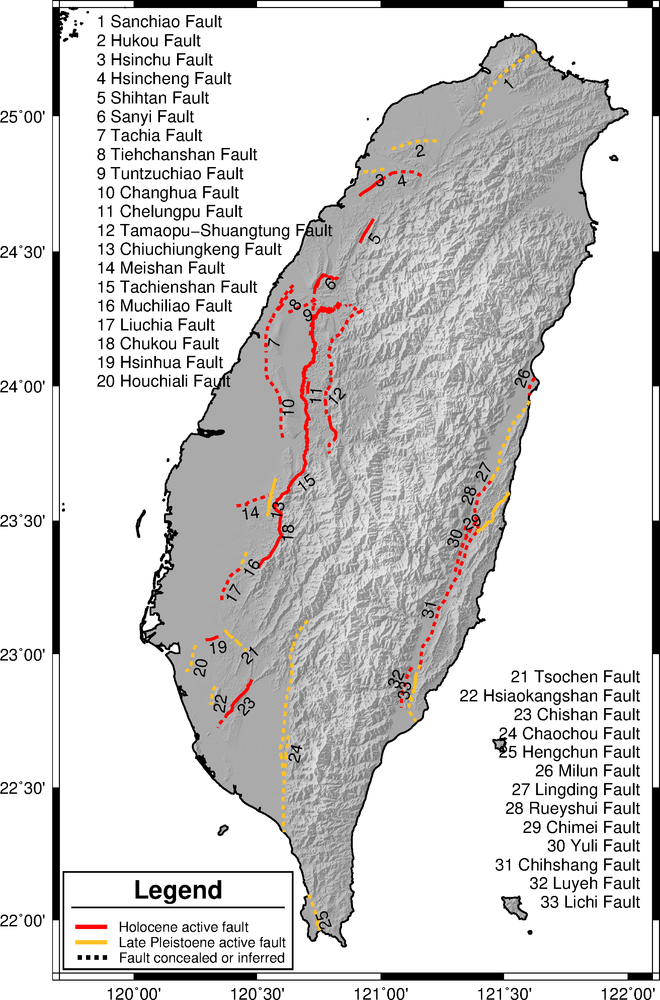
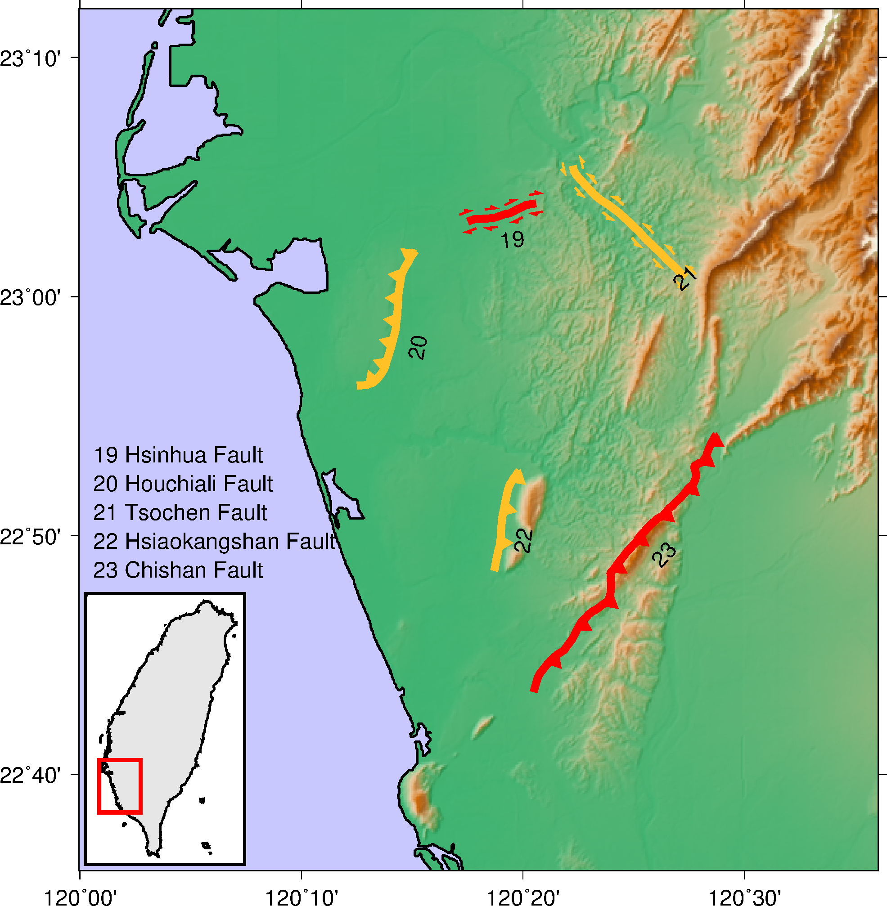

### 目錄
1. [總覽](/index.md)
2. [GMT介紹及安裝](/intro_install.md)
3. [網路資源及配套軟體](/net_software.md)
4. [第零章: 基本概念及默認值](/basic_defaults.md)
5. [第一章: 製作地圖(地理投影法)](/projection.md)
6. [第二章: XY散佈圖(其他投影法)](/xy_figure.md)
7. [第三章: 等高線圖及剖面](/contour_profile.md)
8. [第四章: 地形圖與色階](/topography_cpt.md)
9. [第五章: 地震活動性與機制解](/seismicity_meca.md)
10. [第六章: 向量與速度場](/vector_velocity.md)
11. [第七章: 台灣地理資訊](/taiwan_geography.md)

---

## 11. 台灣地理資訊
本章的目的較為特殊，其目的是提供讀者繪製台灣地區常用的地理資訊，
並不針對特定模組做詳細的闡述，只針對處理這些資料會用到的指令做必要的說明，所使用的資料可以從
[交通網路資訊倉儲系統](https://gist.motc.gov.tw)及
[政府資料開放平台](https://data.gov.tw/)找到，下載後的檔案處理流程，包含轉換座標系統及
排版將不墜述，如想了解，歡迎聯繫我。

## 11.1 目的
本章將學習如何繪製
  1. 交通系統(Traffic Network)
  2. 行政邊界(Region Border)
  3. 河川流域(Drainage Area)
  4. 斷層分佈及型態(Fault System)
  5. 人口密度(Population Density)

## 11.2 學習的指令與概念

* `gmtconvert`: 處理多區塊式文件
* `gmtspatial`: 地理空間中線和多邊形的操作
* `makecpt`: 製作色階檔
* `psscale`: 繪製色彩條
* `pstext`: 在圖上進行排版文字
* `psxy`: 繪製線、多邊形、符號
* `awk`及`sed`語法的示範

## 11.3 交通系統
首先示範台灣地區重要的交通道路系統，分別是省道(綠色)、國道(藍色)、台鐵(黑白相間)及高鐵(黑紅相間)。

使用的資料檔:
- [省道路線](dat/provincial_highway.gmt)
- [國道路線](dat/national_freeway.gmt)
- [台鐵路縣](dat/TRA_rail.gmt)
- [高鐵路縣](dat/THSRC_rail.gmt)

成果圖
<p align="center">
  
</p>

批次檔
```bash
set ps=11_3_taiwan_road.ps
set data=D:\GMT_data\road\

# 1. road map
gmt psbasemap -R119.8/122.1/21.8/25.4 -JM15 -BWeSn -Ba -P -K > %ps%
gmt pscoast -R -JM -Df -W1 -G80 -S159/229/255 -K -O >> %ps%
gmt psxy %data%provincial_highway.gmt -R -JM -W.4,green -K -O >> %ps%
gmt psxy %data%national_freeway.gmt -R -JM -W1.5,blue -K -O >> %ps%
gmt psxy %data%national_freeway_attach.gmt -R -JM -W.7,purple -K -O >> %ps%
gmt psxy %data%TRA_rail.gmt -R -JM -W2.5,white -K -O >> %ps%
gmt psxy %data%TRA_rail.gmt -R -JM -W2.5,black,4_4:0p -K -O >> %ps%
gmt psxy %data%THSRC_rail.gmt -R -JM -W3,red -K -O >> %ps%
gmt psxy %data%THSRC_rail.gmt -R -JM -W3,black,8_8:0p -K -O >> %ps%
gmt psxy %data%THSRC_station.gmt -R -JM -Ss.5 -W.5 -Gred -K -O >> %ps%

# 2. legend set
echo 119.83 25.37 > tmp
echo 119.83 24.75 >> tmp
echo 120.60 24.75 >> tmp
echo 120.60 25.37 >> tmp
gmt psxy tmp -R -JM -W2 -L -G200 -K -O >> %ps%
echo 119.86 25.27 Legend | gmt pstext -R -JM -F+f18,2+jML -K -O >> %ps%
echo 119.86 25.15 > tmp
echo 119.96 25.15 >> tmp
gmt psxy tmp -R -JM -W3,green -K -O >> %ps%
echo 120.00 25.15 Provincial Highway | gmt pstext -R -JM -F+f12+jML -K -O >> %ps%
echo 119.86 25.05 > tmp
echo 119.96 25.05 >> tmp
gmt psxy tmp -R -JM -W3,blue -K -O >> %ps%
echo 120.00 25.05 National Freeway | gmt pstext -R -JM -F+f12+jML -K -O >> %ps%
echo 119.86 24.95 > tmp
echo 119.96 24.95 >> tmp
gmt psxy tmp -R -JM -W3,white -K -O >> %ps%
gmt psxy tmp -R -JM -W3,black,4_4:0p -K -O >> %ps%
echo 120.00 24.95 TRA Rail | gmt pstext -R -JM -F+f12+jML -K -O >> %ps%
echo 119.86 24.85 > tmp
echo 119.96 24.85 >> tmp
gmt psxy tmp -R -JM -W3,red -K -O >> %ps%
gmt psxy tmp -R -JM -W3,black,4_4:0p -K -O >> %ps%
echo 120.00 24.85 THSRC Rail | gmt pstext -R -JM -F+f12+jML -K -O >> %ps%

gmt psxy -R -J -T -O >> %ps%
gmt psconvert %ps% -Tg -A -P
del tmp*
```
學習到的指令:
* `gmt psxy %data%TRA_rail.gmt -R -JM -W2.5,black,4_4:0p -K -O >> %ps%`
  * 之前有提到`-W`寬度,顏色,樣式，其中樣式可以用<mark>-</mark>,<mark>.</mark>符號來繪製虛線，
  這邊使用<mark>4_4:0p</mark>，數字分別對應虛線長度、虛線間隔長度、起始位置偏移，
  來詳細控制虛線的屬性。

## 11.4 行政邊界
示範如何繪製鄉鎮市的行政邊界，並把各鄉鎮市的名字標記上去。

使用的資料檔:
- [都市邊界](dat/city_2016.gmt)
- [鄉鎮邊界](dat/country_2016.gmt)

成果圖
<p align="center">
  
</p>

批次檔
```bash
set ps=11_4_region_border.ps
set data=D:\GMT_data\
set cpt=gebco.cpt

# Taiwan
gmt psbasemap -R119.2/122.1/21.8/25.4 -Jm6 -BWeSn -Ba -P -K > %ps%
gmt grdimage %data%tw_500_119.grd -R -Jm -C%cpt% -I%data%tw_500shad_119.grd -M -K -O >> %ps%
gmt pscoast -R -Jm -Df -Gc -K -O >> %ps%
gmt grdimage %data%tw_40.grd -R -Jm -C%cpt% -I%data%tw_40shad.grd -M -K -O >> %ps%
gmt psxy %data%country_2016.gmt -R -Jm -W.5,237/98/98 -K -O >> %ps%
gmt psxy %data%city_2016.gmt -R -Jm -W1,red -K -O >> %ps%
gmt pscoast -R -Jm -Df -Q -K -O >> %ps%
gmt pscoast -R -Jm -Df -W1 -K -O >> %ps%

gmt gmtspatial %data%country_2016.gmt -Q+p -o0,1 > tmp1
gmt gmtconvert %data%country_2016.gmt -L > tmp2
awk "NR==FNR{tmp1[NR]=$0; next} {print tmp1[FNR], $2,$3,$4}" tmp1 tmp2 > tmp
awk "{print $1,$2,$3}" tmp | gmt pstext -R -Jm -F+f6p=1p,white -K -O >> %ps%
awk "{print $1,$2,$3}" tmp | gmt pstext -R -Jm -F+f6p -K -O >> %ps%
gmt gmtspatial %data%city_2016.gmt -Q+p -o0,1 > tmp1
gmt gmtconvert %data%city_2016.gmt -L > tmp2
awk "NR==FNR{tmp1[NR]=$0; next} {print tmp1[FNR], $2,$3,$4}" tmp1 tmp2 > tmp
gmt pstext tmp -R -Jm -F+f12p=2p,white -K -O >> %ps%
gmt pstext tmp -R -Jm -F+f12p -K -O >> %ps%

# Kinmen
gmt psbasemap -R118.17/118.55/24.35/24.58 -Jm12 -Bwesn -B0 ^
-X.2 -Y17 -K -O --MAP_FRAME_TYPE=plain >> %ps%
gmt pscoast -R -Jm -Df -W1 -G220 -S250 -K -O >> %ps%
gmt pscoast -R -Jm -Df -Gc -K -O >> %ps%
gmt psxy %data%country_2016.gmt -R -Jm -W.5,237/98/98 -K -O >> %ps%
gmt pscoast -R -Jm -Df -Q -K -O >> %ps%

gmt gmtspatial %data%country_2016.gmt -Q+p -o0,1 > tmp1
gmt gmtconvert %data%country_2016.gmt -L > tmp2
awk "NR==FNR{tmp1[NR]=$0; next} {print tmp1[FNR], $2,$3,$4}" tmp1 tmp2 > tmp
awk "{print $1,$2,$3}" tmp | gmt pstext -R -Jm -F+f6p=1p,white -K -O >> %ps%
awk "{print $1,$2,$3}" tmp | gmt pstext -R -Jm -F+f6p -K -O >> %ps%
gmt gmtspatial %data%city_2016.gmt -Q+p -o0,1 > tmp1
gmt gmtconvert %data%city_2016.gmt -L > tmp2
awk "NR==FNR{tmp1[NR]=$0; next} {print tmp1[FNR], $2,$3,$4}" tmp1 tmp2 > tmp
gmt pstext tmp -R -Jm -F+f12p=2p,white -K -O >> %ps%
gmt pstext tmp -R -Jm -F+f12p -K -O >> %ps%

# Lienchiang
gmt psbasemap -R119.86/120.11/25.91/26.30 -Jm -Bwesn -B0 ^
-X5 -Y1 -K -O --MAP_FRAME_TYPE=plain >> %ps%
gmt pscoast -R -Jm -Df -W1 -G220 -S250 -K -O >> %ps%

gmt gmtspatial %data%country_2016.gmt -Q+p -o0,1 > tmp1
gmt gmtconvert %data%country_2016.gmt -L > tmp2
awk "NR==FNR{tmp1[NR]=$0; next} {print tmp1[FNR], $2,$3,$4}" tmp1 tmp2 > tmp
awk "{print $1,$2,$3}" tmp | gmt pstext -R -Jm -F+f6p=1p,white -K -O >> %ps%
awk "{print $1,$2,$3}" tmp | gmt pstext -R -Jm -F+f6p -K -O >> %ps%
gmt gmtspatial %data%city_2016.gmt -Q+p -o0,1 > tmp1
gmt gmtconvert %data%city_2016.gmt -L > tmp2
awk "NR==FNR{tmp1[NR]=$0; next} {print tmp1[FNR], $2,$3,$4}" tmp1 tmp2 > tmp
gmt pstext tmp -R -Jm -F+f10p=2p,white -D.7/-1 -K -O >> %ps%
gmt pstext tmp -R -Jm -F+f10p -D.7/-1 -K -O >> %ps%

gmt psxy -R -J -T -O >> %ps%
gmt psconvert %ps% -Tg -A -P
del tmp*
```
學習到的指令:
* `gmtspatial -Q+p -o0,1`從多區塊文件中算出質心位置。
  * `-Q+p`假設每個區塊文件中的資料都是封閉多邊形，並計算出質心位置。
  * `-o0,1`指定輸出第一欄(經度)和第二欄(緯度)。
* `gmt gmtconvert -L`從多區塊文件中提取檔頭資訊。
  * `-L`只輸出檔頭資訊。
* `awk "NR==FNR{tmp1[NR]=$0; next} {print tmp1[FNR], $2,$3,$4}"`
將經緯度及檔頭資訊中的縣市名稱合併成暫存檔，方便繪製。
* `pstext -F+f6p=1p,white`繪製文字邊框。
  * `-F+f6p=1p,white`中<mark>=</mark>號後面是相對文字大小的邊框寬度及顏色。

## 11.5 河川流域
由於`pscoast`的河川資料庫中並無包含台灣河川的資料，所以需要另外下載製作，
本節將分別繪製河川主流(Mainstream)流域圖及支流(Tributary)流域圖。

使用的資料檔:
- [河川主流資料](dat/taiwan_river_mainstream.gmt)
- [河川支流資料](dat/taiwan_river_tributary.gmt)

成果圖
<p align="center">
  
</p>

批次檔
```bash
set ps=11_5_drainage_area.ps
set data=D:\GMT_data\
set cpt=gebco.cpt

# mainstream
gmt gmtset MAP_FRAME_TYPE=plain
gmt psbasemap -R119.8/122.1/21.8/25.4 -JM10 -BWeSn -Ba -K > %ps%
gmt grdimage %data%tw_500_119.grd -R -JM -C%cpt% -I%data%tw_500shad_119.grd -M -K -O >> %ps%
gmt pscoast -R -JM -Df -Gc -K -O >> %ps%
gmt grdimage %data%tw_40.grd -R -JM -C%cpt% -I%data%tw_40shad.grd -M -K -O >> %ps%
gmt pscoast -R -JM -Df -Q -K -O >> %ps%
gmt pscoast -R -JM -Df -W1 -K -O >> %ps%
gmt psxy %data%taiwan_river_mainstream.gmt -R -JM -W1,30/34/170 -K -O >> %ps%
echo 119.87 25.2 Mainstream | gmt pstext -R -JM -F+f18p,2+jML -K -O >> %ps%
gmt psbasemap -R -JM -D120.7/121.5/24.6/25.4 -F+p2,red -K -O >> %ps%

# mainstream & tributary
gmt psbasemap -R120.7/121.5/24.6/25.4 -JM12 -BwESn -Ba -X12 -K -O >> %ps%
gmt pscoast -R -JM -Df -W1 -S235 -K -O >> %ps%
gmt psxy %data%taiwan_river_tributary.gmt -R -JM -W.5,72/92/199 -K -O >> %ps%
gmt psxy %data%taiwan_river_mainstream.gmt -R -JM -W1,30/34/170 -K -O >> %ps%
echo 120.75 25.35 Mainstream \046 | gmt pstext -R -JM -F+f16p,2+jML -K -O >> %ps%
echo 120.75 25.30 Tributary | gmt pstext -R -JM -F+f16p,2+jML -K -O >> %ps%

gmt psxy -R -J -T -O >> %ps%
gmt psconvert %ps% -Tg -A -P
del tmp* gmt.conf
```
學習到的指令:
* `echo 120.75 25.35 Mainstream \046 | gmt pstext`寫出特殊字元(&)。
  * <mark>\046</mark>可對應到<mark>&</mark>符號，
  詳細內容請參考[4-4特殊字元或符號](basic_defaults#m4.4fs)。

## 11.6 斷層分佈及型態

使用的資料檔:

完成圖如下:
<p align="center">
  
</p>

批次檔
```bash
```
學習到的指令:

完成圖如下:
<p align="center">
  
</p>

批次檔
```bash
```
學習到的指令:


## 11.7 人口密度

使用的資料檔:

完成圖如下:
<p align="center">
  
</p>

批次檔
```bash
```
學習到的指令:

## 11.8 參考批次檔
列出本章節使用的批次檔，供讀者參考使用，檔案路經可能會有些許不同，再自行修改。

---

[上一章](/vector_velocity.md) -- [下一章](/taiwan_geography.md)

---
