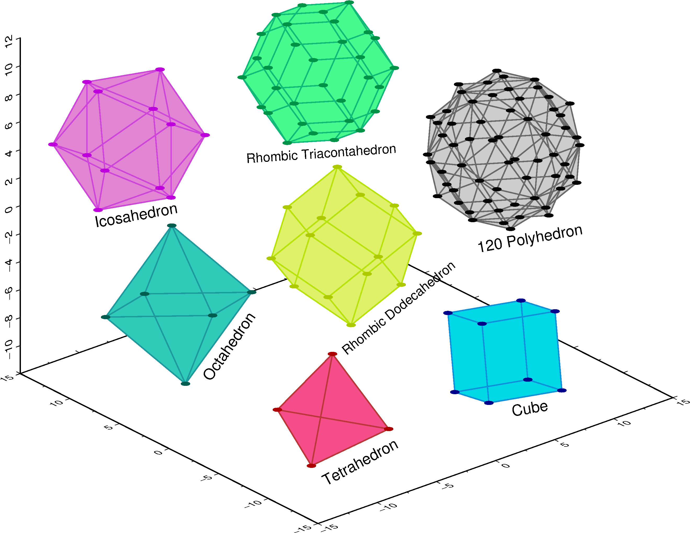
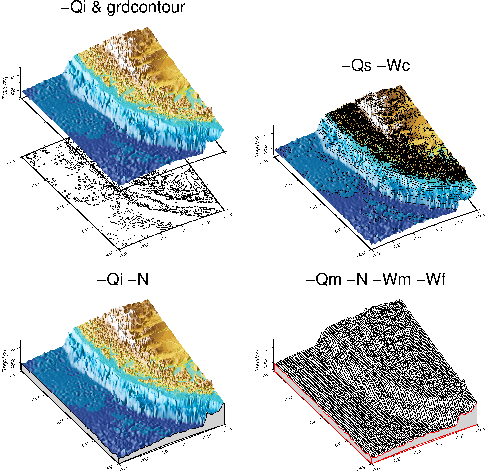
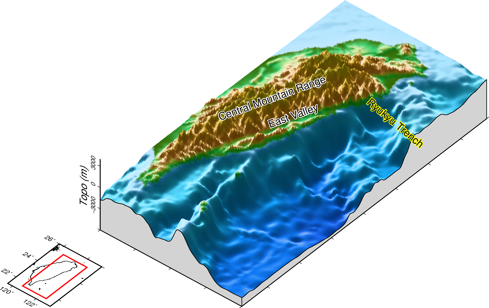

# 三維空間視圖

---

### 目錄
1. [總覽](/index.md)
2. [GMT介紹及安裝](/intro_install.md)
3. [網路資源及配套軟體](/net_software.md)
4. [第零章: 基本概念及默認值](/basic_defaults.md)
5. [第一章: 製作地圖(地理投影法)](/projection.md)
6. [第二章: XY散佈圖(其他投影法)](/xy_figure.md)
7. [第三章: 等高線圖及剖面](/contour_profile.md)
8. [第四章: 地形圖與色階](/topography_cpt.md)
9. [第五章: 地震活動性與機制解](/seismicity_meca.md)
10. [第六章: 向量與速度場](/vector_velocity.md)
11. [第七章: 台灣地理資訊](/taiwan_geography.md)
12. [第八章: 直方、圓餅、三元圖](/histo_pie_ternary.md)
13. [第九章: 三維空間視圖](/three_dimension.md)
14. [第十章: 地質圖](/geology_map.md)

---

## 13. 三維空間視圖
本章將展示如何在GMT中繪製三維空間的圖，其中包含利用`psxyz`來繪製多面體圖形及三維柱狀圖，
`grdview`來繪製三維透視圖。當製作立體圖的時候，透過觀看視角的調整，
將能給讀者更全面的資訊及更好的視覺享受。

## 13.1 目的
本章將學習如何繪製
  1. 多面體圖(Polyhedron)
  2. 柱狀圖(3D Bar Graph)
  3. 三維透視圖(3D Perspective Map)

## 13.2 學習的指令與概念

* `gmtconvert`: 處理多區塊式文件
* `grdview`: 繪製三維透視圖
* `grdsample`: 對網格檔重新取樣
* `psbasemap`: 繪製圖框、刻度、標籤等等
* `pstext`: 三維空間中寫字
* `psxyz`: 繪製三維空間中的點、線、面
* `awk`語法的示範

## 13.3 多面體圖
本節將在三維的座標系統中，去繪製幾種不同的多面體，讓讀者能熟習三維的語法。其中`psxyz`與
`psxy`最大的差別，在輸入的表格中，多了要輸入z軸的位置，而透過[多面體的各端點座標](http://www.rwgrayprojects.com/Lynn/Coordinates/coord01.html)，
將此網站的資料整理成GMT的區塊文件(segment file)，利用點與點連接，來完成多種多面體。

使用的資料檔:
- [多面體_點](dat/polyhedron_vertex.gmt)
- [多面體_線](dat/polyhedron_edge.gmt)
- [多面體_面](dat/polyhedron_face.gmt)

成果圖

<p align="center">
  
</p>

批次檔
```bash
set ps=13_3_3d_polyhedron.ps

gmt psbasemap -R-15/15/-15/15/-12/12 -JX15 -JZ12 -p220/25 ^
-BWeSnZ -Bxa5f2.5 -By5f2.5 -Bz2 -K > %ps%

# Tetrahedron 8
gmt gmtconvert polyhedron_face.gmt -S"Tetrahedron 8 |" > tmp
awk "NR %%4 != 1 {print $1-10, $2-10, $3-7.5}" tmp > tmp1
awk "{print $0} NR %%3 == 0 {print "">""""}" tmp1 > tmp2
gmt psxyz tmp2 -R -J -JZ -p -G244/77/137 -K -O >> %ps%
gmt gmtconvert polyhedron_edge.gmt -S"Tetrahedron 8 |" > tmp
awk "NR %%3 != 1 {print $1-10, $2-10, $3-7.5}" tmp > tmp1
awk "{print $0} NR %%2 == 0 {print "">""""}" tmp1 > tmp2
gmt psxyz tmp2 -R -J -JZ -p -W1,187/55/55 -K -O >> %ps%
gmt gmtconvert polyhedron_vertex.gmt -S"Tetrahedron 8 |" > tmp
awk "NR != 1 {print $1-10, $2-10, $3-7.5}" tmp > tmp1
gmt psxyz tmp1 -R -J -JZ -p -Sc.3 -G173/0/0 -K -O >> %ps%

# Cube 3
gmt gmtconvert polyhedron_face.gmt -S"Cube 3 |" > tmp
awk "NR %%4 != 1 {print $1+5, $2-10, $3-7.5}" tmp > tmp1
awk "{print $0} NR %%3 == 0 {print "">""""}" tmp1 > tmp2
gmt psxyz tmp2 -R -J -JZ -p -G0/216/230 -K -O >> %ps%
gmt gmtconvert polyhedron_edge.gmt -S"Cube 3 |" > tmp
awk "NR %%3 != 1 {print $1+5, $2-10, $3-7.5}" tmp > tmp1
awk "{print $0} NR %%2 == 0 {print "">""""}" tmp1 > tmp2
gmt psxyz tmp2 -R -J -JZ -p -W1,14/145/218 -K -O >> %ps%
gmt gmtconvert polyhedron_vertex.gmt -S"Cube 3 |" > tmp
awk "NR != 1 {print $1+5, $2-10, $3-7.5}" tmp > tmp1
gmt psxyz tmp1 -R -J -JZ -p -Sc.3 -G0/1/138 -K -O >> %ps%

# Octahedron 3
gmt gmtconvert polyhedron_face.gmt -S"Octahedron 3 |" > tmp
awk "NR %%4 != 1 {print $1-10, $2+5, $3-5}" tmp > tmp1
awk "{print $0} NR %%3 == 0 {print "">""""}" tmp1 > tmp2
gmt psxyz tmp2 -R -J -JZ -p -G48/203/184 -K -O >> %ps%
gmt gmtconvert polyhedron_edge.gmt -S"Octahedron 3 |" > tmp
awk "NR %%3 != 1 {print $1-10, $2+5, $3-5}" tmp > tmp1
awk "{print $0} NR %%2 == 0 {print "">""""}" tmp1 > tmp2
gmt psxyz tmp2 -R -J -JZ -p -W1,30/153/157 -K -O >> %ps%
gmt gmtconvert polyhedron_vertex.gmt -S"Octahedron 3 |" > tmp
awk "NR != 1 {print $1-10, $2+5, $3-5}" tmp > tmp1
gmt psxyz tmp1 -R -J -JZ -p -Sc.3 -G0/93/79 -K -O >> %ps%

# Rhombic Dodecahedron 3
gmt gmtconvert polyhedron_face.gmt -S"Rhombic Dodecahedron 3 |" > tmp
awk "NR %%4 != 1 {print $1+4, $2+5, $3-5}" tmp > tmp1
awk "{print $0} NR %%3 == 0 {print "">""""}" tmp1 > tmp2
gmt psxyz tmp2 -R -J -JZ -p -G222/241/105 -K -O >> %ps%
gmt gmtconvert polyhedron_edge.gmt -S"Rhombic Dodecahedron 3 |" > tmp
awk "NR %%3 != 1 {print $1+4, $2+5, $3-5}" tmp > tmp1
awk "{print $0} NR %%2 == 0 {print "">""""}" tmp1 > tmp2
gmt psxyz tmp2 -R -J -JZ -p -W1,184/227/10 -K -O >> %ps%
gmt gmtconvert polyhedron_vertex.gmt -S"Rhombic Dodecahedron 3 |" > tmp
awk "NR != 1 {print $1+4, $2+5, $3-5}" tmp > tmp1
gmt psxyz tmp1 -R -J -JZ -p -Sc.3 -G173/201/0 -K -O >> %ps%

# Icosahedron
gmt gmtconvert polyhedron_face.gmt -S"Icosahedron |" > tmp
awk "NR %%4 != 1 {print $1-10, $2+10, $3+5}" tmp > tmp1
awk "{print $0} NR %%3 == 0 {print "">""""}" tmp1 > tmp2
gmt psxyz tmp2 -R -J -JZ -p -G226/133/211 -K -O >> %ps%
gmt gmtconvert polyhedron_edge.gmt -S"Icosahedron |" > tmp
awk "NR %%3 != 1 {print $1-10, $2+10, $3+5}" tmp > tmp1
awk "{print $0} NR %%2 == 0 {print "">""""}" tmp1 > tmp2
gmt psxyz tmp2 -R -J -JZ -p -W1,205/70/217 -K -O >> %ps%
gmt gmtconvert polyhedron_vertex.gmt -S"Icosahedron |" > tmp
awk "NR != 1 {print $1-10, $2+10, $3+5}" tmp > tmp1
gmt psxyz tmp1 -R -J -JZ -p -Sc.3 -G189/0/219 -K -O >> %ps%

# Rhombic Triacontahedron
gmt gmtconvert polyhedron_face.gmt -S"Rhombic Triacontahedron |" > tmp
awk "NR %%4 != 1 {print $1+6, $2+10, $3+5}" tmp > tmp1
awk "{print $0} NR %%3 == 0 {print "">""""}" tmp1 > tmp2
gmt psxyz tmp2 -R -J -JZ -p -G70/250/142 -K -O >> %ps%
gmt gmtconvert polyhedron_edge.gmt -S"Rhombic Triacontahedron |" > tmp
awk "NR %%3 != 1 {print $1+6, $2+10, $3+5}" tmp > tmp1
awk "{print $0} NR %%2 == 0 {print "">""""}" tmp1 > tmp2
gmt psxyz tmp2 -R -J -JZ -p -W1,17/186/120 -K -O >> %ps%
gmt gmtconvert polyhedron_vertex.gmt -S"Rhombic Triacontahedron |" > tmp
awk "NR != 1 {print $1+6, $2+10, $3+5}" tmp > tmp1
gmt psxyz tmp1 -R -J -JZ -p -Sc.3 -G0/147/72 -K -O >> %ps%

# 120 Polyhedron
gmt gmtconvert polyhedron_face.gmt -S"120 Polyhedron |" > tmp
awk "NR %%4 != 1 {print $1+20, $2+8, $3-4}" tmp > tmp1
awk "{print $0} NR %%3 == 0 {print "">""""}" tmp1 > tmp2
gmt psxyz tmp2 -R -J -JZ -p -G205 -N -K -O >> %ps%
gmt gmtconvert polyhedron_edge.gmt -S"120 Polyhedron |" > tmp
awk "NR %%3 != 1 {print $1+20, $2+8, $3-4}" tmp > tmp1
awk "{print $0} NR %%2 == 0 {print "">""""}" tmp1 > tmp2
gmt psxyz tmp2 -R -J -JZ -p -W1,105 -N -K -O >> %ps%
gmt gmtconvert polyhedron_vertex.gmt -S"120 Polyhedron |" > tmp
awk "NR != 1 {print $1+20, $2+8, $3-4}" tmp > tmp1
gmt psxyz tmp1 -R -J -JZ -p -Sc.3 -G5 -N -K -O >> %ps%

# text
echo 7 -11 Tetrahedron | gmt pstext -R -J -JZ -p180/90 -F+f14p+a28 -K -O >> %ps%
echo 18 -7.5 Cube | gmt pstext -R -J -JZ -p -F+f14p+a10 -N -K -O >> %ps%
echo -1.5 -3.5 Octahedron | gmt pstext -R -J -JZ -p -F+f14p+a55 -N -K -O >> %ps%
echo 9.5 -1 Rhombic Dodecahedron | gmt pstext -R -J -JZ -p -F+f12p+a39 -N -K -O >> %ps%
echo -7.5 5 Icosahedron | gmt pstext -R -J -JZ -p -F+f14p+a10 -N -K -O >> %ps%
echo 4.5 9 Rhombic Triacontahedron | gmt pstext -R -J -JZ -p -F+f12p+a4 -N -K -O >> %ps%
echo 18 3.5 120 Polyhedron | gmt pstext -R -J -JZ -p -F+f14p+a10 -N -K -O >> %ps%

gmt psxy -R -J -JZ -T -O >> %ps%
gmt psconvert %ps% -Tg -A -P
del tmp*
```

學習到的指令:
* `psbasemap`繪製座標系的軸。
  * `-Jz|Z`設定z軸的尺寸，語法如同`-Jx`。
  * `-p`設定觀看圖片的角度，對應的輸入格式<mark>平面角度 俯視角度</mark>。
* `gmtconvert -S`搜尋區塊文件中，符合特定字串的區塊。
* `psxyz`繪製三維空間中的點線面。語法與`psxy`一樣，唯一差別在從2維座標點變成輸入3維的座標點。
* `pstext`透過`-p180/90`讓文字變成在xz平面書寫(原本是在xy平面)，
以及用`-F+a`來調整文字的角度。

[多面體的各端點座標](http://www.rwgrayprojects.com/Lynn/Coordinates/coord01.html)
網站中提到的字母p為黃金比例(Golden Ratio)，一般而言為1.618，編者以這個數值來製作
多面體的端點座標，接著分別繪製多面體的點(vertice)、線(edges)、平面(faces)。
透過`awk`可以改變邊長來造成圖形的縮放，或是加減數值來移動多面體的位置，
除了上面示範中的多面體，也可以自行改變`gmtconvert -S`後面的字串，
來繪製其他種類的多面體，透過該網站，共整理了28種。

## 13.4 柱狀圖
此節將透過政府資料開放平臺所提供的[104年水文地質鑽探岩心紀錄](https://data.gov.tw/dataset/32584)，
將示範如何把五個鑽井的岩性資料，透過立體柱狀的方式，展現在地圖上，這種方式，
將能同時間展現出井口位置以及岩性隨深度的變化。

使用的資料檔:
- [鑽井岩心資料](dat/core.gmt)

成果圖

<p align="center">
  
</p>

批次檔
```bash
set ps=13_4_3d_bar.ps
set data=D:\GMT_data\
set C=gray
set FS=green
set CS=cyan
set G=red

gmt grdimage %data%tw_20.grd -R120.62/120.69/24.03/24.13/0/100 -JM12 -JZ10 -p205/35 ^
-BWeSnZ -Bxa.03 -Bya.04 -Bz10+l"Depth (m)" -Cdem1.cpt -I%data%tw_20shad.grd -K > %ps%
gmt psxy %data%taiwan_river_tributary.gmt -R -JM -JZ -p -W1,72/92/199 -K -O >> %ps%
gmt psxy %data%taiwan_river_mainstream.gmt -R -JM -JZ -p -W1,30/34/170 -K -O >> %ps%

# 061851G1
awk "{if ($3==""061851G1"""") print $0}" core.gmt > tmp
awk "{print $1,$2,$4,0}" tmp | gmt psxyz -R -JM -JZ -p -So.3 -G%C% -W.5 -K -O >> %ps%
awk "{print $1,$2,$4+$6,$4}" tmp | gmt psxyz -R -JM -JZ -p -So.3b -G%CS% -W.5 -K -O >> %ps%
awk "{print $1,$2,$4+$6+$8,$4+$6}" tmp | gmt psxyz -R -JM -JZ -p -So.3b -G%C% -W.5 -K -O >> %ps%
awk "{print $1,$2,$4+$6+$8+$10,$4+$6+$8}" tmp | ^
gmt psxyz -R -JM -JZ -p -So.3b -G%CS% -W.5 -K -O >> %ps%
awk "{print $1,$2,$4+$6+$8+$10+$12,$4+$6+$8+$10}" tmp | ^
gmt psxyz -R -JM -JZ -p -So.3b -G%C% -W.5 -K -O >> %ps%
awk "{print $1,$2,$4+$6+$8+$10+$12+$14,$4+$6+$8+$10+$12}" tmp | ^
gmt psxyz -R -JM -JZ -p -So.3b -G%G% -W.5 -K -O >> %ps%
awk "{print $1,$2,$4+$6+$8+$10+$12+$14+$16,$4+$6+$8+$10+$12+$14}" tmp | ^
gmt psxyz -R -JM -JZ -p -So.3b -G%CS% -W.5 -K -O >> %ps%
awk "{print $1,$2,$3}" tmp | gmt pstext -R -JM -JZ -p -F+f12p=2p,white -D0/-.5 -K -O >> %ps%
awk "{print $1,$2,$3}" tmp | gmt pstext -R -JM -JZ -p -F+f12p -D0/-.5 -K -O >> %ps%

# 062051G1
awk "{if ($3==""062051G1"""") print $0}" core.gmt > tmp
awk "{print $1,$2,$4,0}" tmp | gmt psxyz -R -JM -JZ -p -So.3 -G%G% -W.5 -K -O >> %ps%
awk "{print $1,$2,$4+$6,$4}" tmp | gmt psxyz -R -JM -JZ -p -So.3b -G%FS% -W.5 -K -O >> %ps%
awk "{print $1,$2,$4+$6+$8,$4+$6}" tmp | gmt psxyz -R -JM -JZ -p -So.3b -G%C% -W.5 -K -O >> %ps%
awk "{print $1,$2,$4+$6+$8+$10,$4+$6+$8}" tmp | ^
gmt psxyz -R -JM -JZ -p -So.3b -G%G% -W.5 -K -O >> %ps%
awk "{print $1,$2,$4+$6+$8+$10+$12,$4+$6+$8+$10}" tmp | ^
gmt psxyz -R -JM -JZ -p -So.3b -G%C% -W.5 -K -O >> %ps%
awk "{print $1,$2,$3}" tmp | gmt pstext -R -JM -JZ -p -F+f12p=2p,white -D0/-.5 -K -O >> %ps%
awk "{print $1,$2,$3}" tmp | gmt pstext -R -JM -JZ -p -F+f12p -D0/-.5 -K -O >> %ps%

# 061552G1
awk "{if ($3==""061552G1"""") print $0}" core.gmt > tmp
awk "{print $1,$2,$4,0}" tmp | gmt psxyz -R -JM -JZ -p -So.3 -G%CS% -W.5 -K -O >> %ps%
awk "{print $1,$2,$4+$6,$4}" tmp | gmt psxyz -R -JM -JZ -p -So.3b -G%C% -W.5 -K -O >> %ps%
awk "{print $1,$2,$4+$6+$8,$4+$6}" tmp | gmt psxyz -R -JM -JZ -p -So.3b -G%G% -W.5 -K -O >> %ps%
awk "{print $1,$2,$4+$6+$8+$10,$4+$6+$8}" tmp | ^
gmt psxyz -R -JM -JZ -p -So.3b -G%CS% -W.5 -K -O >> %ps%
awk "{print $1,$2,$4+$6+$8+$10+$12,$4+$6+$8+$10}" tmp | ^
gmt psxyz -R -JM -JZ -p -So.3b -G%G% -W.5 -K -O >> %ps%
awk "{print $1,$2,$4+$6+$8+$10+$12+$14,$4+$6+$8+$10+$12}" tmp | ^
gmt psxyz -R -JM -JZ -p -So.3b -G%CS% -W.5 -K -O >> %ps%
awk "{print $1,$2,$4+$6+$8+$10+$12+$14+$16,$4+$6+$8+$10+$12+$14}" tmp | ^
gmt psxyz -R -JM -JZ -p -So.3b -G%G% -W.5 -K -O >> %ps%
awk "{print $1,$2,$4+$6+$8+$10+$12+$14+$16+$18,$4+$6+$8+$10+$12+$14+$16}" tmp | ^
gmt psxyz -R -JM -JZ -p -So.3b -G%FS% -W.5 -K -O >> %ps%
awk "{print $1,$2,$3}" tmp | gmt pstext -R -JM -JZ -p -F+f12p=2p,white -D0/-.5 -K -O >> %ps%
awk "{print $1,$2,$3}" tmp | gmt pstext -R -JM -JZ -p -F+f12p -D0/-.5 -K -O >> %ps%

# 061553G1
awk "{if ($3==""061553G1"""") print $0}" core.gmt > tmp
awk "{print $1,$2,$4,0}" tmp | gmt psxyz -R -JM -JZ -p -So.3 -G%G% -W.5 -K -O >> %ps%
awk "{print $1,$2,$4+$6,$4}" tmp | gmt psxyz -R -JM -JZ -p -So.3b -G%CS% -W.5 -K -O >> %ps%
awk "{print $1,$2,$4+$6+$8,$4+$6}" tmp | gmt psxyz -R -JM -JZ -p -So.3b -G%G% -W.5 -K -O >> %ps%
awk "{print $1,$2,$4+$6+$8+$10,$4+$6+$8}" tmp | ^
gmt psxyz -R -JM -JZ -p -So.3b -G%FS% -W.5 -K -O >> %ps%
awk "{print $1,$2,$4+$6+$8+$10+$12,$4+$6+$8+$10}" tmp | ^
gmt psxyz -R -JM -JZ -p -So.3b -G%G% -W.5 -K -O >> %ps%
awk "{print $1,$2,$4+$6+$8+$10+$12+$14,$4+$6+$8+$10+$12}" tmp | ^
gmt psxyz -R -JM -JZ -p -So.3b -G%C% -W.5 -K -O >> %ps%
awk "{print $1,$2,$4+$6+$8+$10+$12+$14+$16,$4+$6+$8+$10+$12+$14}" tmp | ^
gmt psxyz -R -JM -JZ -p -So.3b -G%CS% -W.5 -K -O >> %ps%
awk "{print $1,$2,$4+$6+$8+$10+$12+$14+$16+$18,$4+$6+$8+$10+$12+$14+$16}" tmp | ^
gmt psxyz -R -JM -JZ -p -So.3b -G%G% -W.5 -K -O >> %ps%
awk "{print $1,$2,$4+$6+$8+$10+$12+$14+$16+$18+$20,$4+$6+$8+$10+$12+$14+$16+$18}" tmp | ^
gmt psxyz -R -JM -JZ -p -So.3b -G%FS% -W.5 -K -O >> %ps%
awk "{print $1,$2,$3}" tmp | gmt pstext -R -JM -JZ -p -F+f12p=2p,white -D0/-.5 -K -O >> %ps%
awk "{print $1,$2,$3}" tmp | gmt pstext -R -JM -JZ -p -F+f12p -D0/-.5 -K -O >> %ps%

# 061551G1
awk "{if ($3==""061551G1"""") print $0}" core.gmt > tmp
awk "{print $1,$2,$4,0}" tmp | gmt psxyz -R -JM -JZ -p -So.3 -G%G% -W.5 -K -O >> %ps%
awk "{print $1,$2,$4+$6,$4}" tmp | gmt psxyz -R -JM -JZ -p -So.3b -G%C% -W.5 -K -O >> %ps%
awk "{print $1,$2,$4+$6+$8,$4+$6}" tmp | gmt psxyz -R -JM -JZ -p -So.3b -G%FS% -W.5 -K -O >> %ps%
awk "{print $1,$2,$4+$6+$8+$10,$4+$6+$8}" tmp | ^
gmt psxyz -R -JM -JZ -p -So.3b -G%C% -W.5 -K -O >> %ps%
awk "{print $1,$2,$4+$6+$8+$10+$12,$4+$6+$8+$10}" tmp | ^
gmt psxyz -R -JM -JZ -p -So.3b -G%CS% -W.5 -K -O >> %ps%
awk "{print $1,$2,$4+$6+$8+$10+$12+$14,$4+$6+$8+$10+$12}" tmp | ^
gmt psxyz -R -JM -JZ -p -So.3b -G%G% -W.5 -K -O >> %ps%
awk "{print $1,$2,$4+$6+$8+$10+$12+$14+$16,$4+$6+$8+$10+$12+$14}" tmp | ^
gmt psxyz -R -JM -JZ -p -So.3b -G%FS% -W.5 -K -O >> %ps%
awk "{print $1,$2,$3}" tmp | gmt pstext -R -JM -JZ -p -F+f12p=2p,white -D0/-.5 -K -O >> %ps%
awk "{print $1,$2,$3}" tmp | gmt pstext -R -JM -JZ -p -F+f12p -D0/-.5 -K -O >> %ps%

# legend
echo C %C% > tmp
echo L - - L Clay >> tmp
echo C %FS% >> tmp
echo L - - L Fine Sand >> tmp
echo C %CS% >> tmp
echo L - - L Coarse Sand >> tmp
echo C %G% >> tmp
echo L - - L Gravel >> tmp
gmt pslegend tmp -R -JM -JZ -p -Dx7.7/.5+w4 -F+g0+p1+s-6p/-4p/gray20@40 -K -O >> %ps%

gmt psxy -R -J -JZ -T -O >> %ps%
gmt psconvert %ps% -Tg -A -P
del tmp*
```

學習到的指令:
* `psxyz`繪製三維空間中的點線面。
  * `-So`以z軸為基底，繪製三維柱狀圖。讀取的資料格式為<mark>經度 緯度 高度1 高度2</mark>，指令本身後面接上<mark>尺寸[b]</mark>，如果有加上b的話，則更改以高度2為基底高度，反之則用0為基底高度，如果用`-SO`則取消三維照明的效果。
* `pslegend`繪製圖例。
  * `C`文字顏色。
  * `L`寫文字。格式為<mark>字體大小 字體種類 對齊方式 文字內容</mark>，
  <mark>-</mark>表示使用默認值。

此次所使用的鑽井資料，其地點位在沉積平原，取出的岩心，按粒徑大小排列，主要是由黏土礦物、
細砂岩、粗砂岩至礫石。由三維的柱狀圖，可以非常清楚地觀察地底下地層的變化，
如果再配合化石等其他資料，就可以清楚地勾勒出這地區的地層分佈。

## 13.5 三維透視圖
之前有展示如何透過顏色及陰影在平面上繪製地形圖，而本節則示範使用同樣的全球數值地形網格檔，
來繪製三維的地形圖。百內國家公園(Parque Nacional Torres del Paine)，
為智利南部的一座國家公園，以湛藍的冰河峽灣及湖泊景觀聞名，而透過三維透視圖，
將可以把高聳的山脈依傍在海洋的景色，完美地展現出來。

使用的資料檔:
- 請參考[8-5地形暈眩圖](topography_cpt.md#m8.5)，下載全球一角分的數值地形圖。
- [ibcao色階檔](dat/ibcao.cpt)

成果圖

<p align="center">
  
</p>

批次檔
```bash
set data=D:\GMT_data\
set ps=13_5_3d_perspective.ps
set R=-80/-70/-56/-48

gmt gmtset MAP_FRAME_TYPE plain FONT_ANNOT_PRIMARY 8p FONT_LABEL 10p PS_MEDIA A3

gmt grdcut %data%ETOPO1_Bed_g_gmt5.grd -R%R% -Gtmp.grd
gmt grdcut %data%ETOPO1_Bed_g_gmt5_shad.grd -R%R% -Gtmp_shad.grd

# -Qi -N
gmt grdview tmp.grd -Itmp_shad.grd -R%R%/-6000/2000 -JL-75/-52.5/-59/-45/7.5 -JZ2 -p210/40 ^
-Cibcao.cpt -N-6000+glightgray -Qi500 -Ba -Bza4000f2000+l"Topo (m)" -BWeSnZ+t"-Qi -N" -K > %ps%

# -Qi & grdcontour
gmt grdcontour tmp.grd -R -J -JZ -p -C500 -A1000 -Ba -BWeSn -K -O -Y11 >> %ps%
gmt grdview tmp.grd -Itmp_shad.grd -R%R%/-6000/2000 -J -JZ -p -Cibcao.cpt ^
-Qi500+m -Ba -Bza4000f2000+l"Topo (m)" -BwesnZ+t"-Qi & grdcontour" -K -O -Y3 >> %ps%

# -Qs -Wc
gmt grdview tmp.grd -Itmp_shad.grd -R%R%/-6000/2000 -J -JZ -p -Cibcao.cpt ^
-Qs -Ba -Bza4000f2000+l"Topo (m)" -BWeSnZ+t"-Qs -Wc" -Wc.5 -K -O -X13 -Y-3 >> %ps%

# -Qm -N -Wm -Wf
gmt grdsample tmp.grd -I10k -Gtmp10.grd
gmt grdsample tmp_shad.grd -I10k -Gtmp10_shad.grd
gmt grdview tmp10.grd -Itmp10_shad.grd -R%R%/-6000/2000 -JL -JZ -p -Cibcao.cpt ^
-N-6000+glightgray -Qm -Ba -Bza4000f2000+l"Topo (m)" -BWeSnZ+t"-Qm -N -Wm -Wf" ^
-Wm.5 -Wf.75,red -K -O -Y-11 >> %ps%

gmt psxy -R -J -Jz -T -O >> %ps%
gmt psconvert %ps% -Tg -A -P
del tmp*
```

學習到的指令:
* `grdview`繪製三維透視圖或是網格表面。
  * `-Q`模式選擇。
    * **i**影像圖。後面接上dpi值，來調整解析程度，默認是100 dpi。
    * **c**影像圖。用法與**i**一樣，但當節點值為NaN時，則用透明色表示。
    * **m**網格圖。可在後面加上顏色，將取代原有的白色底色。
    * **s**表面圖。如果後面加上**m**，則繪繪製網格線。
  * `-N`在z方向繪製平面。後面接上高程值，**+g**可指定平面的顏色。
  * `-W`格線的設定。格式為**-W種類**筆觸。
    * **-Wc**設定網格或表面圖的等高線。
    * **-Wm**設定網格的格線，搭配**-Qm**或**-Qsm**。
    * **-Wf**設定z平面的外框線，搭配**-N**。

先透過`gmtcut`將原本全球的網格檔切割成較小的目標區域檔，再來透過4種圖片來展示`grdview -Q`的模式差異，
在右下角的網格圖中，由於本身全球一角分的解析度太高，所以透過`grdsample`將網格檔進行從新採樣，
一般的用法是`grdsample 輸入網格檔 -I解析度 -G輸出檔`。

三維透視圖是很好的影像呈現方式，可以一目了然地將地形的差異性表現出來，
也可將**GMT**繪製的結果圖當做底圖，透過如**CorelDraw**等繪圖軟體進行修圖，來繪製地質模型，
將可事半功倍。


## 13.6 習題
從上一節中，看到了峽灣地形，實際上，全球有各式各樣的海岸，華倫亭在他的著作《世界海岸》中
(**Valentin's Classification of Coastal Contexts**)，
將世界上的海岸分為八種類型中，其中峽灣屬於沉水侵蝕退夷，而這次練習繪製的區域是台灣東部海岸，
屬於斷層海岸，在海岸分類中為離水堆積進夷，將3D的地形繪製出來，與前一節的峽灣比較，
來看看兩種海岸的差異吧!

使用的資料檔:
- 請參考[8-5地形暈眩圖](topography_cpt.md#m8.5)，下載全球一角分的數值地形圖。

完成圖如下:
<p align="center">
  
</p>

## 13.7 參考批次檔
列出本章節使用的批次檔，供讀者參考使用，檔案路經可能會有些許不同，再自行修改。
* [13_3_3d_polyhedron](bat/13_3_3d_polyhedron.bat)
* [13_4_3d_bar](bat/13_4_3d_bar.bat)
* [13_5_3d_perspective](bat/13_5_3d_perspective.bat)
* [13_6_3d_east_coast](bat/13_6_3d_east_coast.bat)

---

[上一章](/histo_pie_ternary.md) -- [下一章](/geology_map.md)
