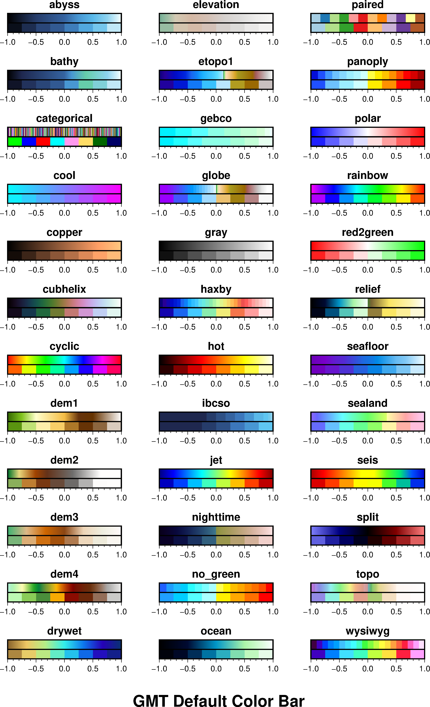
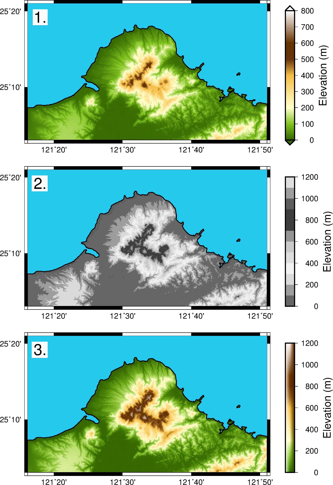
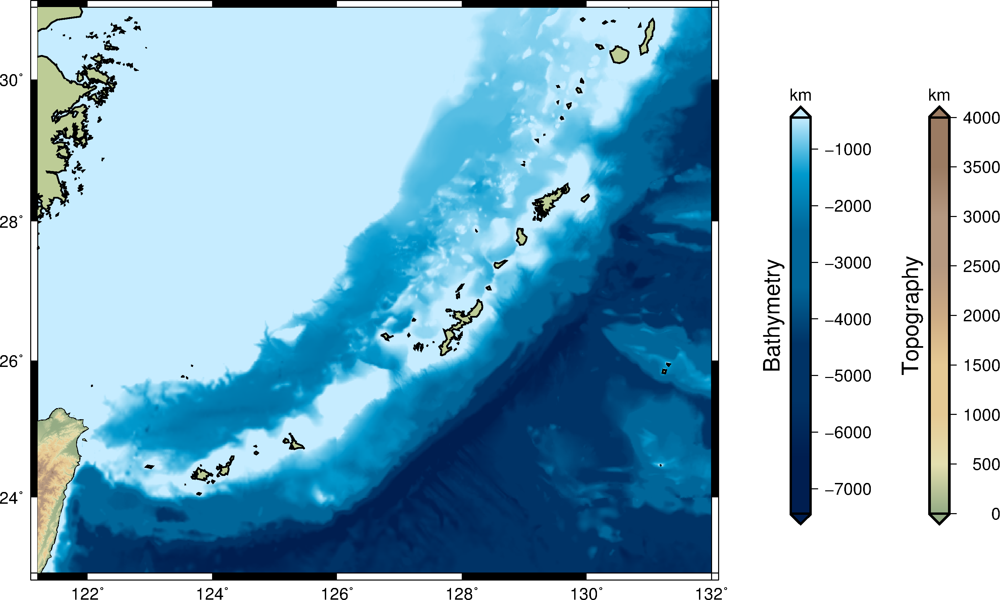
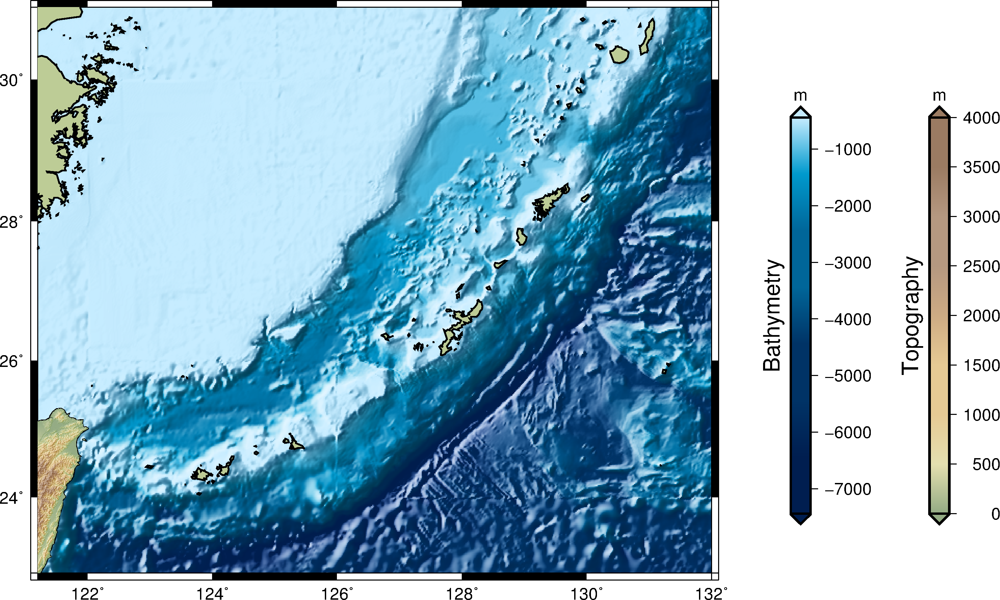

# 地形圖與色階

---

### 目錄
1. [總覽](/index.md)
2. [GMT介紹及安裝](/intro_install.md)
3. [網路資源及配套軟體](/net_software.md)
4. [第零章: 基本概念及默認值](/basic_defaults.md)
5. [第一章: 製作地圖(地理投影法)](/projection.md)
6. [第二章: XY散佈圖(其他投影法)](/xy_figure.md)
7. [第三章: 等高線圖及剖面](/contour_profile.md)
8. [第四章: 地形圖與色階](/topography_cpt.md)
9. [第五章: 地震活動性與機制解](/seismicity_meca.md)
10. [第六章: 向量與速度場](/vector_velocity.md)
11. [第七章: 台灣地理資訊](/taiwan_geography.md)
12. [第八章: 直方、圓餅、三元圖](/histo_pie_ternary.md)
13. [第九章: 三維空間圖](/three_dimension.md)

---

## 8. 地形圖與色階
當想要呈現三維的資料，可以利用xyz座標系畫出立體圖，但如果三維資料要呈現在二維平面上時，
除了利用等高線之外，還可以利用顏色來做為第三維度的變化，因此衍生出了色階，
在GMT裡稱作.cpt(color palette tables)。而這種方式被廣泛利用在各種成果展示上面，
其中一個就是地形圖，本章將介紹如何繪製地形圖以及搭配的色階檔。

## 8.1 目的
本章將學習如何繪製
  1. 簡介色階檔(cpt, color palette tables)
  2. 地形圖(Topography)
  3. 地形暈渲面(Hillshading)

## 8.2 學習的指令與概念

* `grdgradient`: 從網格檔計算方向導數或梯度
* `grdimage`: 繪製色階地圖
* `grdinfo`: 從網格檔中獲取資訊
* `grd2cpt`: 利用網格檔資料建立色階檔
* `makecpt`: 製作色階檔
* `psscale`: 繪製色彩條

## 8.3 簡介色階檔
色階的概念是將某一區段的資料用一種顏色來表示，這種技巧被應用在很多方面，像是熱影像圖、地形圖等等。
GMT在安裝的時後，同時有提供一些色階檔作為使用，這些檔案被安裝在<mark>GMT根目錄/share/cpt</mark>，
打開<mark>abyss.cpt</mark>，裡面的內容:
```bash
#       $Id$
#
# Color table for bathymetry modeled after IBCSO
# at depth but turning lighter towards sea level.
# Designed by P. Wessel, SOEST
# COLOR_MODEL = RGB
-8000      black  	-7000	20/30/53
-7000	20/30/53  	-6000	38/60/106
-6000	38/60/106	-5000	46/80/133
-5000	46/80/133	-4000	53/99/160
-4000	53/99/160	-3000	72/151/211
-3000	72/151/211	-2000	90/185/233
-2000	90/185/233	-1000	141/210/239
-1000	141/210/239	0	245/255/255
B black
F white
N gray
```

一開始`#`之後的文字為註解，通常會紀錄設計者名稱、設計目的、使用的顏色模型，接著檔案的格式為四欄，
第一欄是起始範圍；第二欄色碼；第三欄是結束範圍；第四欄色碼，所以在-8000至-7000就是以黑色來表示，
在檔案的最下面**B**、**F**、**N**分別代表背景色(Background color)、前景色(Foreground color)及無值的顏色(NaN color)，
簡單地說，就是小於範圍中最小值所用的顏色、大於範圍中最大值所用的顏色及無資料時所使用的顏色。
來看GMT有提供的色階檔畫出來的樣子:

<p align="center">
  
</p>

圖中列出44個GMT默認提供的色階檔(GMT version 5.4.2)，將每個色階做正規化的步驟，上方色階代表顏色連續的色階檔，
下方則是顏色離散的色階檔(間隔0.25)，如果原始的色階檔就不連續，那做出來就是不連續的色階檔。
而兩者檔案中，有什麼差別呢？
```bash
# 不連續的色階
0	166/206/227	1	166/206/227
1	31/120/180	2	31/120/180

# 連續的色階
0	38/60/106	1 46/80/133
1	46/80/133	2 53/99/160
```

有看出差別了嗎？在不連續的色階中，0~1都是用同一種顏色，而連續的色階中0~1是不同顏色，而接續下去1~2也是如此，
GMT就是用這種方式，來區分二者的差異。接下來，示範如何用`makecpt`來製作色階檔。自己手動編輯色階檔也是可以，
但需要對顏色的敏感度非常好，時常色階檔的製作，都是利用現成的檔案進行範圍的改寫。
```bash
makecpt -Ccool.cpt -T0/50/10 -D -Z > tmp.cpt
# 產生的tmp.cpt內容如下
0	cyan	10	51/204/255
10	51/204/255	20	102/153/255
20	102/153/255	30	153/102/255
30	153/102/255	40	204/51/255
40	204/51/255	50	magenta
B	cyan
F	magenta
N	127.5
```

學習到的指令:
* `makecpt`:
  * `-C`輸入的色階檔。
  * `-I`倒轉(reverse)色碼檔
  * `-T`範圍的設定，有三種方式:
    1. **最小值/最大值/間隔**
    2. **讀取一個檔案**
    3. **間隔點1,間隔點2,間隔點3,...**
  * `-D`讓前景色與背景色對應最小及最大值的色碼
  * `-Z`製作連續的色階

學會了如何改寫色階檔之後，就是如何調整範圍，來配合資料，達到良好呈獻效果。此外，推薦一個網站，
[cpt-city](http://soliton.vm.bytemark.co.uk/pub/cpt-city/)，裡面收集了大量的現成色階檔，供參考使用。

## 8.4 地形圖
陽明山國家公園是以大屯山火山群為主的火山地型，規劃了眾多的景點，供民眾認識火山地形、地貌。
本節將利用陽明山區域的20公尺數值地形，配合GMT內建安裝的數值檔，來展示不同的色階檔，
對繪製地形圖所帶來的影響。
切割的範圍`121.27/121.85/25.05/25.35`，可以自行練習`grdcut`，或者直接下載下方載點，

使用的資料檔:
- [陽明山數值高程](dat/yangmingShan.grd)

成果圖
<p align="center">
  
</p>

批次檔
```bash
set ps=8_4_yangmingShan.ps
set cpt=dem1.cpt

# 1. use default dem1.cpt
gmt grdimage yangmingShan.grd -R121.27/121.85/25.05/25.35 -JM13 -BWeSn -Ba ^
-C%cpt% -P -Y21 -K > %ps%
gmt pscoast -R -JM -Df -W1 -S34/201/237 -K -O >> %ps%
gmt psscale -C%cpt% -Dx14/0+w7/.5+e -Ba100+l"Elevation (m)" -K -O >> %ps%
echo 121.3 25.32 1. | gmt pstext -R -JM -F+f24p -G250 -K -O >> %ps%

# 2. discrete 0~1200 dem1.cpt
makecpt -C%cpt% -T0/1200/100 > tmp.cpt
gmt grdimage yangmingShan.grd -R -JM -BWeSn -Ba -Ctmp.cpt ^
-M -Y-9 -K -O >> %ps%
gmt pscoast -R -JM -Df -W1 -S34/201/237 -K -O >> %ps%
gmt psscale -Ctmp.cpt -Dx14/0+w7/.5 -Ba200+l"Elevation (m)" -M -K -O >> %ps%
echo 121.3 25.32 2. | gmt pstext -R -JM -F+f24p -G250 -K -O >> %ps%

# 3. continuous 200~1200 dem1.cpt
makecpt -C%cpt% -T0/1200/100 -Z > tmp.cpt
gmt grdclip yangmingShan.grd -R -Sb200/NaN -Gtmp.grd
gmt grdimage tmp.grd -R -JM -BWeSn -Ba -Ctmp.cpt -Q -Y-9 -K -O >> %ps%
gmt pscoast -R -JM -Df -W1 -S34/201/237 -K -O >> %ps%
gmt psscale -Ctmp.cpt -Dx14/0+w7/.5 -Ba200+l"Elevation (m)" -I -K -O >> %ps%
echo 121.3 25.32 3. | gmt pstext -R -JM -F+f24p -G250 -K -O >> %ps%

gmt psxy -R -JM -T -O >> %ps%
gmt psconvert %ps% -Tg -A -P
del tmp*
```

本節學習到的新指令:

<mark>1</mark> 繪製地形圖
* `grdimage`投影網格或是影像(images)至地圖上:
  * `-C`輸入色階檔。
  * `-M`黑白畫面!!
  * `-Q`當資料點為NaN(無值)時，變成透明色。
* `psscale`繪製色彩條(color bar):
  * `-B`調整刻度間距。
  * `-C`輸入色階檔。
  * `-D`調整色彩條的位置。
    * 參考點X位移/Y位移，其餘參考點設定可[參考6-6](xy_figure.md#m6.6)
    * **+w**長度/寬度
    * **+e**顯示前景色(**f**)、背景色(**b**)
    * **+h**改成水平色彩條；**+v**垂直色彩條(默認值)
    * **+m**將**a**(annotation, 註解), **l**(label, 標籤), **u**(unit 單位)，
    位置改放至對面，**c**(標籤轉成垂直)
    * **+n**在一開始加上無值的的矩形範圍
  * `-F`加上邊框:
    * **+c**外框與色彩條的間隔
    * **+g**填色
    * **+i**間距/筆觸，在加上一個內部的邊框
    * **+p**邊框筆觸
    * **+r**弧度，圓角矩形邊框
    * **+s**陰影
  * `-I`開啟照明效果。
  * `-M`轉成黑白模式。
  * `-S`取消自動區分不同顏色的黑線。

<mark>2</mark> 將色階檔範圍改成0至1200，間距100，變成離散的色階檔，加上`-M`讓地圖與色彩條都變成黑白模式。

<mark>3</mark> 將色階檔範圍改成0至1200，間距100，`-Z`變成連續的色階檔，`-I`開啟色彩條照明效果。
這裡使用`grdclip`將高度200以下的資料設定為NaN，配合`grdimage -Q`，讓高度200以下的地區，以透明著色。
詳細的`grdclip`模組介紹。
* `grdclip`剪切網格檔的範圍。
  * `-G`輸出檔名。
  * `-R`範圍。
  * `-Sa`上界值/取代數值，當數值超過上界時，用取代數值取代。
  * `-Sb`下界值/取代數值，用法如上。
  * `-Si`下界值/上界值/取代數值，用法如上，可以重覆使用，來設定特定數值範圍。
  * `-Sr`舊值/取代數值，當數值等於舊值時，用取代數值取代。

第一張圖使用原始dem1.cpt的範圍只有到800公尺，而陽明山區域最高海拔可至約1110公尺，
導致在高度上並沒有辦法完整呈現山頭的資訊。第二張圖，將dem1.cpt的範圍改至1200後，並改成離散化的色階，
山頭的資訊有較明顯的呈現，但河川的訊息變得不太明顯，示範用黑白模式是由於地形圖往往是製圖的背景，
而黑白模式可以有效表達地形差異，又不會又不會搶走之後想表達主題的光彩。第三張圖，
則是針對200公尺以上的區域，較完整地呈現該地區的地形。

## 8.5 地形暈渲面
Hillshading暈渲法(或稱陰影法)，是一種地形圖的表示方式，應用光影的原裡，
以色調的明暗對比來展現地形上的高低起伏，此法是假設一個光源從一特定角度照射照射強度不變的平行光線，
地形的明暗取決於波面受光方向的夾角，迎光面會展線明亮的色調，反之背光面則陰暗，而坡度的變化，
則會因坡陡受光少，顏色較為深色；坡度較緩則因受光多，顏色較淡。

琉球海溝是菲律賓海板塊隱沒至歐亞大陸板塊所形成的版塊邊界，總長約2250公里，最大深度7507公尺。
本節將示範如何製作暈渲地形網格檔(編者習慣稱作陰影檔)，以及繪製暈渲地形圖。

使用的資料檔:
- [colomia色階檔](http://soliton.vm.bytemark.co.uk/pub/cpt-city/wkp/shadowxfox/tn/colombia.png.index.html)，
手動將0以上與以下分成**colomia_u.cpt**和**colomia_d.cpt**。
- 在開始之前，先說明資料準備，下載由[NOAA提供的全球一角分的數值地形](https://www.ngdc.noaa.gov/mgg/global/)，
可選擇北極與格陵蘭有冰層覆蓋，或是無覆蓋的版本，可直接下載netCDF檔，解壓縮後就可使用。

先來看看未使用陰影檔的成果圖與批次檔。

成果圖
<p align="center">
  
</p>

批次檔
```bash
set ps=8_5_ryukyu_trench_n.ps
set data=D:\GMT_data\
set dcpt=colomia_d.cpt
set ucpt=colomia_u.cpt

# 1. Bathymetry
gmt grdinfo %data%ETOPO1_Bed_g_gmt5.grd -R121.2/132.0/22.88/31.0 -C -I1 > tmp
for /f %%i in ('awk "{print $6}" tmp') do set minz=%%i
gmt makecpt -C%dcpt% -T%minz%/0/1000 -D -Z > tmp.cpt
# grdinfo %data%ETOPO1_Bed_g_gmt5.grd -R -T500 > tmp
# set /p T=<tmp
# makecpt -C%cpt% %T% -Z > tmp.cpt
gmt grdimage %data%ETOPO1_Bed_g_gmt5.grd -R -JM17 -BWeSn -Ba ^
-Ctmp.cpt -K > %ps%
gmt psscale -Ctmp.cpt -Dx19/1.5+w10/.5+e+ml -Bxa1000+l"Bathymetry" -By+l"m" -K -O >> %ps%

# 2. Topography
gmt pscoast -R -JM -Di -W1 -G189/204/150 -K -O >> %ps%
gmt pscoast -R -JM -Df -Gc -K -O >> %ps%
gmt grdinfo %data%tw_40.grd -R -C -I1 > tmp
for /f %%i in ('awk "{print $7}" tmp') do set maxz=%%i
gmt makecpt -C%ucpt% -T0/%maxz%/500 -D -Z > tmp.cpt
# gmt grd2cpt %data%tw_40.grd -C%cpt% -R > tmp.cpt
gmt grdimage %data%tw_40.grd -R -JM -Ctmp.cpt -K -O >> %ps%
gmt pscoast -R -JM -Df -Q -K -O >> %ps%
gmt psscale -Ctmp.cpt -Dx22.5/1.5+w10/.5+e+ml -Bxa500+l"Topography" -By+l"m" -K -O >> %ps%

gmt psxy -R -JM -T -O >> %ps%
gmt psconvert %ps% -Tg -A -P
del tmp*
```

本節學習的新指令:

<mark>1</mark>繪製海底地形
* `grdinfo`: 獲取網格檔資訊，在前一節中，製作色階檔都仰賴手動設定最大最小值，
這邊將介紹如何利用這指令，來找出網格檔的範圍。
  * `-C`輸出x軸最小(w) x軸最大(e) y軸最小(s) y軸最大(n) z軸最小(z0) z軸最大(z1) x軸間隔 y軸間隔 x軸點數 y軸點數。
  * `-F`改成通用格式顯示訊息。
  * `-I`四捨五入輸出，搭配`-C`使用。
  * `-L`輸出基本統計的數值。
    * **-L0**重新掃描一次資料在輸出資訊，而非使用檔頭的資訊
    * **-L1**回傳z軸的中位數及1.4826*中位數決對偏差(Median Absolute Deviation)
    * **-L2**回傳z軸平均、標準差、方均根
    * **-La**回傳上述全部資訊
  * `-M`回傳z軸最大最小值出現的xy座標。
  * `-R`給特定的範圍。
  * `-T`輸出z軸最小/最大/間隔，供`makecpt -T`使用。

<mark>2</mark>繪製陸地地形
* `grd2cpt`: 從網格檔直接輸出色階檔。  
  * `-C`對應使用的色階檔。
  * `-D`讓前景色與背景色對應最小及最大值的色碼
  * `-I`倒轉色階檔
  * `-L`最小限制/最大限制，限制色階檔的範圍
  * `-Z`製作連續的色階檔

這次的批次檔中，將`grdinfo -T`及`grd2cpt`變為註釋，是因為想利用高度0公尺來區分陸地及海洋使用不同的色階檔，
如果單純使用一種，可以直接使用該指令。GMT提供了多種方式來獲取網格檔的訊息，以及提供方便的`grd2cpt`指令，
列出這些的使用方法，供作參考。

接下來，將介紹陰影檔的製作方式，使用的指令是`grdgradient`，範例如下:
```bash
grdgradient ETOPO1_Bed_g_gmt5.grd -Nt1 -A300 -GETOPO1_Bed_g_gmt5_shad.grd
```

本節學習的新指令:
* `grdgradient`從網格檔計算方向導數或梯度
  * `-A`角度，光源照射的角度。
  * `-G`輸出檔名，輸出的檔案名稱。
  * `-N`正規化震幅。算式: gn=amp*(g-offset)/max(abs(g-offset))，g是平均値
    * `-Ne`用cumulative Laplace distribution，算式: gn = amp * (1.0 - exp(sqrt(2) * (g - offset)/ sigma))
    * `-Nt`用 cumulative Cauchy distribution，算式: gn = (2 * amp / PI) * atan( (g - offset)/ sigma)
  * `-R`給特定範圍

接著只要將`grdimage`模組中加入`-IETOPO1_Bed_g_gmt5_shad.grd`，就可以將剛剛做好的陰影檔一併呈現出來，
就來看看兩者的差別吧。

成果圖
<p align="center">
  
</p>

## 8.6 習題
大西洋中洋脊從北緯87度延伸至南緯54度，在北大西洋的部份，分離了北美洲板塊與歐亞大陸板塊，屬張裂型板塊邊界，
透過這章學到的技巧，來繪製一張北大西洋的中洋脊地形圖吧！

範圍在<mark>-70/0/0/50</mark>，使用的色階檔[ibcao.cpt](http://soliton.vm.bytemark.co.uk/pub/cpt-city/ibcao/tn/ibcao.png.index.html)，
順便複習一下蘭伯特投影的用法`-JL`。

完成圖如下:
<p align="center">
  
</p>

## 8.7 參考批次檔
列出本章節使用的批次檔，供讀者參考使用，檔案路經可能會有些許不同，再自行修改。
* [8_3_cpt](bat/8_3_cpt.bat)
* [8_4_yangmingShan](bat/8_4_yangmingShan.bat)
* [8_5_ryukyu_trench](bat/8_5_ryukyu_trench.bat)
* [8_6_mid-atlantic_ridge](bat/8_6_mid-atlantic_ridge.bat)

---

[上一章](/contour_profile.md) -- [下一章](/seismicity_meca.md)
