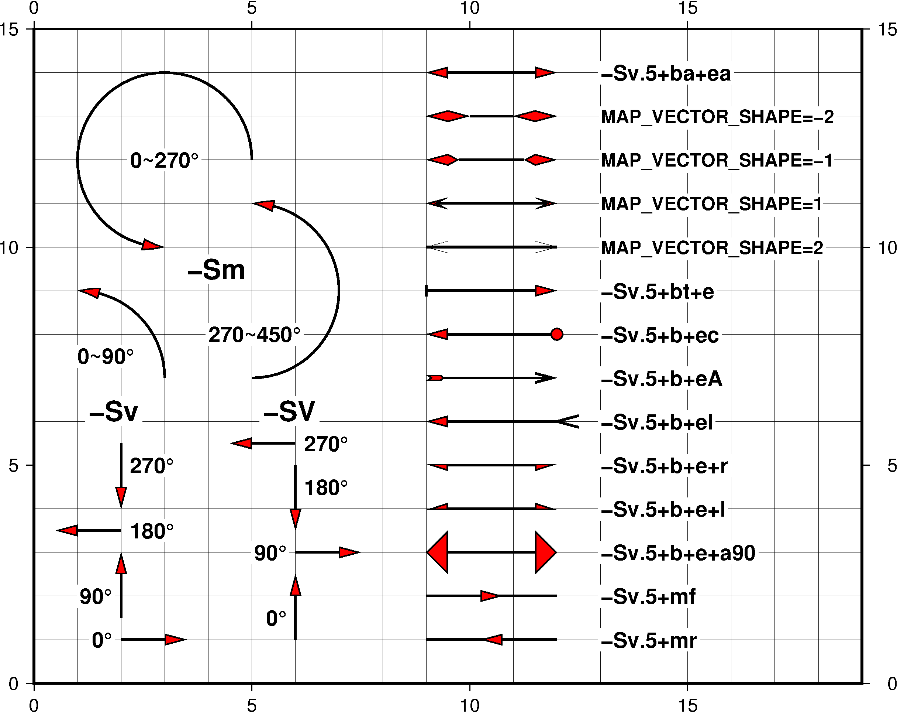
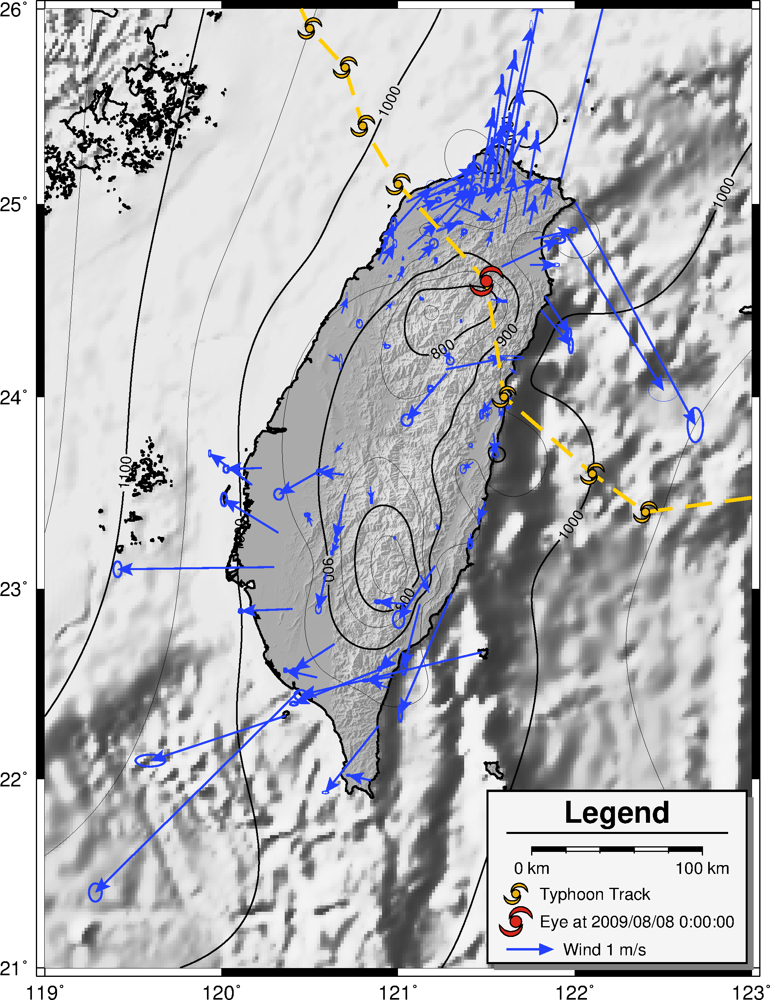
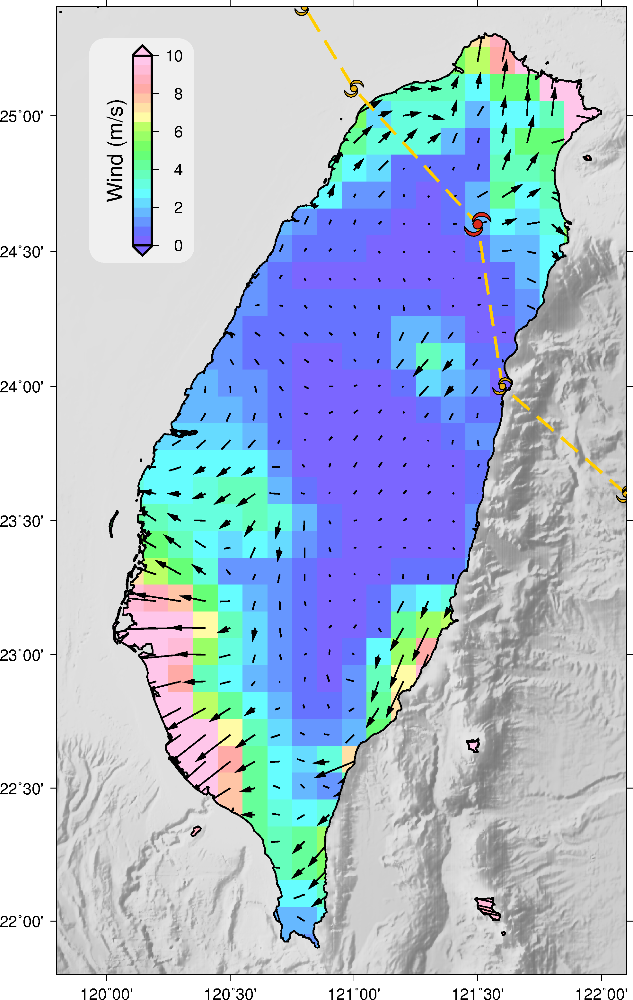
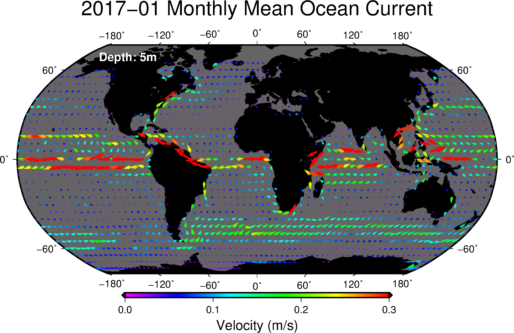

### 目錄
1. [總覽](/index.md)
2. [GMT介紹及安裝](/intro_install.md)
3. [網路資源及配套軟體](/net_software.md)
4. [第零章: 基本概念及默認值](/basic_defaults.md)
5. [第一章: 製作地圖(地理投影法)](/projection.md)
6. [第二章: XY散佈圖(其他投影法)](/xy_figure.md)
7. [第三章: 等高線圖及剖面](/contour_profile.md)
8. [第四章: 地形圖與色階](/topography_cpt.md)
9. [第五章: 地震活動性與機制解](/seismicity_meca.md)
10. [第六章: 向量與速度場](/vector_velocity.md)
11. [第七章: 台灣地理資訊](/taiwan_geography.md)
12. [第八章: 直方、圓餅、三元圖](/histo_pie_ternary.md)

---

## 10. 向量與速度場
向量(vector)是用來同時表達大小與方向的幾何圖形，在6-6極軸中，
介紹了利用極軸來表示四個氣象站夏季與冬季的風量(大小)及風向(方向)，
明顯地，這種資料符合向量所描述的對象，當想把這些帶有大小及方向性的資料繪製在地圖時，
要如何利用GMT來繪製向量，將在本章介紹。

## 10.1 目的
本章將學習如何繪製
  1. 向量(Vector)
  2. 速度場(Velocity Field)
  3. 網格速度場(Grid Velocity Field)

## 10.2 學習的指令與概念

* `surface`: 利用可調整張力的連續彎曲曲線(adjustable tension continuous curvature splines)來網格化表格式資料
* `grdvector`: 繪製網格向量場
* `psvelo`: 在地圖上繪製向量場
* `psxy`: 繪製線、多邊形、符號

## 10.3 向量
在開始學習將向量繪製在地圖上之前，首先先熟習GMT在繪製箭頭上的語法，使用的模組是`psxy`，
但是選項是之前沒介紹的笛卡爾向量`-Sv(V)`及弧形向量`-Sm`，而地理向量`-S=`將在不本章介紹，
就來看看向量有哪些變化吧！

成果圖
<p align="center">
  
</p>

批次檔
```bash
set ps=10_3_vector.ps

gmt psbasemap -R0/19/0/15 -JX19/15 -BWESN -Bag1 -K > %ps%

# 1. -Sv
echo 2 1 0 1.5 | gmt psxy -R -JX -Sv.5+e -W1.5 -Gred -K -O >> %ps%
echo 1.8 1 0\260 | gmt pstext -R -JX -F+f14p,1+jMR -G255 -K -O >> %ps%
echo 2 1.5 90 1.5 | gmt psxy -R -JX -Sv.5+e -W1.5 -Gred -K -O >> %ps%
echo 1.8 2 90\260 | gmt pstext -R -JX -F+f14p,1+jMR -G255 -K -O >> %ps%
echo 2 3.5 180 1.5 | gmt psxy -R -JX -Sv.5+e -W1.5 -Gred -K -O >> %ps%
echo 2.2 3.5 180\260 | gmt pstext -R -JX -F+f14p,1+jML -G255 -K -O >> %ps%
echo 2 5.5 270 1.5 | gmt psxy -R -JX -Sv.5+e -W1.5 -Gred -K -O >> %ps%
echo 2.2 5 270\260 | gmt pstext -R -JX -F+f14p,1+jML -G255 -K -O >> %ps%
echo 1.25 6.25 -Sv | gmt pstext -R -JX -F+f18p,1+jML -G255 -K -O >> %ps%

# 2. -SV
echo 6 1 0 1.5 | gmt psxy -R -JX -SV.5+e -W1.5 -Gred -K -O >> %ps%
echo 5.8 1.5 0\260 | gmt pstext -R -JX -F+f14p,1+jMR -G255 -K -O >> %ps%
echo 6 3.0 90 1.5 | gmt psxy -R -JX -SV.5+e -W1.5 -Gred -K -O >> %ps%
echo 5.8 3.0 90\260 | gmt pstext -R -JX -F+f14p,1+jMR -G255 -K -O >> %ps%
echo 6 5.0 180 1.5 | gmt psxy -R -JX -SV.5+e -W1.5 -Gred -K -O >> %ps%
echo 6.2 4.5 180\260 | gmt pstext -R -JX -F+f14p,1+jML -G255 -K -O >> %ps%
echo 6 5.5 270 1.5 | gmt psxy -R -JX -SV.5+e -W1.5 -Gred -K -O >> %ps%
echo 6.2 5.5 270\260 | gmt pstext -R -JX -F+f14p,1+jML -G255 -K -O >> %ps%
echo 5.25 6.25 -SV | gmt pstext -R -JX -F+f18p,1+jML -G255 -K -O >> %ps%

# 3. -Sm
echo 1 7 2 0 90 | gmt psxy -R -JX -Sm0.2i+e -W1.5 -Gred -K -O >> %ps%
echo 1 7.5 0~90\260 | gmt pstext -R -JX -F+f14p,1+jML -G255 -K -O >> %ps%
echo 5 9 2 270 450 | gmt psxy -R -JX -Sm0.2i+e -W1.5 -Gred -K -O >> %ps%
echo 4 8 270~450\260 | gmt pstext -R -JX -F+f14p,1+jML -G255 -K -O >> %ps%
echo 3 12 2 0 270 | gmt psxy -R -JX -Sm0.2i+e -W1.5 -Gred -K -O >> %ps%
echo 3 12 0~270\260 | gmt pstext -R -JX -F+f14p,1+jMC -G255 -K -O >> %ps%
echo 3.5 9.5 -Sm | gmt pstext -R -JX -F+f18p,1+jML -G255 -K -O >> %ps%

# 4. vector type
echo 9 14 0 3 | gmt psxy -R -JX -Sv.5+ba+ea -W1.5 -Gred -K -O >> %ps%
echo 13 14 -Sv.5+ba+ea | gmt pstext -R -JX -F+f14p,1+jML -G255 -K -O >> %ps%
echo 9 13 0 3 | gmt psxy -R -JX -Sv.5+ba+ea -W1.5 -Gred -K -O --MAP_VECTOR_SHAPE=-2 >> %ps%
echo 13 13 MAP_VECTOR_SHAPE=-2 | gmt pstext -R -JX -F+f12p,1+jML -G255 -K -O >> %ps%
echo 9 12 0 3 | gmt psxy -R -JX -Sv.5+ba+ea -W1.5 -Gred -K -O --MAP_VECTOR_SHAPE=-1 >> %ps%
echo 13 12 MAP_VECTOR_SHAPE=-1 | gmt pstext -R -JX -F+f12p,1+jML -G255 -K -O >> %ps%
echo 9 11 0 3 | gmt psxy -R -JX -Sv.5+ba+ea -W1.5 -Gred -K -O --MAP_VECTOR_SHAPE=1 >> %ps%
echo 13 11 MAP_VECTOR_SHAPE=1 | gmt pstext -R -JX -F+f12p,1+jML -G255 -K -O >> %ps%
echo 9 10 0 3 | gmt psxy -R -JX -Sv.5+ba+ea -W1.5 -Gred -K -O --MAP_VECTOR_SHAPE=2 >> %ps%
echo 13 10 MAP_VECTOR_SHAPE=2 | gmt pstext -R -JX -F+f12p,1+jML -G255 -K -O >> %ps%
echo 9 9 0 3 | gmt psxy -R -JX -Sv.5+bt+e -W1.5 -Gred -K -O >> %ps%
echo 13 9 -Sv.5+bt+e | gmt pstext -R -JX -F+f14p,1+jML -G255 -K -O >> %ps%
echo 9 8 0 3 | gmt psxy -R -JX -Sv.5+b+ec -W1.5 -Gred -K -O >> %ps%
echo 13 8 -Sv.5+b+ec | gmt pstext -R -JX -F+f14p,1+jML -G255 -K -O >> %ps%
echo 9 7 0 3 | gmt psxy -R -JX -Sv.5+bi+eA -W1.5 -Gred -K -O >> %ps%
echo 13 7 -Sv.5+bi+eA | gmt pstext -R -JX -F+f14p,1+jML -G255 -K -O >> %ps%
echo 9 6 0 3 | gmt psxy -R -JX -Sv.5+b+eI -W1.5 -Gred -K -O >> %ps%
echo 13 6 -Sv.5+b+eI | gmt pstext -R -JX -F+f14p,1+jML -G255 -K -O >> %ps%
echo 9 5 0 3 | gmt psxy -R -JX -Sv.5+b+e+r -W1.5 -Gred -K -O >> %ps%
echo 13 5 -Sv.5+b+e+r | gmt pstext -R -JX -F+f14p,1+jML -G255 -K -O >> %ps%
echo 9 4 0 3 | gmt psxy -R -JX -Sv.5+b+e+l -W1.5 -Gred -K -O >> %ps%
echo 13 4 -Sv.5+b+e+l | gmt pstext -R -JX -F+f14p,1+jML -G255 -K -O >> %ps%
echo 9 3 0 3 | gmt psxy -R -JX -Sv.5+b+e+a90 -W1.5 -Gred -K -O >> %ps%
echo 13 3 -Sv.5+b+e+a90 | gmt pstext -R -JX -F+f14p,1+jML -G255 -K -O >> %ps%
echo 9 2 0 3 | gmt psxy -R -JX -Sv.5+mf -W1.5 -Gred -K -O >> %ps%
echo 13 2 -Sv.5+mf | gmt pstext -R -JX -F+f14p,1+jML -G255 -K -O >> %ps%
echo 9 1 0 3 | gmt psxy -R -JX -Sv.5+mr -W1.5 -Gred -K -O >> %ps%
echo 13 1 -Sv.5+mr | gmt pstext -R -JX -F+f14p,1+jML -G255 -K -O >> %ps%

gmt psxy -R -J -T -O >> %ps%
gmt psconvert %ps% -Tg -A -P
del tmp*
```

學習到的指令:

* `-Sv`笛卡爾向量(直線向量)，對應的資料格式<mark>x軸位置 y軸位置 角度 長度 (大小)</mark>，
角度是從水平逆時針旋轉算起，如果沒有在`-Sv`指定大小，將會讀取第五欄的大小。
  * **+a**設定向量頭(vector head)的角度大小，默認值是30。
  * **+b**在起使位置繪製向量。
    * **t**向量改用終端線(terminal line)表示
    * **c**向量改用圓形表示
    * **a**向量改用箭頭表示，默認值
    * **i**向量改用箭尾表示
    * **A**向量改用簡單箭頭表示
    * **I**向量改用簡單箭尾表示
  * **+e**在結束位置繪製向量，其餘設置同**+b**。
  * **+l**只繪製左半邊的箭頭。
  * **+m**將向量頭繪製在中間，其餘設置同**+b**。
    * **f**箭頭朝終點方向
    * **r**箭頭朝起點方向
  * **+r**只繪製右半邊的箭頭。
  * **+t**偏移起始點與終點位置。
  * **+s**資料格式改成<mark>起始x軸位置 起始y軸位置 結束x軸位置 結束y軸位置</mark>
  * **--MAP_VECTOR_SHAPE**設定向量頭的種類，數值從-2到2。
* `-SV`的語法和`-Sv`一樣，除了角度是從北邊開始順時鐘算起。
* `-Sm`弧形向量，對應的資料格式<mark>圓心x軸位置 圓心y軸位置 半徑 起始角度 結束角度</mark>。
* `-G`向量頭的顏色。
* `-W`設定線段的寬度。

從上圖中可以清楚地從各圖片配合旁邊的文字解說，了解各種向量頭的繪製方式，
下一節將利用這些知識，加上實際的資料，來看看把向量繪製在地圖上的效果。

## 10.4 速度場
從大氣水文資料庫得到莫拉克颱風期間的氣象測站資料(局屬和自動測站)，
統計各測站在2009/08/08這天0點~12點的氣壓(PS01)、平均風風速(WD01)及平均風風向(WD02)，
利用Python計算12小時內東西及南北方向的平均風速及一倍標準差(1 sigma)，
還有12小時內的平均氣壓，最後整理成GMT畫圖所對應的格式。莫拉克颱風的路徑，
透過氣象局[颱風資料庫](http://rdc28.cwb.gov.tw/)下載取得。

使用的資料檔:
- [莫拉克颱風風速](dat/morakot_wind.gmt)
- [莫拉克颱風氣壓](dat/morakot_presure.gmt)
- [莫拉克颱風路徑](dat/morakot_track.dat)

成果圖
<p align="center">
  
</p>

批次檔
```bash
set ps=10_4_morakot_wind.ps
set data=D:\GMT_data\
set cpt=gebco.cpt

gmt surface morakot_presure.gmt -R119/123/21/26 -I.01  -Gmorakot_presure.grd

# 1. topography & presure contour
gmt psbasemap -R119/123/21/26 -JM15 -BWeSn -Bxa -Bya -P -K > %ps%
gmt grdimage %data%ETOPO1_Bed_g_gmt5.grd -R -JM -C%cpt% ^
-I%data%ETOPO1_Bed_g_gmt5_shad.grd -M -K -O >> %ps%
gmt pscoast -R -JM -Df -Gc -K -O >> %ps%
gmt grdimage %data%tw_40.grd -R -JM -C%cpt% ^
-I%data%tw_40shad.grd -M -K -O >> %ps%
gmt pscoast -R -JM -Q -K -O >> %ps%
gmt pscoast -R -JM -Df -W1 -K -O >> %ps%
gmt grdcontour morakot_presure.grd -R -JM -A100 -C50 -K -O >> %ps%

# 2. typhoon track & wind
gmt psvelo morakot_wind.gmt -R -JM -Se.3/.01/0 -G36/64/254 -A+ea+a45 -W1,36/64/254 -K -O >> %ps%
awk "{print $3,$2}" morakot_track.dat | gmt psxy -R -JM -W2,255/205/0,- -K -O >> %ps%
awk "$1 != 082009080800 {print $3,$2}" morakot_track.dat | ^
gmt psxy -R -JM -SkHURRICANE/.5 -G232/178/14 -W.5 -K -O >> %ps%
awk "$1 == 082009080800 {print $3,$2}" morakot_track.dat | ^
gmt psxy -R -JM -SkHURRICANE/.7 -G218/41/28 -W.5 -K -O >> %ps%

# 3. legend set
echo H 18 1 Legend > tmp
echo D 0.4 1p >> tmp
echo G .2 >> tmp
echo M 122 21.5 100+u +f >> tmp
echo G .2 >> tmp
echo S .5 kHURRICANE .5 232/178/14 .5 1 Typhoon Track >> tmp
echo P >> tmp
echo G .2 >> tmp
echo S .5 kHURRICANE .7 218/41/28 .5 1 Eye at 2009/08/08 0:00:00 >> tmp
echo G .2 >> tmp
echo S .8 v.3+ea+a45 1 36/64/254 1,36/64/254 1.5 Wind 1 m/s >> tmp
gmt pslegend tmp -R -JM -C.1/.1 -Dx9.4/.1+w5.5 -F+g245+p1+s4p/-4p/gray50 ^
--FONT_ANNOT_PRIMARY=10p --FONT_LABEL=14p -K -O >> %ps%

gmt psxy -R -J -T -O >> %ps%
gmt psconvert %ps% -Tg -A -P
del tmp*
```

學習到的指令:

* `Surface`將xyz三欄的表格資料，
透過`(1-T)*L(L(z))+T*L(z)`運算式，轉換成網格檔，
其中T代表張量參數(Tension Factor)，L是拉普拉斯運算子(Laplacian Operator)。
  * `-G`輸出檔名。
  * `-I`x軸網格間距[單位]/y軸間距[單位]。
  * `-R`x軸最小範圍/x軸最大範圍/y軸最小範圍/y軸最大範圍。
  * `-C`收斂限制百分比，和z軸資料同單位。
  * `-T`張量參數，0~1之間，0表示最小曲率解(minimum curvature solution)，
  容易造成不希望的振盪，形成假的局部最大值或最小值，1則是給一個諧和曲面(harmonic surface)，
  不會有最大最小值出現，除了在原始控制點上，一般建議T設定為0.25，如果資料變化較為劇烈，
  可以設定為0.35。

<mark>1</mark>繪製地形及氣壓等值線

<mark>2</mark>繪製向量(風速和方向)及颱風路徑
* `psvelo`在地圖上繪製向量場
  * `-Se`向量尺寸/誤差橢圓尺寸/標題字大小，對應的輸入資料格式為<mark>經度 緯度
  東西向數值 南北向數值 東西向誤差 南北向誤差 東西向與南北向的相關性 標題名</mark>。
  * `-Sr`與`-Se`一致，差別在輸入的資料格式<mark>經度 緯度
  東西向數值 南北向數值 橢圓的半長軸 橢圓的半短軸 長軸從水平向逆時針旋轉的角度
  標題名</mark>。
  * `-Sn`尺寸，異向性的向量(Anisotropy bars)，輸入資料格式為<mark>經度 緯度 東西向數值
  南北向數值</mark>。
  * `-Sw`扇形尺寸/規模，輸入資料格式為<mark>經度 緯度 旋轉的角度(radians為單位)
  旋轉的誤差角度</mark>。
  * `-Sx`十字線尺吋，常用於繪製應變軸，輸入資料格式為<mark>經度 緯度 應變擴張軸數值
  應變壓縮軸數值 旋轉角度(從北順時鐘，degree為單位)</mark>。
  * `-A`修改向量頭的屬性，同上一節介紹。
  * `-F`邊框和標題字的顏色。
  * `-G`向量頭及誤差橢圓的顏色。
  * `-W`向量頭、誤差橢圓及線段的筆觸。
* `psxy`繪製線、多邊形、符號。
  * `-Sk`自訂義符號名稱/大小，可參考[4-4自訂符號對照表](basic_defaults.md#m4.4sk)。

<mark>3</mark>製作圖例說明
* 同樣地，在製作自訂符號的圖例說明，也是用到`S 圖間隔 k自訂符號名稱 大小 顏色 外框筆觸
字間隔 文字`的模式來完成。

上述的公式來自<mark>Smith and Wessel, 1990</mark>[^1]，有興趣的話，
可以到註腳找到該文章題目，自行下載研讀。

從圖中顯示，颱風中心在8月8號0時位在宜蘭附近山區，處在低氣壓區，可以明顯地在北部測站觀察到，
逆時鐘的外旋氣旋，南部的測站也有此現象，惟多數測站以故障，測站數明顯少於北部。

[^1]: Gridding with continuous curvature splines in tension (W.H.F. Smith and P. Wessel, 1990)

## 10.5 網格速度場
延續上一節所使用的資料檔，來示範將表格資料透過`surface`轉成網格資料後，
如何呈現網格速度場。另外製作風速的純量檔，利用色階來呈現。

使用的資料檔:
- [莫拉克颱風風速純量](dat/morakot_wind_scalar.gmt)

成果圖
<p align="center">
  
</p>

批次檔
```bash
set ps=10_5_grid_vector.ps
set data=D:\GMT_data\
set cpt=sealand.cpt

# 1. surface .xyz to .grd & makecpt
awk "{print $1,$2,$3}" morakot_wind.gmt | ^
gmt surface -R119.9/122.1/21.8/25.4 -I.1 -Gmorakot_wind_e.grd
awk "{print $1,$2,$4}" morakot_wind.gmt | ^
gmt surface -R -I.1 -Gmorakot_wind_n.grd
gmt surface morakot_wind_scalar.gmt -R -I.1 -T.25 -Gmorakot_wind_scalar.grd
gmt makecpt -C%cpt% -T0/10/.5 -D > tmp.cpt

# 2. bathymetry & grdvector
gmt psbasemap -R119.8/122.1/21.8/25.4 -JM15 -BWeSn -Bxa ^
-Bya -P -K --MAP_FRAME_TYPE=PLAIN > %ps%
gmt grdimage %data%tw_500_119.grd -R -JM -C%cpt% ^
-I%data%tw_500shad_119.grd -M -K -O >> %ps%
gmt pscoast -R -JM -Df -Gc -K -O >> %ps%
gmt grdimage morakot_wind_scalar.grd -R -JM -Ctmp.cpt -K -O >> %ps%
gmt grdvector morakot_wind_e.grd morakot_wind_n.grd -R -JM -Q+ea -W1 ^
-G0 -S.4 -I.1 -K -O >> %ps%
gmt pscoast -R -JM -Q -K -O >> %ps%
gmt pscoast -R -JM -Df -W1 -K -O >> %ps%

# 3. typhoon track & psscale
awk "{print $3,$2}" morakot_track.dat | gmt psxy -R -JM -W2,255/205/0,- -K -O >> %ps%
awk "$1 != 082009080800 {print $3,$2}" morakot_track.dat | ^
gmt psxy -R -JM -SkHURRICANE/.5 -G232/178/14 -W.5 -K -O >> %ps%
awk "$1 == 082009080800 {print $3,$2}" morakot_track.dat | ^
gmt psxy -R -JM -SkHURRICANE/.7 -G218/41/28 -W.5 -K -O >> %ps%
gmt psscale -Ctmp.cpt -Dx2/19.2+w5/.5+e+ml -Bxa2+l"Wind (m/s)" ^
-F+g240+r.4+c.3 -K -O >> %ps%

gmt psxy -R -J -T -O >> %ps%
gmt psconvert %ps% -Tg -A -P
del tmp*
```

學習到的指令:

* <mark>1</mark>將風速檔透過`surface`轉成網格資料
  * 配合`grdvector`要的輸入檔案格式，分別將風速檔轉換東西向及南北向的網格檔。
  * 為了`grdimage`繪圖所需，將風速的純量檔轉成網格檔。

* <mark>2</mark>海底地形與網格速度場
  * `grdvector`繪製網格向量場，輸入的資料格式為<mark>x軸方向的網格檔 y軸方向的網格檔</mark>
    * `-A`將輸入的格式轉成<mark>長度 角度</mark>。
    * `-C`根據向量長度決定顏色。
    * `-G`向量顏色。
    * `-I`x間隔/y間隔，必需是原始網格的整數倍。
    * `-N`不剪裁地圖外的向量。
    * `-S`向量長度的縮放比例。
    * `-W`向量外框的筆觸。

* <mark>3</mark>繪製海底路徑及色彩條。

本節示範了與上一節不同的方式來呈現向量檔，透過將表格向量資料轉換網格資料，並繪製在地圖上，
可以看到和上節得到差不多的結論，惟在使用`surface`需要多注意，要確認原始資料點的分佈情形及
`-T`張量參數的使用，才不致於出現不尋常的極大極小區域，另外，善用色階來突顯想表達的重點。

## 10.6 習題
美國國家海洋與大氣管理局(National Oceanic and Atmospheric Administration, NOAA)
關注全球海洋與大氣的變化，也提供許多開放的資源供大家使用，本次習題將會利用其下的
[全球海洋資料同化系統](https://www.esrl.noaa.gov/psd/data/gridded/data.godas.html#detail)
(Global Ocean Data Assimilation System, GODAS)，此系統提供海水面高、鹽含量、洋流等等資料，
將使用洋流資料來繪製出全球尺度的洋流系統。

該系統所使用的檔案格式為<mark>netCDF</mark>，為一種資料壓縮的格式，慣用的副檔名為<mark>.nc</mark>，
常用於地球科學相關領域，GMT內訂海岸線的檔案格式也為此格式。接下來，簡單介紹該檔案格式，
它是一種self-described data format，意思是所有與資料有關的訊息都會被記錄在檔頭資訊裡，
其中檔頭資訊中分成兩個，第一，Attributes，用來描述該<mark>.nc</mark>檔的標題、
製作日期等等的文字敘述；第二，Dimension，是做為資料點對應的維度。接著資料點會被歸類在Variable中，
而Variable可透過Dimension來描述。

打個比方，Dimension中有4個維度，分別是時間、高程、經度、緯度，有一個Variable叫溫度，
它可以用這4個維度來描述，如2009-01-01在東經120度、北緯20度、高程2000公尺時，溫度為15度。
同理，有可能這個<mark>.nc</mark>檔中還有大氣壓這個Variable，但大氣壓只有提供地面的資料，
所以只需時間、經度、緯度這三個維度來描述。

了解檔案格式後，就交給Python來處理，從<mark>.nc</mark>檔提取需要的資訊，整理成GMT使用的格式。
本次習題希望利用下方兩筆資料，來繪製全球洋流的地圖。

使用的資料檔:
- [201701全球洋流東西向](dat/ucur_201701.xyz)
- [201701全球洋流南北向](dat/vcur_201701.xyz)

完成圖如下:
<p align="center">
  
</p>

## 10.7 參考批次檔
列出本章節使用的批次檔，供讀者參考使用，檔案路經可能會有些許不同，再自行修改。
* [10_3_vector](bat/10_3_vector.bat)
* [10_4_morakot_wind](bat/10_4_morakot_wind.bat)
* [10_5_grid_vector](bat/10_5_grid_vector.bat)
* [10_6_ocean_current](bat/10_6_ocean_current.bat)

---

[上一章](/seismicity_meca.md) -- [下一章](/taiwan_geography.md)

---

### 註腳
