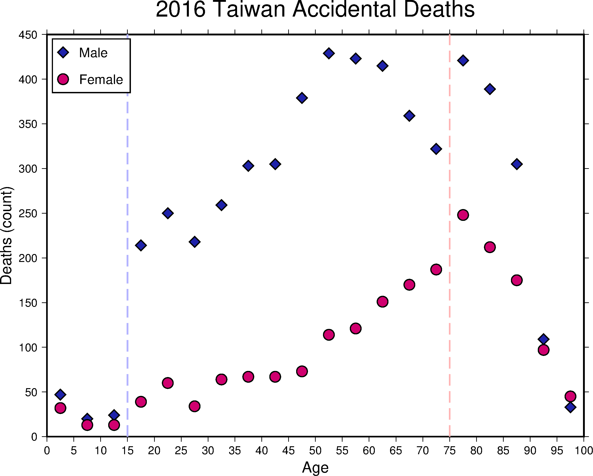
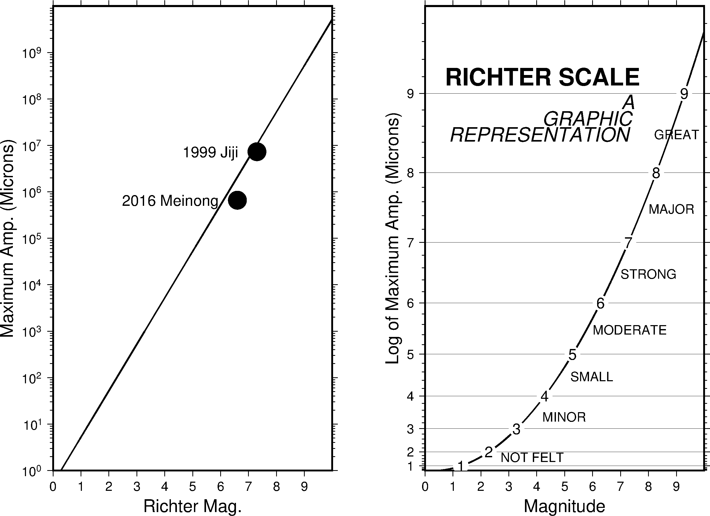

### 目錄
1. [總覽](/index.md)
2. [GMT介紹及安裝](/intro_install.md)
3. [網路資源及配套軟體](/net_software.md)
4. [第零章: 基本概念及默認值](/basic_defaults.md)
5. [第一章: 製作地圖(地理投影法)](/projection.md)
6. [第二章: XY散佈圖(其他投影法)](/xy_figure.md)

---

## 6. XY散佈圖
除了將資料展示在地圖上，另一個數據分析很重要的圖表格式就是XY散佈圖，本章將分成4個小節介紹

## 6.1 目的
本章將學習如何繪製
  1. 線性軸(Linear)
  2. 指數、對數軸(Power, Logarithmic)
  3. 時間序列(Time)
  4. 極軸(Polar)

## 6.2 學習的指令與概念

* `psbasemap`: 繪製圖框(Frame)、刻度(Tick)、標籤(Label)等等
* `pstext`: 在圖上進行排版文字
* `psxy`: 繪製線、多邊形、符號
* `gmtset`: GMT地圖參數
* Winodws中批次檔`batch`常用指令

## 6.3 線性軸(-Jx -JX)
當我們想知道兩個變數之間的關係，常會用到XY散佈圖來表示，看兩者之間是正相關還是負相關。
此節利用[死因統計](https://data.gov.tw/dataset/5965)，想知道意外事故死亡人數，在各年齡層之間的變化，
以及與性別的關係。整理好的[資料檔](dat/dead105.dat)，首先先來看成果圖及批次檔。

成果圖
<p align="center">
  
</p>

批次檔
```bash
set ps=6_3_accidentalDeath.ps

# 製作底圖框架
gmt psbasemap -R0/100/0/450 -JX20/15 -Bxa5+l"Age" -Bya50+l"Deaths (count)" ^
-BWeSn+t"2016 Taiwan Accidental Deaths" -K > %ps%

# 繪製垂直虛線
echo 15 0 > area
echo 15 450 >> area
gmt psxy area -R -JX -W1.5,180/180/255,- -K -O >> %ps%
echo 75 0 > area
echo 75 450 >> area
gmt psxy area -R -JX -W1.5,255/180/180,- -K -O >> %ps%

# 繪製死亡人數資料點
awk "$3==1 {print $1, $2}" dead105.dat | gmt psxy -R -JX -Sd.4 ^
-G30/34/170 -W1 -K -O >> %ps%
awk "$3==2 {print $1, $2}" dead105.dat | gmt psxy -R -JX -Sc.4 ^
-G208/0/111 -W1 -K -O >> %ps%

# 圖例框與圖例說明
echo 1 385 > area
echo 15.5 385 >> area
echo 15.5 445 >> area
echo 1 445 >> area
gmt psxy area -R -JX -W1 -G255 -L -K -O >> %ps%
echo 3 430 | gmt psxy -R -JX -Sd.4 -G30/34/170 -W1 -K -O >> %ps%
echo 6 430 Male | gmt pstext -R -JX -F+f14+jML -K -O >> %ps%
echo 3 400 | gmt psxy -R -JX -Sc.4 -G208/0/111 -W1 -K -O >> %ps%
echo 6 400 Female | gmt pstext -R -JX -F+f14+jML -O >> %ps%

# 轉成.png檔，刪除暫存資料
gmt psconvert %ps% -Tg -A -P
del area
```

本節學習到的新指令:
* 第3行: `#`符號代表這行後面的字為註記，執行時會略過這行，不同的環境下所使用的符號不太一樣，
像是Linux、MAC是使用<mark>#</mark>(bash shell)，在Windows則是用<mark>rem</mark>。
**特別說明：因為本網頁語法無支援batch檔的hightlight，所以才用<mark>#</mark>代替<mark>rem</mark>，
如果複製後在Windows上執行會出錯，請自行修改，或是下載最後提供的參考批次檔。**
* 第4行: `psbasemap`製作圖形外框，其中:
  * `-R`x軸最小值/x軸最大值/y軸最小值/y軸最大值。
  * `-JX`寬度/高度。
  * `-B`之中，`+l`給予標籤；`+t`給予標題。
* 第8,9行: 例用`echo`輸出一個暫存檔area。
* 第10行: 上一章有介紹`-W`寬度,顏色,樣色，這邊提供一些參考資訊。

**寬度單字對照表**

|Word    |Width|Word    |Width|
|--------|-----|--------|-----|
|faint   |0    |thicker |1.5p |
|default |0.25p|thickest|2p   |
|thinnest|0.25p|fat     |3p   |
|thinner |0.50p|fatter  |6p   |
|thin    |0.75p|fattest |12p  |
|thick   |1.0p |obese   |18p  |

**線樣式表**

|Style |    |
|:----:|----|
|-     |dash| 
|.     |dot |
|-.    |dash-dot|
|..-   |dot-dot-dash|
|**可自行搭配**|

* 第21~26行: 繪製圖例框，`echo`四個點時，編者習慣逆時針編輯點位置。
在`psxy`之中，`-L`強制關閉多邊形
* 第28行: `pstext`書寫圖例說明，吃的輸入檔格式為<mark>x軸位置 y軸位置 書寫的字</mark>。細部選項有:
  * `-F`: 
    * **+a**改變字的角度
    * **+f**字大小,字體,顏色
    * **+j**對齊模式，可參考[4-4字的對齊模式](basic_defaults.md#m4.4j)
    * **+t**寫字，可把想寫的字串放在後面，這樣資料檔中的第三欄就會被忽略
  * `-G`顏色，包含文字的方形圖框顏色
  * `-W`設定圖框邊線
* 第34行: `del`刪除檔案，語法為`del [檔名1 檔名2 ...]`，**強制刪除，請小心使用**。

從2016台灣意外死亡人數的xy散佈圖來看，在15~20區間之後(藍色虛線之後)，男性意外死亡人數急遽增加，相對地，
女性並沒有大幅度地增加，另一方面在75~80區間之後(粉紅色虛線之後)，意外死亡的人數開始下滑，
從上述兩點，推測可能的原因是...(省略)。

上一段的文字，示範如何利用資料作圖，並嘗試觀察出現象，來解釋其成因。當然，單單從一年份的意外死亡人數來推斷成因，
是不夠週全的，還需要像是其他年份的死亡資料、男女比例、其他死因等等的證據，才能寫出一份全面地論述。

## 6.4 指數、對數軸
每當地震來時，大家都會提到這次地震的規模多少，規模2或3你就會聯想到這次地震不大(~~可以去PTT發地震文~~)，
規模6或7你就會反應這次地震很大，查一下各地區的震度(**記住保命優先**)！而你想過，地震規模到底是怎麼得到的嗎？

1935年發生了南加州地震，Charles Richter教授為了量化地震本身的大小，提出了芮氏地震規模**M<font size="-2">L</font>**(Richter magnitude)，
或稱作近震規模(Local magnitude)。他以南加州地震為例，提出的公式<mark>M<font size="-2">L</font>=logA+2.76logD-2.48</mark>，
其中**A**代表地震儀紀錄最大振幅(微米)；**D**代表震央距(度)；**2.76**及**2.48**是區域修正常數。
還有其他像是**M<font size="-2">b</font>**體波規模、**M<font size="-2">s</font>**表面波規模、
**M<font size="-2">w</font>**地震矩規模，來估算地震大小。讓我們來假設震央距為10度，不同大小的振幅所對應的芮氏規模吧！
本節用到的資料檔，[芮氏規模資料](dat\richter_magnitude.dat)及[取log後芮氏規模資料](dat\richter_magnitude_log.dat)。

成果圖
<p align="center">
  
</p>

批次檔
```bash
set ps=6_4_richter_magnitude.ps

# 製作左側圖
gmt psbasemap -R0/9.99/1e0/9.99e9 -JX9/15l -BWeSn -Bxa1+l"Richter Mag." ^
-Bya1pf3+l"Maximum Amp. (Microns)" -K > %ps%
gmt psxy richter_magnitude.dat -R -JX -W1 -K -O >> %ps%
echo 7.3 7.3e6 1999 Jiji > tmp
echo 6.6 6.6e5 2016 Meinong >> tmp
gmt psxy tmp -R -JX -Sc.6 -G0 -K -O >> %ps%
gmt pstext tmp -R -JX -F+f14p+jMR -D-.6/0 -K -O >> %ps%

# 製作右側圖
gmt psbasemap -R0/9.99/1e-2/9.99 -JX9/15p2 -BWeSn -Bxa1+l"Magnitude" ^
-Bya1f.2g1+l"Log of Maximum Amp. (Microns)" -X12 -K -O >> %ps%
gmt psxy richter_magnitude_log.dat -R -JX -W1 -K -O >> %ps%
for /l %%x in (1, 1, 9) do (
awk "$2==%%x {print $1, $2}" richter_magnitude_log.dat | ^
gmt psxy -R -JX -Sc.5 -G255 -K -O >> %ps%)
for /l %%x in (1, 1, 9) do (
awk "$2==%%x {print $1, $2, %%x}" richter_magnitude_log.dat | ^
gmt pstext -R -JX -F+f14p -K -O >> %ps%)
echo 2.7 1.7 NOT FELT > tmp
echo 4.2 3.4 MINOR >> tmp
echo 5.2 4.5 SMALL >> tmp
echo 6 5.5 MODERATE >> tmp
echo 7 6.5 STRONG >> tmp
echo 8 7.5 MAJOR >> tmp
echo 8.2 8.5 GREAT >> tmp
gmt pstext tmp -R -JX -F+f12p+jML -K -O >> %ps%
echo 7.7 9.2 RICHTER SCALE | gmt pstext -R -JX -F+f22p,1+jMR -K -O >> %ps%
echo 7.5 8.9 A | gmt pstext -R -JX -F+f18p,2+jMR -K -O >> %ps%
echo 7.4 8.7 GRAPHIC | gmt pstext -R -JX -F+f18p,2+jMR -K -O >> %ps%
echo 7.3 8.5 REPRESENTATION | gmt pstext -R -JX -F+f18p,2+jMR -K -O >> %ps%
gmt psxy -R -JX -T -O >> %ps%

gmt psconvert %ps% -Tg -A -P
del tmp
```

成果圖右側參考*<font size="-1">1</font>。本節學習的新指令:
* 第4~5行: `-JX9/15l`會將y軸設定以10次方倍為一個區間的線性軸，
`-By`之中<mark>a1p</mark>是將y軸的註解(tick markes or annotation)變成10次方表示；
<mark>f3</mark>當-JX設定為l時，次要刻度有兩種選項，2以線性畫刻度，3以次方倍畫刻度。
* 第13~14行: `-JX9/15p2`會將y軸設定為資料點平方的指數軸，p後面的數字代表多少次方倍。
* 第16~21行: `for /l`設定一個數字範圍迴圈，語法為`for /l %%參數 in (起始,間隔,結束) do (指令)`，
利用1~9間隔為1的迴圈，找出芮氏規模為1~9時，對應的振幅，
* 第31,32行: `-F`+22p,1` or `-F`+18p,2`，改變字型，請參考[4-4字體對照表](basic_defaults.md#m4.4f)。
* 第34行: `-T`忽略所有輸入檔，往往在寫GMT畫圖時，常常需要更改或換指令的前後順序，
導致圖層沒有確實關閉(-O沒在最後一個畫圖指令)，利用`psxy -T`忽略輸入檔的方式，來確保圖層關閉。

> *<font size="-1">1</font> A Graphic Representation of the Richter Scale (V.J. Ansfield, 1992)

---

[上一章](/projection.md) -- [下一章](/xy_figure.md)