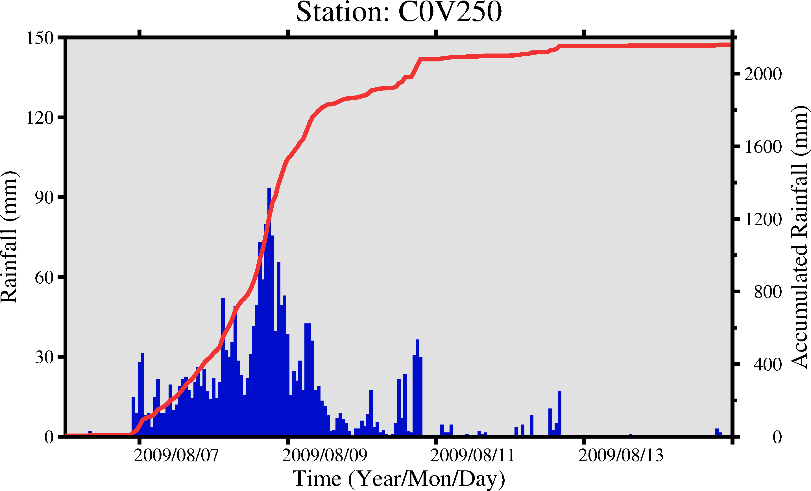
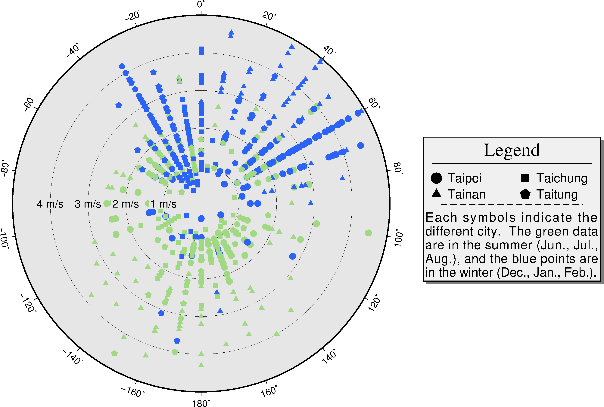
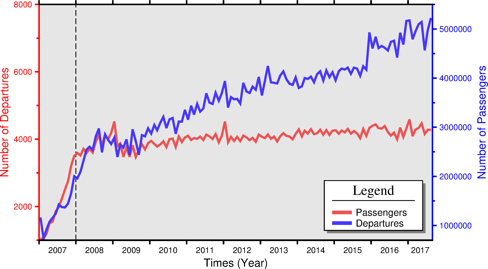
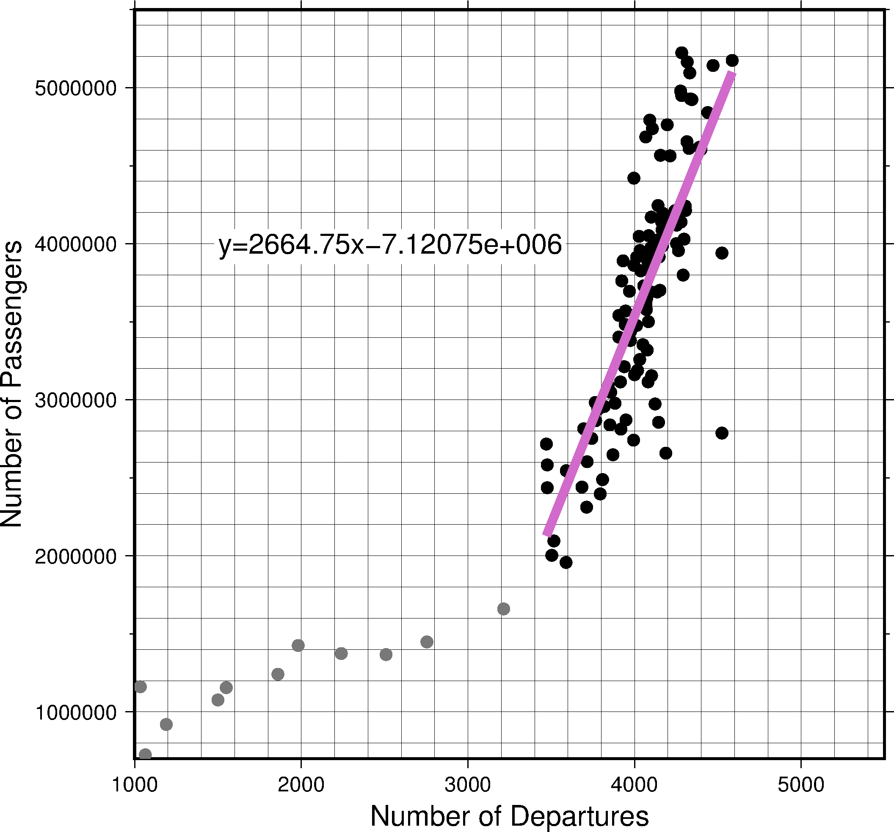

### 目錄
1. [總覽](/index.md)
2. [GMT介紹及安裝](/intro_install.md)
3. [網路資源及配套軟體](/net_software.md)
4. [第零章: 基本概念及默認值](/basic_defaults.md)
5. [第一章: 製作地圖(地理投影法)](/projection.md)
6. [第二章: XY散佈圖(其他投影法)](/xy_figure.md)

---

## 6. XY散佈圖
除了將資料展示在地圖上，另一個數據分析很重要的圖表格式就是XY散佈圖，本章將分成4個小節介紹如何將資料呈現在線性、對數、時間軸上，
以及極座標上。

## 6.1 目的
本章將學習如何繪製
  1. 線性軸(Linear)
  2. 指數、對數軸(Power, Logarithmic)
  3. 時間序列(Time)
  4. 極軸(Polar)

## 6.2 學習的指令與概念

* `psbasemap`: 繪製圖框(Frame)、刻度(Tick)、標籤(Label)等等
* `pstext`: 在圖上進行排版文字
* `psxy`: 繪製線、多邊形、符號
* `pslegend`: 繪製圖例、說明
* `gmtset`: GMT地圖參數
* Winodws中批次檔`batch`常用指令

## 6.3 線性軸(-Jx -JX)
當我們想知道兩個變數之間的關係，常會用到XY散佈圖來表示，看兩者之間是正相關還是負相關。
此節利用[死因統計](https://data.gov.tw/dataset/5965)，想知道意外事故死亡人數，在各年齡層之間的變化，
以及與性別的關係，首先先來看成果圖及批次檔。

使用的資料檔:
- [105年意外死亡人數](dat/dead105.dat)

成果圖
<p align="center">
  
</p>

批次檔
```bash
set ps=6_3_accidentalDeath.ps

# 製作底圖框架
gmt psbasemap -R0/100/0/450 -JX20/15 -Bxa5+l"Age" -Bya50+l"Deaths (count)" ^
-BWeSn+t"2016 Taiwan Accidental Deaths" -K > %ps%

# 繪製垂直虛線
echo 15 0 > area
echo 15 450 >> area
gmt psxy area -R -JX -W1.5,180/180/255,- -K -O >> %ps%
echo 75 0 > area
echo 75 450 >> area
gmt psxy area -R -JX -W1.5,255/180/180,- -K -O >> %ps%

# 繪製死亡人數資料點
awk "$3==1 {print $1, $2}" dead105.dat | gmt psxy -R -JX -Sd.4 ^
-G30/34/170 -W1 -K -O >> %ps%
awk "$3==2 {print $1, $2}" dead105.dat | gmt psxy -R -JX -Sc.4 ^
-G208/0/111 -W1 -K -O >> %ps%

# 圖例框與圖例說明
echo 1 385 > area
echo 15.5 385 >> area
echo 15.5 445 >> area
echo 1 445 >> area
gmt psxy area -R -JX -W1 -G255 -L -K -O >> %ps%
echo 3 430 | gmt psxy -R -JX -Sd.4 -G30/34/170 -W1 -K -O >> %ps%
echo 6 430 Male | gmt pstext -R -JX -F+f14+jML -K -O >> %ps%
echo 3 400 | gmt psxy -R -JX -Sc.4 -G208/0/111 -W1 -K -O >> %ps%
echo 6 400 Female | gmt pstext -R -JX -F+f14+jML -O >> %ps%

# 轉成.png檔，刪除暫存資料
gmt psconvert %ps% -Tg -A -P
del area
```

本節學習到的新指令:
* 第3行: `#`符號代表這行後面的字為註記，執行時會略過這行，不同的環境下所使用的符號不太一樣，
像是Linux、MAC是使用<mark>#</mark>(bash shell)，在Windows則是用<mark>rem</mark>。
**特別說明：因為本網頁語法無支援batch檔的hightlight，所以才用<mark>#</mark>代替<mark>rem</mark>，
如果複製後在Windows上執行會出錯，請自行修改，或是下載最後提供的參考批次檔。**
* 第4行: `psbasemap`製作圖形外框，其中:
  * `-R`x軸最小值/x軸最大值/y軸最小值/y軸最大值。
  * `-JX`寬度/高度。
  * `-B`之中，`+l`給予標籤；`+t`給予標題。
* 第8,9行: 例用`echo`輸出一個暫存檔area。
* 第10行: 上一章有介紹`-W`寬度,顏色,樣色，這邊提供一些參考資訊。

**寬度單字對照表**

|Word    |Width|Word    |Width|
|--------|-----|--------|-----|
|faint   |0    |thicker |1.5p |
|default |0.25p|thickest|2p   |
|thinnest|0.25p|fat     |3p   |
|thinner |0.50p|fatter  |6p   |
|thin    |0.75p|fattest |12p  |
|thick   |1.0p |obese   |18p  |

**線樣式表**

|Style |    |
|:----:|----|
|-     |dash| 
|.     |dot |
|-.    |dash-dot|
|..-   |dot-dot-dash|
|**可自行搭配**|

* 第21~26行: 繪製圖例框，`echo`四個點時，編者習慣逆時針編輯點位置。
在`psxy`之中，`-L`強制關閉多邊形
* 第28行: `pstext`書寫圖例說明，吃的輸入檔格式為<mark>x軸位置 y軸位置 書寫的字</mark>。細部選項有:
  * `-F`: 
    * **+a**改變字的角度
    * **+f**字大小,字體,顏色
    * **+j**對齊模式，可參考[4-4字的對齊模式](basic_defaults.md#m4.4j)
    * **+t**寫字，可把想寫的字串放在後面，這樣資料檔中的第三欄就會被忽略
  * `-G`顏色，包含文字的方形圖框顏色
  * `-W`設定圖框邊線
* 第34行: `del`刪除檔案，語法為`del [檔名1 檔名2 ...]`，**強制刪除，請小心使用**。

從2016台灣意外死亡人數的xy散佈圖來看，在15~20區間之後(藍色虛線之後)，男性意外死亡人數急遽增加，相對地，
女性並沒有大幅度地增加，另一方面在75~80區間之後(粉紅色虛線之後)，意外死亡的人數開始下滑，
從上述兩點，推測可能的原因是...(省略)。

上一段的文字，示範如何利用資料作圖，並嘗試觀察出現象，來解釋其成因。當然，單單從一年份的意外死亡人數來推斷成因，
是不夠週全的，還需要像是其他年份的死亡資料、男女比例、其他死因等等的證據，才能寫出一份全面地論述。

## 6.4 指數、對數軸
每當地震來時，大家都會提到這次地震的規模多少，規模2或3你就會聯想到這次地震不大(~~可以去PTT發地震文~~)，
規模6或7你就會反應這次地震很大，查一下各地區的震度(**記住保命優先**)！而你想過，地震規模到底是怎麼得到的嗎？

1935年發生了南加州地震，Charles Richter教授為了量化地震本身的大小，提出了芮氏地震規模**M<font size="-2">L</font>**(Richter magnitude)，
或稱作近震規模(Local magnitude)。他以南加州地震為例，提出的公式<mark>M<font size="-2">L</font>=logA+2.76logD-2.48</mark>，
其中**A**代表地震儀紀錄最大振幅(微米)；**D**代表震央距(度)；**2.76**及**2.48**是區域修正常數。
還有其他像是**M<font size="-2">b</font>**體波規模、**M<font size="-2">s</font>**表面波規模、
**M<font size="-2">w</font>**地震矩規模，來估算地震大小。讓我們來假設震央距為10度，不同大小的振幅所對應的芮氏規模吧！

使用的資料檔:
- [芮氏規模資料](dat/richter_magnitude.dat)
- [取log後芮氏規模資料](dat/richter_magnitude_log.dat)

成果圖
<p align="center">
  
</p>

批次檔
```bash
set ps=6_4_richter_magnitude.ps

# 製作左側圖
gmt psbasemap -R0/9.99/1e0/9.99e9 -JX9/15l -BWeSn -Bxa1+l"Richter Mag." ^
-Bya1pf3+l"Maximum Amp. (Microns)" -K > %ps%
gmt psxy richter_magnitude.dat -R -JX -W1 -K -O >> %ps%
echo 7.3 7.3e6 1999 Chi-Chi > tmp
echo 6.6 6.6e5 2016 Meinong >> tmp
gmt psxy tmp -R -JX -Sc.6 -G0 -K -O >> %ps%
gmt pstext tmp -R -JX -F+f14p+jMR -D-.6/0 -K -O >> %ps%

# 製作右側圖
gmt psbasemap -R0/9.99/1e-2/9.99 -JX9/15p2 -BWeSn -Bxa1+l"Magnitude" ^
-Bya1f.2g1+l"Log of Maximum Amp. (Microns)" -X12 -K -O >> %ps%
gmt psxy richter_magnitude_log.dat -R -JX -W1 -K -O >> %ps%
for /l %%x in (1, 1, 9) do (
awk "$2==%%x {print $1, $2}" richter_magnitude_log.dat | ^
gmt psxy -R -JX -Sc.5 -G255 -K -O >> %ps%)
for /l %%x in (1, 1, 9) do (
awk "$2==%%x {print $1, $2, %%x}" richter_magnitude_log.dat | ^
gmt pstext -R -JX -F+f14p -K -O >> %ps%)
echo 2.7 1.7 NOT FELT > tmp
echo 4.2 3.4 MINOR >> tmp
echo 5.2 4.5 SMALL >> tmp
echo 6 5.5 MODERATE >> tmp
echo 7 6.5 STRONG >> tmp
echo 8 7.5 MAJOR >> tmp
echo 8.2 8.5 GREAT >> tmp
gmt pstext tmp -R -JX -F+f12p+jML -K -O >> %ps%
echo 7.7 9.2 RICHTER SCALE | gmt pstext -R -JX -F+f22p,1+jMR -K -O >> %ps%
echo 7.5 8.9 A | gmt pstext -R -JX -F+f18p,2+jMR -K -O >> %ps%
echo 7.4 8.7 GRAPHIC | gmt pstext -R -JX -F+f18p,2+jMR -K -O >> %ps%
echo 7.3 8.5 REPRESENTATION | gmt pstext -R -JX -F+f18p,2+jMR -K -O >> %ps%

gmt psxy -R -JX -T -O >> %ps%
gmt psconvert %ps% -Tg -A -P
del tmp
```

成果圖右側參考*<font size="-1">1</font>。本節學習的新指令:
* 第4~5行: `-JX9/15l`會將y軸設定以10次方倍為一個區間的線性軸，
`-By`之中<mark>a1p</mark>是將y軸的註解(tick markes or annotation)變成10次方表示；
<mark>f3</mark>當-JX設定為l時，次要刻度有兩種選項，2以線性畫刻度，3以次方倍畫刻度。
* 第13~14行: `-JX9/15p2`會將y軸設定為資料點平方的指數軸，p後面的數字代表多少次方倍。
* 第16~21行: `for /l`設定一個數字範圍迴圈，語法為`for /l %%參數 in (起始,間隔,結束) do (指令)`，
利用1~9間隔為1的迴圈，找出芮氏規模為1~9時，對應的振幅，
* 第31,32行: `-F+f22p,1` or `-F+f18p,2`，改變字型，請參考[4-4字體對照表](basic_defaults.md#m4.4f)。
* 第35行: `-T`忽略所有輸入檔，往往在寫GMT畫圖時，常常需要更改或換指令的前後順序，
導致圖層沒有確實關閉(-O沒在最後一個畫圖指令)，利用`psxy -T`忽略輸入檔的方式，來確保圖層關閉。

在芮氏規模的公式中，振福與規模存在一個10次方倍的關係，如果用線性軸來表示，會因為x,y軸量值差距過大，
而無法正常表示，所以左側的圖，將y軸設定為以10次方倍為一個區間，才能將這關係轉換至線性，便於表現在圖上。
右側的圖，為了示意振幅及規模兩者之間非線性關係，先將振幅資料取log，再透過指數軸來示意兩者非線性之間的關係。

> *<font size="-1">1</font> A Graphic Representation of the Richter Scale (V.J. Ansfield, 1992)

## 6.5 時間序列

時間序列這類型的圖，主要用來表示資料與時間之間的關係，普偏地出現在平常的生活當中，股票及匯率的走勢、
國內生產毛額(GDP)、公司各季的財務報表等等，都被稱作時間序列。本節將利用[大氣水文資料庫](https://dbahr.narlabs.org.tw)，
中央氣象局自動測站C0V250(甲仙)在莫拉克颱風期間的雨量資料，來學習如何繪製時間序列圖。

使用的資料檔:
- [甲仙站雨量資料](dat/C0V250_rain.dat)

成果圖
<p align="center">
  
</p>

批次檔
```bash
set ps=6_5_C0V250_morakot.ps

# 設定圖框、刻度、標題等等
gmt gmtset ^
FORMAT_DATE_MAP = yyyy/mm/dd ^
MAP_FRAME_PEN = 3p ^
MAP_TICK_PEN_PRIMARY = 3p ^
FONT_ANNOT_PRIMARY = 16p,4,black ^
FONT_LABEL = 20p,4,black ^
FONT_TITLE = 26p,4,black

# 繪製雨量長條圖
gmt psbasemap -R2009-08-06T/2009-08-15T/0/150 -JX20/12 ^
-BW+t"Station: C0V250"+g225 -Bxa2D -Bya30+l"Rainfall (mm)" -K > %ps%
awk "{print $1,$2}" C0V250_rain.dat | gmt psxy -R -JX -Sb.1 -G0/14/203 -K -O >> %ps%

# 繪製累積雨量折線圖
awk "{print $1,$3}" C0V250_rain.dat | gmt psxy -R2009-08-06T/2009-08-15T/0/2200 ^
-JX -W3.5,242/51/51 -K -O >> %ps%
gmt psbasemap -R -JX -BESn -Bxa2D+l"Time (Year/Mon/Day)" ^
-Bya400f200+l"Accumulated Rainfall (mm)" -K -O >> %ps%

gmt psxy -R -JX -T -O >> %ps%
gmt psconvert %ps% -Tg -A -P
del gmt.conf
```

本節學習的新指令:
* 第4~10行: `gmtset`默認值設定，在章節4-3有提到如何修改默認值，這裡採用第二種方式，
透過查詢[4-4地圖框的設定](basic_defaults.md#m4.4m)，修改了
  * `FORMAT_DATE_MAP`地圖的時間格式，**yyyy**四碼年份、**mm**兩碼月份、**dd**兩碼日子。
  * `MAP_FRAME_PEN`地圖框畫筆。
  * `MAP_TICK_PEN_PRIMARY`刻度畫筆。
  * `FONT_ANNOT_PRIMARY`註解的字型。
  * `FONT_LABEL`標籤的字型。
  * `FONT_TITLE`標題的字型。
* 第13,14行: 示範psbasemap如何設定為標準時間格式。
  * `-R[date]T[clock]`，年月日的寫法是yyyy-mm-dd，時分秒[毫秒]的寫法是hh:mm:ss[.xxx]，
  中間用T隔開，GMT就可以了解到資料為標準時間格式。
  * `-B+g顏色`，設定圖框內的底色。
  * `-Bxa2D`，x軸間隔設定為2天，詳細的間隔設定，可參考[4-4時間的單位](basic_defaults.md#4.4t)。
* 第15行: `-Sb`尺寸，繪製垂直長條，如果是`-SB`則是水平長條。
* 第18行: 將y軸範圍改成0/2200，配合累積雨量。
* 第20行: `-BEsn`配合第14行`-BW`，達到繪製雙y軸的效果，此處psbasemap與psxy指令的順序交換，
是為了不讓累積雨量的折線，覆蓋到圖框。
* 第25行: 為了避免<mark>gmt.conf</mark>影響到其他GMT畫圖的批次檔，將此檔刪除。

為了表達在同一段時間內，不同資料的變化趨勢，雙軸圖(twin axis figure)被廣泛地應用在時間序列中，
透過簡單的`-B`參數設定來達到此效果。從圖中可以看到甲仙地區，在2009/08/06晚上開始下雨(藍色長條)，
約以每小時20~40mm的降水量持續到8號下午，8號晚間帶來80~100mm/hr的雨量，在此之後開始緩慢下降，
從6號到15號，莫拉克颱風共帶來約2200mm的總降雨量(紅線)。透過此圖，將這災難性的颱風所帶來的雨量紀錄，
清楚地顯示雨量集中的時間段，以及短時間內的雨量總量。

## 6.6 極軸

極座標軸是由角度和相對原點距離來組成，常應用在數學、物理、工程等等領域，像是岩層走向、航海雷達等。
本節將利用[大氣水文資料庫](https://dbahr.narlabs.org.tw)中台北、台中、台南、台東，共四個氣象站的風速及方向資料，
來展示台灣夏季及冬季的風向與風速的差異，並示範`pslegend`的用法。

使用的資料檔:
- [夏季風資料](dat/summer_wind.dat)
- [冬季風資料](dat/winter_wind.dat)

成果圖
<p align="center">
  
</p>

批次檔
```bash
set ps=6_6_season_wind.ps

gmt psbasemap -R0/360/0/5 -JPa17 -BN+g230 -Bxa20 -Byg1 -K > %ps%
# 466920, Taipei
awk "$4==466920 {print $3, $2}" summer_wind.dat | gmt psxy -R -JP -Sc.3 -G161/216/132 -K -O >> %ps%
awk "$4==466920 {print $3, $2}" winter_wind.dat | gmt psxy -R -JP -Sc.3 -G42/99/246 -K -O >> %ps%
# 467490, Taichung
awk "$4==467490 {print $3, $2}" summer_wind.dat | gmt psxy -R -JP -Ss.3 -G161/216/132 -K -O >> %ps%
awk "$4==467490 {print $3, $2}" winter_wind.dat | gmt psxy -R -JP -Ss.3 -G42/99/246 -K -O >> %ps%
# 467410, Tainan
awk "$4==467410 {print $3, $2}" summer_wind.dat | gmt psxy -R -JP -St.3 -G161/216/132 -K -O >> %ps%
awk "$4==467410 {print $3, $2}" winter_wind.dat | gmt psxy -R -JP -St.3 -G42/99/246 -K -O >> %ps%
# 467660, Taitung
awk "$4==467660 {print $3, $2}" summer_wind.dat | gmt psxy -R -JP -Sn.3 -G161/216/132 -K -O >> %ps%
awk "$4==467660 {print $3, $2}" winter_wind.dat | gmt psxy -R -JP -Sn.3 -G42/99/246 -K -O >> %ps%
# wind speed label
echo -90 1 1 m/s > tmp
echo -90 2 2 m/s >> tmp
echo -90 3 3 m/s >> tmp
echo -90 4 4 m/s >> tmp
gmt pstext tmp -R -JP -F+f14p -G230 -K -O >> %ps% 

# legend set
echo H 24 Times-Roman Legend > tmp
echo D 0.4 1p >> tmp
echo G .2 >> tmp
echo N 2 >> tmp
echo S .5 c .5 0 0 1 Taipei >> tmp
echo S .5 s .5 0 0 1 Taichung >> tmp
echo G .1 >> tmp
echo S .5 t .5 0 0 1 Tainan >> tmp
echo S .5 n .5 0 0 1 Taitung >> tmp
echo D 0.8 1p,0,- >> tmp
echo P >> tmp
echo G .1 >> tmp
echo T Each symbols indicate the different city. >> tmp
echo T The green data are in the summer (Jun., Jul., Aug.), >> tmp
echo T and the blue points are in the winter (Dec., Jan., Feb.). >> tmp
gmt pslegend tmp -R -JP -C.1/.1 -Dx18.5/5+w8 -F+g240+p1+s4p/-4p/gray50 ^
--FONT_ANNOT_PRIMARY=16p -K -O >> %ps%

gmt psxy -R -JX -T -O >> %ps%
gmt psconvert %ps% -Tg -A -P
del tmp
```

本節學習的新指令:
* 第3行: `-JPa17`其中**a**表示由北開始，如果沒有則是從東開始；**17**設定圖寬度。
`-R0/360/0/5`前兩個數字設定圓的角度範圍，也可以用-180/180表示，只能給整圓和半圓(0/180)；
後面則是距離範圍。`-BN`只用給定N，大寫顯示註解、小寫則無。
* 第5~15行: 利用`awk`讀取各城市的資料，用不同的符號來表示，季節則用不同顏色顯示。
* 第17~21行: 寫風速的註解。
* 第24~38行: 示範如何編寫配合`pslegend`的文檔，按順序介紹:
  * **H**設定標題，字大小 字體 標題文字
  * **D**繪製水平線，兩測的空白間距 線屬性
  * **G**給一個垂直空白
  * **N**修改圖例中的欄數，給予數量(等寬)或是數量 [欄寬1 欄寬2 ...]
  * **S**繪製圖例符號，格式為符號左邊界距離 符號代碼 符號大小 符號顏色 符號筆觸 文字左邊界距離 文字內容
  * **P**開啟段落模式
  * **T**寫一段文字
  * 其他還有滿多的用法，可自行參考GMT官網。
* 第39,40行: 示範`pslegend`的用法:
  * `-C`: 設定圖例邊框與內部圖例之間的空白，默認是4p/4p。
  * `-D`: 設定圖例框的位置及大小。
    * **x**是參考點方式接上位移單位，共有**g**, **j**, **J**, **n**, **x**
      * **g**用數據的座標系
      * **j**指定底圖的9個錨點(BL, BC, BR ...)
      * **J**指定底圖錨點並同時給定圖例錨點。假設底圖錨點為BR、圖例錨點TL，則圖例會出現在底圖的右下角
      * **n**正規化座標系(0~1之間)
      * **x**用底圖的座標，類似`-X`、`-Y`的用法
    * **+w**圖例框的寬度，可給長/高，如寬不設定或為0，則GMT會自動估算高度
  * `-F`: 圖例框的屬性。
    * **+g**圖例框內的底色
    * **+p**圖例框的筆觸
    * **+s**設定陰影
  * `--FONT_ANNOT_...`: 改變<mark>gmtset</mark>，只對這行有效。

台灣為在副熱帶季風區，在夏季的時後吹西南風；冬季則是吹東北風，從這四個站的資料顯示，大致符合這個現象，
夏季風向約從140至240度，而冬季從320度至80度(順時鐘數)，另一方面，冬季季風的風速大於夏季季風。

圖例是一張圖中重要的元素之一，要能清楚地表達各符號、顏色等等分別代表什麼意思，GMT提供了方便的指令，
來製作結果圖，但如何構圖、配色，來凸顯資料的特徵，則需要大量的經驗，這又是另一門學問了。

## 6.7 習題
本次習題將使用，政府資料開放平台中的[高鐵運量統計表](https://data.gov.tw/dataset/8013)，
來看自2007年1月5號高鐵開始通車，到2017年8月底為止，官方統計的車次數量及乘客量在時間上的變化，
以及這兩個變數之間有什麼關係。
* 1.繪製從2007-01-01至2017-08-31的折線圖，顯示**列車次數**及**旅客人數**在時間上的變化。
請用雙軸的方式呈現，並嘗試更改其外框顏色，另外練習在2008-01-01畫一條垂直虛線，
以及如何製作圖例`pslegend`，完成圖如下:
<p align="center">
  
</p>
* 2.繪製**旅客人數**及**列車次數**的xy點散佈圖，從上題完成圖中可以看到2007年(第一年)，
較之後有很大的不同，試著將2007年的點用不同的顏色表示出來。另外GMT有提供一些資料運算的功能，
在將來將會依序用到，此題將會使用到`gmt regress`，將**旅客人數**及**列車次數**做線性回歸，
並繪製回歸線及方程式，請試著去GMT官網找到該模組，並練習如何使用。
<p align="center">
  
</p>

## 6.8 參考批次檔
列出本章節使用的批次檔，供讀者參考使用，檔案路經可能會有些許不同，再自行修改。
* [6_3_accidentalDeath](bat/6_3_accidentalDeath.bat)
* [6_4_richter_magnitude](bat/6_4_richter_magnitude.bat)
* [6_5_C0V250_morakot](bat/6_5_C0V250_morakot.bat)
* [6_6_season_wind](bat/6_6_season_wind.bat)
* [6_7_THSRC_timeseries](bat/6_7_THSRC_timeseries.bat)
* [6_7_THSRC_xyFigure](bat/6_7_THSRC_xyFigure.bat)

---

[上一章](/projection.md) -- [下一章](/xy_figure.md)